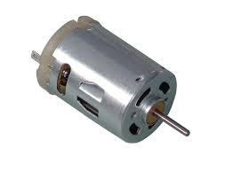

# Workshop 4 - Servos and Internet

Today we will make one Arduino connected to the internet control another Arduino, also connected to the internet. The first Arduino acts as web client (basically an automatic web browser) and the other us a web server. But first let's have a look at servo motors. 

##The servo motor

The servo motor is often found in radio controlled airplanes and cars to control flaps and steering. They are very practical to use together with the Arduino if you want to make a movement between fixed positions. A normal electrical motor such as the one in the image below is simply rotating continuously when it is connected to a power source. 

**Standard DC motor**

The servo motor on the other hand can move between two end points.

**Servo motor**. Image from [Wikipedia](http://en.wikipedia.org/wiki/Servo_(radio_control))

The servo motor has a gear box built in and a sensor for measuring the position of the outgoing shaft. Arduino already has a built in function for controlling servos:


myservo.write(val); 

	
where `val` is a variable that should have a value between 0 and 180. When this function is called, the servo will move to the number of degrees according to `val`.

[Sweep](http://arduino.cc/en/Tutorial/sweep) and [Knob](http://arduino.cc/en/Tutorial/Knob) are two good tutorials from the official Arduino site. 

##Controlling a LED from the web

Now will try to control the Arduino from a web page, by turning on and off an LED. 

The led is turned on or off by requesting a web page from the Arduino with either 

http://10.0.19.21/on

or

http://10.0.19.21/off

**NOTE** The IP-number must be changed to your IP-number.

Here is the code that will be explained in detail. Don't be scared by the length of it. 


#include <SPI.h>
#include <Ethernet.h>

#define BUFSIZ 100

int led=9;

//replace with mac address of your arduino
byte mac[]= { 0x90, 0xA2, 0xDA, 0x00, 0x??, 0x?? };
//NOTE The last four ? should be changed to 
//the letters or numbers on your shield

EthernetServer server(80);

void setup()
{
  Serial.begin(9600);
  delay(2000);
  Serial.println("Starting...");
  pinMode(led, OUTPUT);
  Ethernet.begin(mac);
  server.begin();
  Serial.println(Ethernet.localIP()); //useful for debugging
}

void loop()
{
  char url[BUFSIZ];
  int index = 0;
 
  // listen for incoming clients
  EthernetClient client = server.available();
  if (client) {
    // an http request ends with a blank line
    boolean currentLineIsBlank = true;
    while (client.connected()) {
      if (client.available()) {
        char c = client.read();
        //find the reuested url and store in array url
        url[index]=c;
        index++;
        if (index >= BUFSIZ) { 
            index = BUFSIZ -1;
        }
        
        if (c == '\n' && currentLineIsBlank) {
          url[index]=0; //end of string

          //http ok, doctype, html, head
          htmlstart(client);
          //is "on" part of url?
          if (strstr(url,"arduino/on")!=0) {
            client.print("turning on");
            digitalWrite(led,HIGH);
          }         
          //is "off" part of url?
          else if (strstr(url,"arduino/off")!=0) {
            client.print("turning off");
            digitalWrite(led,LOW);
          } else {
            client.print("unknown command");
          }
          htmlend(client);
          break;
        }
        if (c == '\n') {
          currentLineIsBlank = true;
        } 
        else if (c != '\r') {
          currentLineIsBlank = false;
        }
      }
    }
    // give the web browser time to receive the data
    delay(1);
    // close the connection:
    client.stop();
  }
}

void htmlstart(EthernetClient client) {
  //this text will be the beginning of all http requests
  //Strings can eat meomory. With F, the constant strings 
  //are stored in Flash memory and saves memory for the code. 
  client.println(F("HTTP/1.1 200 OK"));
  client.println(F("Content-Type: text/html"));
  client.println();
  client.print(F("<!doctype html>"));
  client.print(F("<html>"));
  client.print(F("<head>"));
  client.print(F("<meta charset='UTF-8'>"));
  client.print(F("<title>on off</title>"));
  client.print(F("</head>"));
  client.print(F("<body>"));
}

void htmlend(EthernetClient client) {
  //this text will be the end of all http requests
  client.print(F("</body>"));
  client.print(F("</html>"));
}


##Control one Arduino from another one

Now it is time to control the Arduino in the example above from another Arduino. The Arduino that will be *controlled* will use exactly the same sketch as the in example above. This Arduino is the web server. 

The Arduino that will *control* will instead act as web client. That means that it acts as an automatic web browser in the same way as the standard web browser from above. 

A push button should be connected to the pin 9 of the controlling Arduino. We will now use an internal pull up resistor meaning that we can connect the push button directly between pin 9 and GND. Pushing the button on the client will turn on or off the LED on the server. Here is the web client sketch: 


//This is an adapted version of the Example
//File->Examples->Ethernet->WebClientRepeating

#include <SPI.h>
#include <Ethernet.h>

int buttonPin=9;

byte mac[] = { 0x90, 0xA2, 0xDA, 0x00, 0x??, 0x?? }; 
//NOTE The last four ? should be changed to 
//the letters or numbers on your shield

int ledState=LOW;

// initialize the library instance:
EthernetClient client;

//NOTE this must be changed to the IP of the Arduino you want to control
char otherArduinoServer[] = "192.168.0.7";

boolean lastConnected = false; // state of the connection last time through the main loop

void setup() {
  pinMode(buttonPin, INPUT);
  digitalWrite(buttonPin, HIGH); // enable internal pull up. this line is not needed with external pull up connected to on button  

  // start serial port:
  Serial.begin(9600);
  // give the ethernet module time to boot up:
  delay(2000);
  Serial.print("Starting...");
  // start the Ethernet connection
  Ethernet.begin(mac);
  // print the Ethernet board/shield's IP address:
  Serial.print("My IP address: ");
  Serial.println(Ethernet.localIP());
}

void loop() {
  // if there's incoming data from the net connection.
  // send it out the serial port.  This is for debugging
  // purposes only:
  if (client.available()) {
    char c = client.read();
    Serial.print(c);
  }

  // if there's no net connection, but there was one last time
  // through the loop, then stop the client:
  if (!client.connected() && lastConnected) {
    Serial.println();
    Serial.println("disconnecting.");
    client.stop();
  }

  // if you're not connected, and ten seconds have passed since
  // your last connection, then connect again and send data:

  if(!client.connected() && digitalRead(buttonPin)==LOW) {
    httpRequest();
    delay(1000);
  }
  // store the state of the connection for next time through
  // the loop:
  lastConnected = client.connected();
}

// this method makes a HTTP connection to the server:
void httpRequest() {
  // if there's a successful connection:
  if (client.connect(otherArduinoServer, 80)) {
    Serial.println("connecting...");
    // send the HTTP GET request:
    if (ledState==LOW) {
      client.println("GET /arduino/on/ HTTP/1.1");
      ledState=HIGH;
    } else {
      client.println("GET /arduino/off/ HTTP/1.1");
      ledState=LOW;
    }
    
    client.println("Host: ");
    client.println(otherArduinoServer);
    client.println("User-Agent: arduino-ethernet");
    client.println("Connection: close");
    client.println();

  } 
  else {
    // if you couldn't make a connection:
    Serial.println("connection failed");
    Serial.println("disconnecting.");
    client.stop();
  }
}


##Challenge: Control a servo over the web

Try to combine what we have done so far so that the servo on one Arduino can be controlled by a web browser or by another Arduino. 

