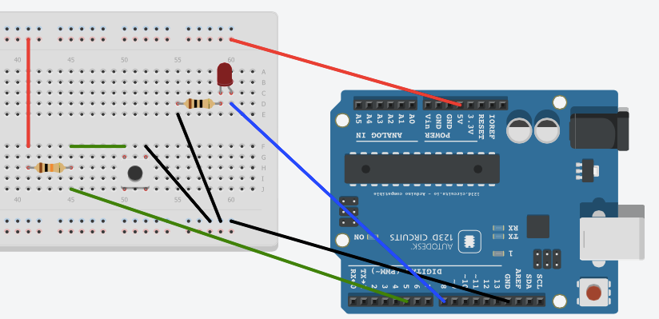

# Workshop 3 - Sensors and Actuators, Connection to internet

## Sensors and Actuators

### Sensors

Sensors are the inputs to the Arduino. A normal computer has typically a keyboard and a mouse as input. The Arduino can have a wide range of sensors as input, for example:

- simple button or switch
- pressure sensor
- light sensor
- potentiometer
- temperature sensor
- humidity sensor
- touch sensor
- microphone

The only thing the Arduino can sense, or measure, is *voltage* . Some sensors give a *voltage* directly, but many sensors don't give a voltage directly, and that means that we have to make an electric circuit that will transform the output of the sensor to voltage. Some sensors such as potentiometers, light sensors, pressure sensors, buttons and switches give a variable resistance as output. A variable resistance can easily be converted to a voltage with the help of a *voltage divider*.

We start with a **push button**. A push button has two states

- pushed - zero resistance 
- not pushed - infinite resistance 

To connect a push button, you need something called a *pull up resistor*. (Actually you can also use a pull down resistor, or even a built-in pull up resistor in the Arduino, as described in [this tutorial](http://arduino.cc/en/Tutorial/DigitalPins)).

A good value for the pull up resistor is somewhere around 10k (10k is short for 10k&#937; which in turn is short for 10000 ohms). The pull up resistor makes sure that the input of the Arduino will be 5 V when the button is **not** pushed and 0 V when the button **is** pushed. 

The state of the button can be detected by the following Arduino code:


int buttonPin = 5; //button connected to pin 5 with pull up resistor

void setup() {                
   pinMode(buttonPin, INPUT);     
}

void loop() {
  int val=digitalRead(buttonPin);
  //the variable val will be: 
  // HIGH when the button is not pushed
  // LOW when the button is pushed
}


A **light sensor** or **photo resisitor** can be connected in the same way as the button. A photo resistor has a changing resistance when the light is changing. If it is connected with a pull up resistor, the voltage will change between 0 V and 5 V depending on the light. The photo resistor is an *analog* sensor while the push button is a *digital* sensor, and must be connected to the analog input of the Arduino. 

### Actuators

Actuators are things that will produce some action that humans usually can detect. Actions can for example be sound, light or movement. Examples of actuators are:

- light sources (lamps, LEDs)
- motors (servo motors, DC motors, stepper motors)
- speakers (magnetic or piezo speaker)
- heating elements

Small speakers can be connected directly to the Arduino, between ground (GND) and one of the digital output pins. But wait, aren't speakers analog? Yes they are, but it is possible to produce analog output on on the digital pins with something called pulse widht modulation, PWM. More on that later.  

An LED can be connected almost directly to the Arduino, but it must be connected in series with a resistor of ca 200&#937;, otherwise the Arduino might be damaged. 

Really small motors can also be connected directly to the Arduino, but larger motors need som kind of amplification and external power source to work.

Let's connect a push button and a LED to the Arduino.

This sketch will *turn off* the LED when the button is pushed. 


int buttonPin = 5; //button connected to pin 5 with pull up resistor
int ledPin = 8;

void setup() {                
   pinMode(buttonPin, INPUT);     
   pinMode(ledPin, OUTPUT);     

}

void loop() {
  int val=digitalRead(buttonPin);
  //the variable val will be: 
  // HIGH when the button is not pushed
  // LOW when the button is pushed
  digitalWrite(ledPin,val);
}


### Analog and Digital

Something digital can be in two states, HIGH or LOW, which often is the same as 5V or 0V (there are also Arduinos where HIGH is 3.3 V).

Analog values on the other hand can be anything. Arduino can measure analog voltages between 0V and 5V, and the analog voltage can be anything between that. However, computers can only handle  *binary digits* or *bits*. A bit can be 1 or  0 where 1 is HIGH, and 0 is LOW. A collection of bits can be used to represent whole numbers, integers. 10 bits can represent the numbers 0 to 1023, and the Arduino converts any voltage that is connected to the analog inputs to a whole number between 0 and 1023. 

- if the input is 0 V, this is represented by the number 0
- if the input is 5 V, this is represented by 1023
- if the input is for example 2 V, this is represented by 2*1023/5 = 409

The conversion from analog to digital is made by an *ADC*, *analog-to-digital-converter*. 

## Connecting the Arduino to the Internet

### Accessing the light sensor from a web browser

We will now try to access the value of the light sensor from a web browser. We can keep the same connection for the light sensor but we should disconnect the speaker, and put an ethernet shield on top of the Arduino. The Arduino sketch will be more complicated now that we add Internet connection. Most of the code is taken from

Examples -> Ethernet - WebServer

but it has been modified a little. 


/*
  Web Server 
 */

#include <SPI.h>
#include <Ethernet.h>

// Enter the MAC address for your Arduino.

byte mac[]= { 0x90, 0xA2, 0xDA, 0x??, 0x??, 0x?? };
//NOTE The mac-address should be changed to 
//the letters or numbers on your shield

// Initialize the Ethernet server library with port 80 (standard for a server)
EthernetServer server(80);

void setup()
{
  //Start serial to make testing and debugging easier
  Serial.begin(9600);

  // start the Ethernet connection and the server:
  Ethernet.begin(mac);
  server.begin();
  //print the IP-address. We will need the IP-address when we connect to it
  Serial.println(Ethernet.localIP());
}

void loop()
{
  //The following code is a little complicated
  //but almost the same code can be used for all web server sketches.
  // Listen for incoming clients - a web browser requesting a web page
  EthernetClient client = server.available();
  if (client) {
    // an http request ends with a blank line
    boolean currentLineIsBlank = true;
    while (client.connected()) {
      if (client.available()) {
        char c = client.read();
        // if you've gotten to the end of the line (received a newline
        // character) and the line is blank, the http request has ended,
        // so you can send a reply
        if (c == '\n' && currentLineIsBlank) {
          // send a standard http response header
          client.println("HTTP/1.1 200 OK");
          client.println("Content-Type: text/html");
          client.println("Connection: close");
          client.println("Refresh: 2");  // refresh every 2 sec
          client.println();

          //read the value of analog pin 0          
          int a0=analogRead(0);
          
          int red=a0/4; //divide it to get number between 0 and 255
          int green=0;
          int blue=255-red;
          
          //output html code for a webpage
          client.println("<!doctype html>");
          client.print("<html><head><meta charset='UTF-8'>");
          client.print("<title>webserver</title>");
          
          //make a css stylesheet where the background color 
          //changes when analog pin 0 changes
          client.print("");
                    
          client.print("</head><body>");
          //print all analog input values
          for (int analogChannel = 0; analogChannel < 6; analogChannel++) {
            client.print("analog input ");
            client.print(analogChannel);
            client.print(" is ");
            client.print(analogRead(analogChannel));
            client.println(" ");
          }
          client.print("</body></html>");
          break;
        }
        if (c == '\n') {
          // you're starting a new line
          currentLineIsBlank = true;
        } 
        else if (c != '\r') {
          // you've gotten a character on the current line
          currentLineIsBlank = false;
        }
      }
    }
    // give the web browser time to receive the data
    delay(1);
    // close the connection:
    client.stop();
    Serial.println("finnished");
  }
}


Open a web browser and enter the IP-number of your Arduino in the address field, for example and you should see a web page that changes color when the light condition for the light sensor changes. 