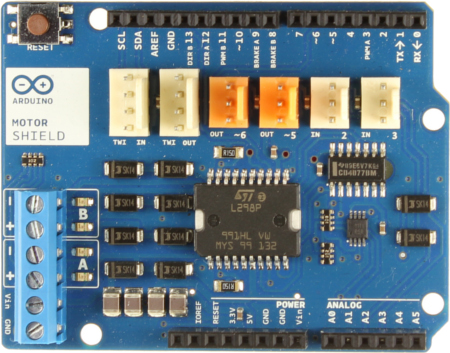
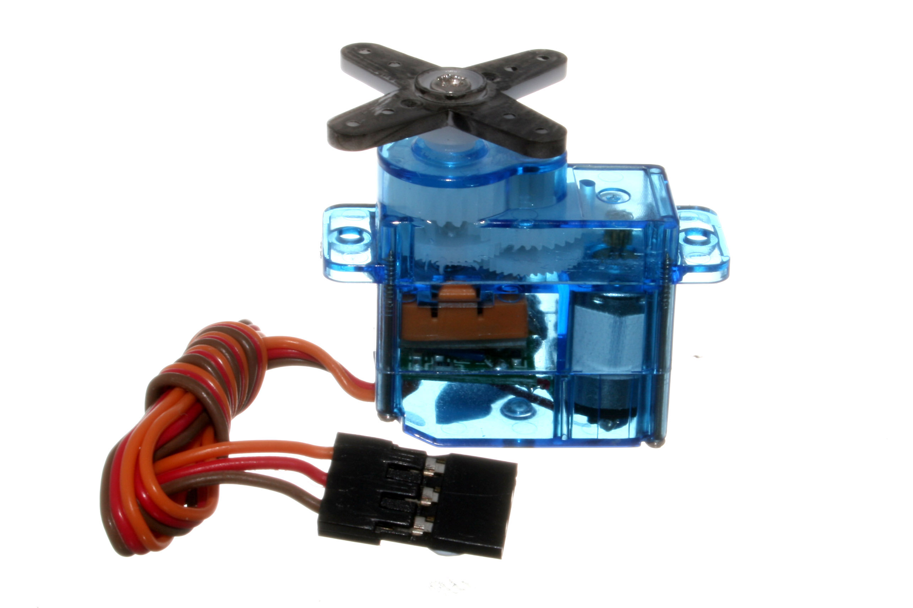

# Workshop 3 - Actuators and Connecting to web services

Today we will connect the Arduino to web services like <http://xively.com> and <http://zapier.com> and learn more by actuators. 


## Actuators

Actuators are things that will produce some action that humans usually can detect. Actions can for example be sound, light or movement. Examples of actuators are:

- light sources (lamps, LEDs)
- motors (servo motors, DC motors, stepper motors)
- speakers (magnetic or piezo speaker)
- heating elements

Small speakers can be connected directly to the Arduino, between ground (GND) and one of the digital output pins. But wait, aren't speakers analog? Yes they are, but it is possible to produce analog output on on the digital pins with something called pulse width modulation, PWM. 

An LED can be connected almost directly to the Arduino, but it must be connected in series with a resistor of ca 200&#937;, otherwise the Arduino might be damaged. 

Really small motors can also be connected directly to the Arduino, but larger motors need som kind of amplification and external power source to work, for example a device called an H-bridge. DC-motors and servo motors are the most common motors connected to the Arduino.

### DC motors

A normal electrical motor such as the one in the image below is simply rotating continuously when it is connected to a power source. 


**Standard DC motor**

The simplest way to connect a DC motor to the Arduino is to use a motor shield, which has one or more [H-bridges](https://en.wikipedia.org/wiki/H_bridge) on them:



**Motor shield**

### Servo motors

The servo motor is often found in radio controlled airplanes and cars to control flaps and steering. They are very practical to use together with the Arduino if you want to make a movement between fixed positions. 



**Servo motor**. Image from [Wikipedia](http://en.wikipedia.org/wiki/Servo_(radio_control))

The servo motor has a gear box built in and a sensor for measuring the position of the outgoing shaft. Arduino already has a built in function for controlling servos:

```c++
myservo.write(val); 
```

where `val` is a variable that should have a value between 0 and 180. When this function is called, the servo will move to the number of degrees according to `val`.

[Sweep](http://arduino.cc/en/Tutorial/sweep) and [Knob](http://arduino.cc/en/Tutorial/Knob) are two good tutorials from the official Arduino site. 

## LED and push button example

Let's connect a push button and a LED to the Arduino.


This sketch will *turn off* the LED when the button is pushed. 

```c++
int buttonPin = 5; //button connected to pin 5 with pull up resistor
int ledPin = 8;

void setup() {
  //NOTE: you can use internal pullup instead of external pullup if you
  //change following line to
  //pinMode(buttonPin, INPUT_PULLUP);          
  pinMode(buttonPin, INPUT);     
  pinMode(ledPin, OUTPUT);     

}

void loop() {
  int val=digitalRead(buttonPin);
  //the variable val will be: 
  // HIGH when the button is not pushed
  // LOW when the button is pushed
  digitalWrite(ledPin,val);
}
```

## Controlling a LED from the web

Now we will try to control the Arduino from a web page, by turning on and off an LED. 

The led is turned on or off by requesting a web page from the Arduino with either 

http://http://195.178.228.115/arduino/on

or

http://http://195.178.228.115/arduino/off

Giving commands like this is in a URL is usually called *representational state transfer*, or [REST](https://en.wikipedia.org/wiki/Representational_state_transfer) 

**NOTE** The IP-number must be changed to your IP-number.

Here is the code that will be explained in detail. 

```c++
#include <SPI.h>
#include <Ethernet.h>

#define BUFSIZ 100

int led=9;

//replace with mac address of your arduino
byte mac[]= { 0x90, 0xA2, 0xDA, 0x??, 0x??, 0x?? };
//NOTE The ? should be changed to 
//the letters or numbers on your shield

EthernetServer server(80);

void setup()
{
  Serial.begin(9600);
  delay(2000);
  Serial.println("Starting...");
  pinMode(led, OUTPUT);
  Ethernet.begin(mac);
  server.begin();
  Serial.println(Ethernet.localIP()); //useful for debugging
}

void loop()
{
  char url[BUFSIZ];
  int index = 0;
 
  // listen for incoming clients
  EthernetClient client = server.available();
  if (client) {
    // an http request ends with a blank line
    boolean currentLineIsBlank = true;
    while (client.connected()) {
      if (client.available()) {
        char c = client.read();
        //find the reuested url and store in array url
        url[index]=c;
        index++;
        if (index >= BUFSIZ) { 
            index = BUFSIZ -1;
        }
        
        if (c == '\n' && currentLineIsBlank) {
          url[index]=0; //end of string

          //http ok, doctype, html, head
          htmlstart(client);
          //is "on" part of url?
          if (strstr(url,"arduino/on")!=0) {
            client.print("turning on");
            digitalWrite(led,HIGH);
          }         
          //is "off" part of url?
          else if (strstr(url,"arduino/off")!=0) {
            client.print("turning off");
            digitalWrite(led,LOW);
          } else {
            client.print("unknown command");
          }
          htmlend(client);
          break;
        }
        if (c == '\n') {
          currentLineIsBlank = true;
        } 
        else if (c != '\r') {
          currentLineIsBlank = false;
        }
      }
    }
    // give the web browser time to receive the data
    delay(1);
    // close the connection:
    client.stop();
  }
}

void htmlstart(EthernetClient client) {
  //this text will be the beginning of all http requests
  //Strings can eat meomory. With F, the constant strings 
  //are stored in Flash memory and saves memory for the code. 
  client.println(F("HTTP/1.1 200 OK"));
  client.println(F("Content-Type: text/html"));
  client.println();
  client.print(F("<!doctype html>"));
  client.print(F("<html>"));
  client.print(F("<head>"));
  client.print(F("<meta charset='UTF-8'>"));
  client.print(F("<title>on off</title>"));
  client.print(F("</head>"));
  client.print(F("<body>"));
}

void htmlend(EthernetClient client) {
  //this text will be the end of all http requests
  client.print(F("</body>"));
  client.print(F("</html>"));
}
```

## Control one Arduino from another one

Now it is time to control the Arduino in the example above from another Arduino. The Arduino that will be *controlled* will use exactly the same sketch as the in example above. This Arduino is the web server. 

The Arduino that *control* will instead act as web client. That means that it acts as an automatic web browser in the same way as the standard web browser from above. 

A push button should be connected to the pin 8 of the controlling Arduino. We will now use an internal pull up resistor meaning that we can connect the push button directly between pin 8 and GND. Pushing the button on the client will turn on or off the LED on the server. Here is the web client sketch: 

```c++
//This is an adapted version of the Example
//File->Examples->Ethernet->WebClientRepeating

#include <SPI.h>
#include <Ethernet.h>

int buttonPin=8;

byte mac[] = { 0x90, 0xA2, 0xDA, 0x??, 0x??, 0x?? }; 
//NOTE The ? should be changed to 
//the letters or numbers on your shield

int ledState=LOW;

// initialize the library instance:
EthernetClient client;


//NOTE this must be changed to the IP of the Arduino you want to control
char otherArduinoServer[] = "192.168.0.7";

boolean lastConnected = false; // state of the connection last time through the main loop

void setup() {
  pinMode(buttonPin, INPUT);
  digitalWrite(buttonPin, HIGH); // enable internal pull up. this line is not needed with external pull up connected to on button  

  // start serial port:
  Serial.begin(9600);
  // give the ethernet module time to boot up:
  delay(2000);
  Serial.print("Starting...");
  // start the Ethernet connection
  Ethernet.begin(mac);
  // print the Ethernet board/shield's IP address:
  Serial.print("My IP address: ");
  Serial.println(Ethernet.localIP());
}

void loop() {
  // if there's incoming data from the net connection.
  // send it out the serial port.  This is for debugging
  // purposes only:
  if (client.available()) {
    char c = client.read();
    Serial.print(c);
  }

  // if there's no net connection, but there was one last time
  // through the loop, then stop the client:
  if (!client.connected() && lastConnected) {
    Serial.println();
    Serial.println("disconnecting.");
    client.stop();
  }

  // if you're not connected, and ten seconds have passed since
  // your last connection, then connect again and send data:

  if(!client.connected() && digitalRead(buttonPin)==LOW) {
    httpRequest();
    delay(1000);
  }
  // store the state of the connection for next time through
  // the loop:
  lastConnected = client.connected();
}

// this method makes a HTTP connection to the server:
void httpRequest() {
  // if there's a successful connection:
  if (client.connect(otherArduinoServer, 80)) {
    Serial.println("connecting...");
    // send the HTTP GET request:
    if (ledState==LOW) {
      client.println("GET /arduino/on/ HTTP/1.1");
      ledState=HIGH;
    } else {
      client.println("GET /arduino/off/ HTTP/1.1");
      ledState=LOW;
    }
    
    client.println("Host: ");
    client.println(otherArduinoServer);
    client.println("User-Agent: arduino-ethernet");
    client.println("Connection: close");
    client.println();

  } 
  else {
    // if you couldn't make a connection:
    Serial.println("connection failed");
    Serial.println("disconnecting.");
    client.stop();
  }
}
```

## Connecting to Xively

Xively is a cloud based data logging service. It is easy to send data from the Arduino to Xively. Xively also offers the possibility to add *triggers* that can for example make http posts when a sensor value exceeds a certain value. 

Start by logging in to <http://xively.com>. Add a device, then add a channel for that device. Name the channel `sensor1` (you can name it something else, but then you must make some changes to the Arduino sketch below). 

Note the API key and Feed ID for this channel. These values will go into this Arduino sketch:

```c++
//this is a slight modification of the example
//Ethernet->CosmClient, modified to work both for Arduino Uno with ethernet shield and for Arduino Galileo

#define DEBUG 1

#if DEBUG
  #define DEBUG_PRINTLN(x)  Serial.println(x)
  #define DEBUG_PRINT(x) Serial.print(x)
#else
  #define DEBUG_PRINTLN(x)
  #define DEBUG_PRINT(x)
#endif


#include <SPI.h>
#include <Ethernet.h>
char compile_date[] = __DATE__ " " __TIME__;

byte mac[]= { 0x90, 0xA2, 0xDA, 0x??, 0x??, 0x?? };//change to your mac address. For the Galileo it can be 00 00 00 00 00 00

unsigned long postingInterval=10000L; //milliseconds between connections 

#define APIKEY         "xxxxxxxxxxxxxxxxxxxxxxxxxxx" // replace your xively api key here between double quotes
#define FEEDID         0000000000 // replace your feed ID, without double quotes

char server[] = "api.xively.com";

EthernetClient client;
unsigned long lastConnectionTime = 0;  // last time you connected to the server, in milliseconds
boolean lastConnected=false;

boolean initSucceeded=false;

int led=3;

boolean started=false;

void setup() {
  Serial.begin(9600);
  DEBUG_PRINTLN(compile_date);
  pinMode(led, OUTPUT);

  flashLed(5);
  
  //ethernet stuff
  if (Ethernet.begin(mac)==0) {
    DEBUG_PRINTLN("ethernet init failed");
    initSucceeded=false;
  } else {
    DEBUG_PRINTLN("ethernet init succeded");
    initSucceeded=true;
    DEBUG_PRINTLN(Ethernet.localIP());
  }
  delay(2000);
  lastConnectionTime=millis();
}

void loop() {
  int sensorReading=analogRead(0);

  if(!client.connected() && (millis() - lastConnectionTime > postingInterval)) {
    sendData(sensorReading);
    lastConnectionTime=millis();
  }  
  
  //if there are incoming bytes available 
  // from the server, read them (if not buffer will be full and next connection will fail)
  if (client.available()) {
    started=true;
    char c = client.read();
    DEBUG_PRINT(c);
  } 
   

  if (!client.connected() && lastConnected) { 
    DEBUG_PRINTLN("stopping method 1");
    client.stop();
    started=false;
  }
  
  //sometimes method 1 fails to stop the connection, at least on the Galileo version. 
  //Use this second method as a fallback. 
  if (started && !client.available()) {
    DEBUG_PRINTLN("stopping method 2");
    client.stop();
    client.flush();
    started=false;
  }
  
  lastConnected = client.connected();
  
}

void sendData(int thisData) {
  //try to connect to web
  DEBUG_PRINTLN("trying to connect");
  if (client.connect(server, 80) && initSucceeded) {
    DEBUG_PRINTLN("connected");
    // Make a HTTP request:
    client.print("PUT /v2/feeds/");
    client.print(FEEDID);
    client.println(".csv HTTP/1.1");
    client.print("Host: ");
    client.println(server);
    client.print("X-PachubeApiKey: ");
    client.println(APIKEY);
    client.print("Content-Length: ");
    // calculate the length of the sensor reading in bytes:
    // 8 bytes for "sensor1," + number of digits of the data:
    //NOTE: if channel called something with different length from sensor1, 8 must be changed
    //to the new length of the channel, including the comma
    int thisLength = 8 + getLength(thisData);
    client.println(thisLength);
    // last pieces of the HTTP PUT request:
    client.println("Content-Type: text/csv");
    client.println("Connection: close");
    client.println();

    // here's the actual content of the PUT request:
    client.print("sensor1,"); //NOTE thisLength calculation above might have to be adjusted if name of channel is changed
    client.println(thisData); //send to xively
    DEBUG_PRINTLN(thisData); //print in serial monitor for debugging

    flashLed(1); //indicate there was a successful connection
  } 
  else {
    // if you didn't get a connection to the server:
    DEBUG_PRINTLN("connection failed");       
    client.stop();
  }
}

int getLength(int someValue) {
  // there's at least one byte:
  int digits = 1;
  // continually divide the value by ten, 
  // adding one to the digit count for each
  // time you divide, until you're at 0:
  int dividend = someValue /10;
  while (dividend > 0) {
    dividend = dividend /10;
    digits++;
  }
  // return the number of digits:
  return digits;
}

void flashLed(int times) {
  for (int j=0;j<times;j++){
    for (int i=0;i<6;i++) {
      digitalWrite(led,1-digitalRead(led));
      delay(30);
    }
  }
}
```

## Connection to Zapier

- Log in to <http://zapier.com>
- Make a new zap
- Choose web hook as trigger
- Choose something where you have an account as action, for example Twitter
- Choose Catch hook as trigger method
- Continue and copy the generated web hook url
- Switch back to Xively and create a trigger. 
- Add the web hook url to Xively and test the trigger. 
- Go back again to Zapier and match up the web hook to for example Twitter. You can insert fields containing values from the Xively data stream. 
- Name it and turn it on. You can now have a tweet automatically sent when a sensor value passes a certain threshold. 

## Challenge for next week

Make processing sketch that reads and visualizes Xively data. See [workshop 5](ws5.html) for more info.  