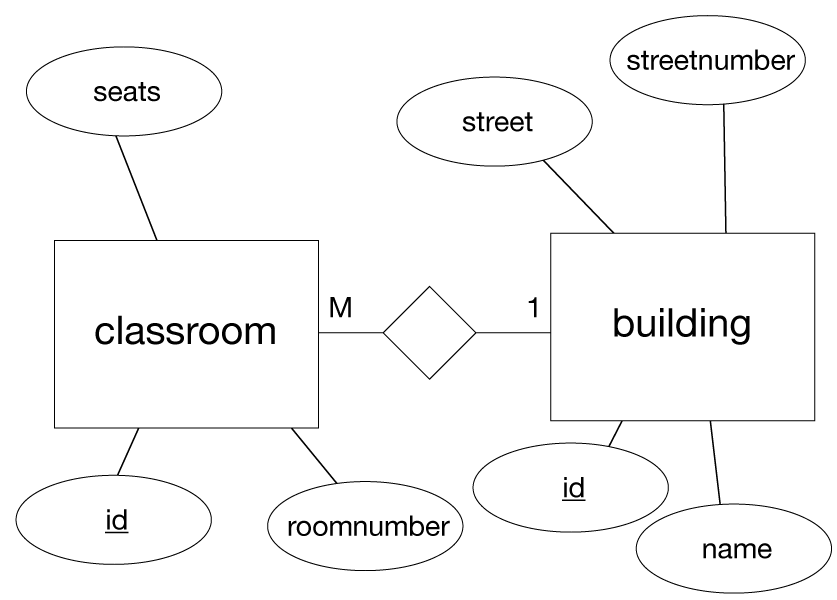

#Självstudier 3

##Uppgift 1

Rita E/R-diagram för en databas som ska innehålla två entiteter:

- sal (*classroom*)
- byggnad (*building*)

Följande information om sal ska sparas i databasen:

- salsbeteckning (*roomnumber*)
- antal platser (*seats*)

Följande information om byggnaden ska sparas:

- gatuadress (*street*)
- gatunummer (*streetnumber*)
- benämning (*name*, tex kranen, ubåtshallen etc)

Dessutom ska det framgå i vilken byggnad en viss sal ligger. Det gör man med ett förhållande mellan entiteterna byggnad och sal.

<!--START SHOW/HIDE-->
<input type="button" value="visa/göm lösning" onclick="toggle('answer1');">

<!--END SHOW/HIDE-->

## Uppgift 2

Vilken typ av förhållande är det mellan byggnad och sal? En-till-en, en-till-många, många-till-en eller många-till-många?

<!--START SHOW/HIDE-->
<input type="button" value="visa/göm lösning" onclick="toggle('answer2');">

Mellan byggnad och sal är sambandet <b>en-till-många</b>: En byggnad kan innehålla många salar. (Mellan sal och byggnad är sambandet <b>många-till-en</b>).

<!--END SHOW/HIDE-->

## Uppgift 3

Ta fram tabeller som motsvarar entiteterna sal och byggnad. Vilka kolumner behövs, dels för själva innehållet, men dessutom för att hantera sambandet mellan sal och byggnad?

<!--START SHOW/HIDE-->
<input type="button" value="visa/göm lösning" onclick="toggle('answer3');">

Vi ser direkt i ER-diagrammet att tabellen <b>classroom</b> behöver kolumnerna <b>id</b>, <b>seats</b> och <b>roomnumber</b>. Dessutom behövs kolumnen <b>buildingid</b> för att koppla ett visst rum till en viss byggnad. 

Tabellen <b>building</b> behöver kolumnerna <b>id</b>, <b>name</b>, <b>street</b> och <b>streetnumber</b>. Här behövs ingen extra kolumn. 

<!--END SHOW/HIDE-->

##Statistik

Jättesnällt om du talar om att du gjort eller försökt göra självstudien. Det är helt anonymt.

<iframe frameborder="0" src="http://ddwap.mah.se/k3bope/me105a/self/result.php?thisstudy=3" width="500" height="500">
</iframe>

