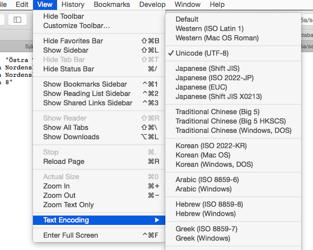
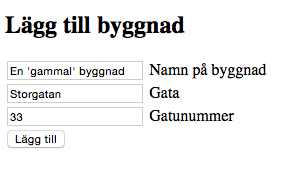
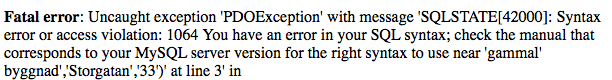

#Självstudier 7

##Uppgift 1

Gör en php-sida som exporterar alla kolumner i tabellen **building** i en tab-separerad fil **utan att använda** php-funktionen `fputcsv`

<!--START SHOW/HIDE-->
<input type="button" value="visa/göm lösning" onclick="toggle('answer1');">

{::options parse_block_html="true" /}

<!doctype html>
<html>
<head>
<meta charset="UTF-8">
<title>Uppgift 1</title>
</head>
<body>
<h1>Självstudie 8</h1>
<h2>Uppgift 1</h2>
<?php
error_reporting(E_ALL);
ini_set('display_errors', 1);

// Anslut till databasen
include $_SERVER['DOCUMENT_ROOT'] . '/username/me105a/connect.php';

// Hämta alla kolumner från tabellen building
$sql = 'SELECT * FROM building';
$result = $pdo->query($sql);

//OBS före loopen måste vi skapa en tom strängvariabel $export som sedan byggs på
$export="";
foreach ($result as $row) {
	$id=$row['id'];   
	$name=$row['name'];
	$street=$row['street'];
	$streetnumber=$row['streetnumber'];
	//lägg ihop alla kolumner till en sträng. tabb-tecken \t mellan varje kolumn, ny rad \n på slutet	
	$tab_separated_row="$id\t$name\t$street\t$streetnumber\n";
	//lägg till aktuell rad sist i strängen $export
	$export.=$tab_separated_row;
}
//nu ska vi spara $export i en fil
$filename="export1.txt";
file_put_contents($filename,$export);
//filen finns nu på webbservern men vi behöver en länk för
//att komma åt den
echo "Hämta exporterad fil: ";
echo "<a href='$filename'>$filename</a>";
?>
</body>
</html>

<!--END SHOW/HIDE-->
 
##Uppgift 2

Gör en php-sida som exporterar alla kolumner i tabellen **building** i en tab-separerad fil **genom att använda** php-funktionen `fputcsv`

<!--START SHOW/HIDE-->
<input type="button" value="visa/göm lösning" onclick="toggle('answer2');">

{::options parse_block_html="true" /}

<!doctype html>
<html>
<head>
<meta charset="UTF-8">
<title>Uppgift 2</title>
</head>

<body>
<h1>Självstudie 8</h1>
<h2>Uppgift 2</h2>
<?php
error_reporting(E_ALL);
ini_set('display_errors', 1);

// Anslut till databasen
include $_SERVER['DOCUMENT_ROOT'] . '/username/me105a/connect.php';

// Hämta alla kolumner från tabellen building
$sql = 'SELECT * FROM building';
$result = $pdo->query($sql);

$filename="export2.txt";

// Öppna filen för att kunna skriva till den
$file = fopen($filename, 'w');

foreach ($result as $row) {
	// Bestäm vilka kolumner som ska skrivas till filen
	// och lägg i en array
	$values = array(
		$row['id'],
		$row['name'],
		$row['street'],
		$row['streetnumber']
	);
	// Skriv alla värden ($values) till vår fil ($file)
	// Separera alla värden med en tab (\t)
	fputcsv($file, $values, "\t");
}

// Stäng filen
fclose($file);
echo "Hämta exporterad fil: ";
echo "<a href='$filename'>$filename</a>";
?>
</body>
</html>

<!--END SHOW/HIDE-->

##Uppgift 3

Gör en php-sida som exporterar alla kolumner i tabellen **building** i en komma-separerad fil **genom att använda** php-funktionen `fputcsv`

<!--START SHOW/HIDE-->
<input type="button" value="visa/göm lösning" onclick="toggle('answer3');">

{::options parse_block_html="true" /}

<!doctype html>
<html>
<head>
<meta charset="UTF-8">
<title>Uppgift 3</title>
</head>

<body>
<h1>Självstudie 8</h1>
<h2>Uppgift 3</h2>
<?php
error_reporting(E_ALL);
ini_set('display_errors', 1);

// Anslut till databasen
include $_SERVER['DOCUMENT_ROOT'] . '/username/me105a/connect.php';

// Hämta alla kolumner från tabellen building
$sql = 'SELECT * FROM building';
$result = $pdo->query($sql);

$filename="export3.txt";

// Öppna filen för att kunna skriva till den
$file = fopen($filename, 'w');

foreach ($result as $row) {
	// Bestäm vilka kolumner som ska skrivas till filen
	// och lägg i en array
	$values = array(
		$row['id'],
		$row['name'],
		$row['street'],
		$row['streetnumber']
	);
	// Skriv alla värden ($values) till vår fil ($file)
	// Separera alla värden med komma
	fputcsv($file, $values, ",");
}

// Stäng filen
fclose($file);
echo "Hämta exporterad fil: ";
echo "<a href='$filename'>$filename</a>";
?>
</body>
</html>

<!--END SHOW/HIDE-->

##Uppgift 4

Använd formuläret från självstudie 4 för att lägga till några byggnader som innehåller olika tecken som kan ställa till problem i databassammanhang, och testa hur exporten från uppgift 3 fungerar. 

Testa byggnadsnamn som innehåller följande tecken:

- åäö
- ; (semikolon)
- , (komma)
- ' (apostrof)
- " (citationstecken)
- mellanslag

Hur ser den exporterade filen ut?

<!--START SHOW/HIDE-->
<input type="button" value="visa/göm lösning" onclick="toggle('answer4');">

{::options parse_block_html="true" /}

Om ett byggnadsnamn innehåller åäö kan filen se konstig ut, men om man väljer rätt teckenkodning, utf-8, bör det bli korrekt:

Om ett byggnadsnamn innehåller semikolon funkar det som vilket tecken som helst


3,Semikolonet;,Storgatan,1


Om ett byggnadsnamn innehåller komma eller mellanslag så läggs automatiskt citationstecken till runt fältet:


4,"Kommat,",Storgatan,2
5,"Mellan slaget",Storgatan,3


Om ett byggnadsnamn innehåller citationstecken kommer citationstecknen att dubbleras för att indikera att de är en del av byggnadsnamnet och inte start eller slut på ett fält:


6,"En ""ny"" byggnad",Storgatan,18


Om ett byggnadsnamn innehåller apostrof går det inte att mata in i databasen utan att ta till något trick:

Hur man matar in apostrofer i databaser diskuteras på sidan 149 och framåt i boken "PHP & MySQL - Novice to Ninja". 

<!--END SHOW/HIDE-->
