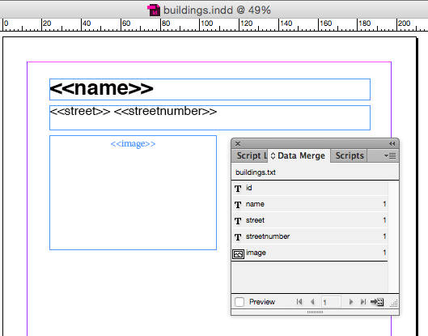
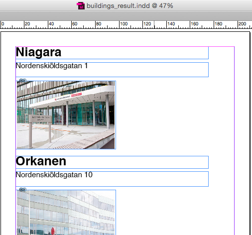

# Självstudier 8

## Uppgift 1

Följande fil är exporterad från tabellen **building** från tidigare självstudier, men även kompletterad med en kolumn som innehåller filnamn på bilder av byggnaderna. InDesign kräver UTF-16- format på filen istället för UTF-8 som vi brukar använda, annars fungerar inte åäö.

Denna fil finns att ladda ned: [buildings.txt UTF-16](buildings.txt). 

Även bilder på byggnaderna finns att ladda ned:

- [niagara](im8/niagara.png)
- [orkanen](im8/orkanen.png)
- [scylla](im8/scylla.png)
- [odontologen](im8/odontologen.png)
- [gaddan](im8/gaddan.png)
- [halsasamhalle](im8/halsasamhalle.png)

Använd InDesigns mergefunktion för att ladda in den tab-separerade textfilen och gör en layout som innehåller namn, adress och bild på byggnaderna. 

<!--START SHOW/HIDE-->
<input type="button" value="visa/göm lösning" onclick="toggle('answer1');">

{::options parse_block_html="true" /}

Följande InDesign-mall läser in buildings.txt och skapar en layout:

[buildings.indd](buildings.indd)

Resultatet av en datamerge blir följande fil:

[buildings_result.indd](buildings_result.indd)

<!--END SHOW/HIDE-->

## Statistik

Jättesnällt om du talar om att du gjort eller försökt göra självstudien. Det är helt anonymt.

<iframe frameborder="0" src="http://ddwap.mah.se/k3bope/me105a/self/result.php?thisstudy=8" width="500" height="500">
</iframe>

