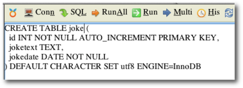

#Laboration 1

Syfte med laborationen:
att testa PHP-kod för att kommunicera med MySQL

Redovisning: Redovisa filen index.php från uppgift 3 samt sql-koden från uppgift 4 på It's learning.

Genom hela kursen kommer vi att använda samma webbserver som i Programmering för webben, <http://ddwap.mah.se>  med stöd för PHP och MySQL. För att kunna använda MySQL-delen för databaser måste först en databas skapas som sedan kan användas genom hela kursen. 

##Uppgift 1

Stegen på sidorna 35-42 i boken PHP & MySQL - Novice to Ninja ska följas, men något modifierade. De modifierade stegen finns beskrivna nedan. 

Gå till <http://ddwap.mah.se> och logga in.

Klicka sedan MYSQL QUERY BROWSER och logga in. **OBS ange ditt användarnamn med små bokstäver, annars blir det problem längre fram i kursen.**

 

 
Det finns nu två databaser, en som heter *information_schema*, som vi *inte* kommer att använda, och en som heter samma som ditt användarnamn, i mitt fall *k3bope*. Det är den vi kommer att använda genom hela kursen. I boken heter databasen som används *ijdb* men vi saknar rättigheter att skapa nya databaser och måste därför använda databasen med samma namn som användarnamnet. 

Nu ska tabellen *joke* skapas enligt instruktionerna på sidan 38 i boken. 

Börja med att markera databasen med ditt användarnamn i listan till vänster.

Skriv sedan in texten på s 38 för att skapa tabellen. Läs i boken vad de olika raderna betyder. 

När det är inskrivet klickar du Run. 

Nu har tabellen *joke* skapats. Klicka plustecknet vid Tables så kan du kolla att *joke* finns: 

Nu ska en post (en rad) läggas till i tabellen. Det finns beskrivet på sidan 41 i boken. Det finns två sätt att göra det, 

Antingen med SET:

eller utan SET:

Prova någon av alternativen. Om det funkar kan du se att en rad lagts till i tabellen om du klickar på den:

Nu är det klart att börja med den egentliga laborationen.

##Uppgift 2

Uppgiften går ut på att fortsätta med joke-tabellen som skapades i föra uppgiften men nu ska vi istället skriva egen PHP-kod för att kommunicera med tabellen. 

Vi kommer att göra ungefär det som beskrivs på s. 96 och framåt i boken, “Connecting to MySQL with PHP”.  

Vissa saker måste dock bytas ut:

- Username är ert användarnamn
- Databasens namn är inte ijdb utan ert användarnamn

PHP-filerna sparas på precis samma sätt som i kursen Programmering för webben. Du kan behålla dina Dreamweaver-inställningar. Om inställningarna inte finns kvar finns det instruktioner på <http://ddwap.mah.se/k3bope/me132a/public2014/dwsettings.pdf>. 

Förhoppningsvis finns mappen ddwap kvar från föregående kurs. Skapa en ny mapp *inuti* ddwap som heter *me105a*.  Skapa dessutom en mapp i me105a som heter *lab1*. Labbens filer lägger du sedan i *ddwap/me105a/lab1*. 

Skapa en ny php-fil i mappen ddwap/me105/lab1 som döps till index.php. Mappen ddwap måste vara den mappen som angetts som Local Site Folder i site-inställningarna i Dreamweaver:

Testa sedan koden nedan. 


<?php
/* 
steg 1: upprätta kontakt mellan php-sidan och databasen
i boken är dbname=ijdb, men på vår server måste vi
använda vårt användarnamn som databasnamn

ersätt k3bope på två ställen med ert userid och 
ersätt XXXXXXXXX med ert lösenord
*/

$pdo=new PDO('mysql:host=localhost;dbname=k3bope','k3bope','XXXXXXXXX'); 

/*steg 2: fråga efter alla rader i tabellen joke*/
$sql='SELECT * FROM joke';
$result=$pdo->query($sql);

/*steg 3: visa alla rader*/
foreach ($result as $row) {
	$joketext=$row['joketext'];
	echo $joketext;
	echo " ";
}
?>


Publicera den på servern och öppna med webbläsare. Om allt funkar ska det skämt som matades in i uppgift 1 visas. 

##Uppgift 3
Som ni ser i föregående uppgift så sparas ert lösenord i klartext i php-filen. Det gör till exempel att den som rättar er labb får tillgång till ert lösenord om ni skickar in filen som den är på it's learning. För att slippa undan är det bättre att lägga lösenordet i en separat fil som infogas med include. Denna fil kan sedan användas genom hela kursen för att ansluta till er databas. En annan brist i koden i föregående uppgift är att eventuella fel vid anslutning till databasen inte hanteras. Även felhanteringen kan läggas in den separata filen med lösenordet. 

Skapa en fil som ligger direkt i katalogen me105a (alltså inte i lab1) som heter *connect.php*. Den ska innehålla följande kod (men med k3bope ersätt med ert användarnamn och xxxxxxx med ert lösenord). Filen ska bara innehålla php-kod, ingen html-kod. 


<?php
try 
{
	$pdo=new PDO('mysql:host=localhost;dbname=k3bope','k3bope','xxxxxxxx');
	$pdo->setAttribute(PDO::ATTR_ERRMODE,PDO::ERRMODE_EXCEPTION);
	$pdo->exec('SET NAMES "utf8"');
} 
catch (Exception $e)
{
	echo "Unable to connect to the database server. ";
	exit();
}
?>


Ersätt sedan raden 


$pdo=new PDO(...


i index.php med


include $_SERVER['DOCUMENT_ROOT'].'/username/me105a/connect.php';


där *username* är ditt användarnamn. 

Testa att öppna index.php med en webbläsare. Om allt funkar ska skämtet som matades in i första uppgiften visas. 

**OBS** Lämna endast in filen index.php på it's learning, behåll connect.php för er själva eftersom den innehåller ert lösenord. 

## Uppgift 4

Använd MySQL Query Browser för att skapa en ny tabell med SQL-kod 


CREATE TABLE...


Tabellen ska heta *contacts* och ha följande kolumner:

- id (med auto increment)
- firstname
- lastname
- email

Lägg sedan till ett namn och epostadress till tabellen. 

Lämna in på it's learning:

- sql-kod för att skapa tabell
- sql-kod för att lägga till namn till tabellen
