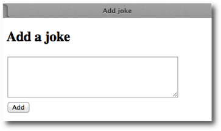
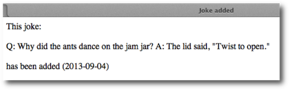

# Laboration 2

Syfte med laborationen:
att göra använda PHP för att ta hand om data från formulär och kommunicera med en MySQL-databas. 

### Förberedelser:

Läs kapitel 4 till och med sidan 118 i boken "PHP & MySQL - Novice to Ninja"

### Redovisning:

Redovisa endast uppgift 3, 4 och 5. Både **php-kod**, samt **ddwap-länk** till uppgifterna lämnas in på <http://peergrade.io>.

### Introduktion

Uppgiften går ut på att fortsätta med joke-tabellen som skapades i labb 1 men nu ska vi istället skriva egna formulär för att kommunicera med tabellen. 

I stora drag kan instruktionerna i kapitel 4 följas men vissa saker måste ändras.

- Username är samma användarnamn som ni använder för att logga in
- Databasens namn är inte *ijdb* utan ert *användarnamn*
- För att inte ert lösenord ska synas lägger vi det i en egen fil som hämtas in vid behov på samma sätt som i laboration 1. 
- Vi kommer att göra sökning i databas något förenklat jämfört med avsnittet *Handling SELECT Results*. I boken används include-filer, en while-loop och en foreach-loop. Vi kommer endast att använda en foreach-loop som i laboration 1. 
 
Om det i boken står 


$pdo=new PDO('mysqli:host=localhost;dbname=ijdb','ijdbuser','mypassword');


så skriver vi istället


//ersätt username med ditt användarnamn
include $_SERVER['DOCUMENT_ROOT'].'/username/me105a/connect.php';


precis som i laboration 1 för att ansluta till databasen. 

## Uppgift 1

Skapa ett formulär, *index.html* i mappen *me105a/lab2/uppgift1/* där man ska kunna lägga till nya skämt. 

Formuläret ska leda vidare till sidan *add.php* som lägger till skämtet i tabellen *joke* i databasen och meddelar att det är gjort. Dagens datum i formatet åååå-mm-dd ska automatiskt läggas till i tabellen (jämför laboration 1 i grundkursen Programmering för webben)

## Uppgift 2

Komplettera uppgift 1 så att sidan med formuläret även visar alla tidigare skämt. Sidan med formuläret måste nu vara en PHP-sida istället för HTML. Döp filen till *index.php* och lägg i */ddwap/me105a/lab2/uppgift2/*

Har du glömt hur man visar sökresultatet ur tabellen? Se laboration 1. 

## Uppgift 3

Det kan bli problem om man matar in html-taggar i formuläret i uppgift 1 och 2. Om man gör följande inmatning

blir resultatet

Modifiera uppgift 2 så att sidan som tar emot skämtet och lägger till det i databasen tar hand om eventuell html-kod i formulärinmatningen. 

## Uppgift 4

I förra labben skapades även tabellen *contacts*. Gör ett formulär och en svarssida där du kan mata in namn och e-post. 

## Uppgift 5

Gör en sida *showall.php* som visar alla namn och e-postadresser som finns i tabellen *contacts*. 

## Uppgift 6 (frivillig)

Komplettera uppgift 4 så att epost-adressen endast läggs till i tabellen om den innehåller ett @-tecken. Tips: använd php-funktionen [strpos](http://php.net/manual/en/function.strpos.php) för att testa om @-tecknet finns med. 