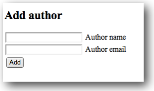

>>>>>>> me105a

# Laboration 3

Syftet med laborationen är att komplettera joke-databasen så att den även kan hantera vem som som matat in skämten. **OBS** I uppgift 1-3 hanterar vi databasen direkt med SQL-kommandon i MySQL Query Browser. I uppgift 4 använder vi istället PHP-kod.

## Uppgift 1

Gå in på ddwap.mah.se, Manage files, och sedan MySQL Query Browser. Komplettera tabellen joke med en kolumn för **authorname** och en kolumn för **authoremail** enligt s 143 i boken. 

Lägg sedan till några namn och epostadresser. Utgå från följande exempel


UPDATE joke SET authorname='Bo P', 
authoremail='bo.peterson@mah.se' WHERE id=1


men ändra authorname, authorid och id till lämpliga värden.

## Uppgift 2

Extra kolumner för namn och epost är inte bästa sättet att hantera användaruppgifter i en databas. Bättre är att skapa en separat tabell med användaruppgifter och sedan koppla tabellerna till varandra. 

- Börja med att ta bort authorname- och authoremailkolumnerna som du just skapat. Se sidan 146. 

- Skapa sedan tabellen author, även det beskrivet på s 146. 

- Slutligen ska tabellen joke kompletteras med kolumnen authorid (se s 146). 

Nu har vi en bättre struktur för databasen och kan börja lägga in data. 

## Uppgift 3

Lägg till dig själv som author i tabellen author. Det kan göras enligt exemplet på s 147, 


INSERT INTO author SET id=1 


osv. 

Koppla alla skämt du lagt till i jokedatabasen till dig själv. Det gör du med


UPDATE joke SET authorid=1


**OBS** Eftersom det inte finns något WHERE på slutet uppdateras *samtliga* rader i tabellen. 

## Uppgift 4

I förra labben gjorde vi php-sidor för att lägga till ett skämt i joke-tabellen. Gör nu sidor på samma sätt för att lägga till name och email i authortabellen. Gör en sida *index.php* som leder vidare till *add.php*. Lägg sidorna i */ddwap/me105a/lab3/uppgift4/*

## Uppgift 5

xxx kolla på uppgifterna i lab 2