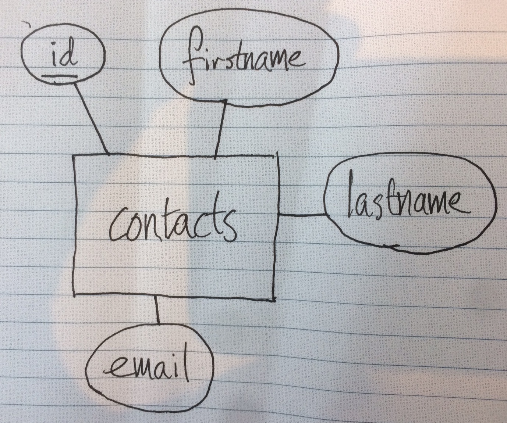
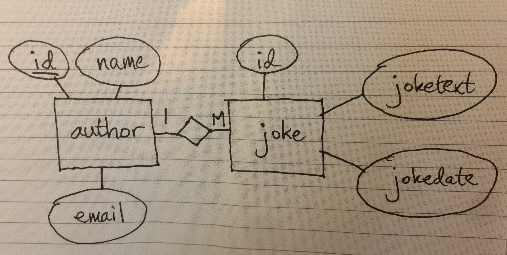

# Laboration 3 lösning

## Uppgift 1

```sql
ALTER TABLE joke ADD COLUMN authorname VARCHAR(255);
ALTER TABLE joke ADD COLUMN authoremail VARCHAR(255);
UPDATE joke SET authorname='Bo P', authoremail='bo.peterson@mah.se' WHERE id=1;
UPDATE joke SET authorname='Axel O', authoremail='axel.olsson@mah.se' WHERE id=2;
```

## Uppgift 2

```sql
ALTER TABLE joke DROP COLUMN authorname;
ALTER TABLE joke DROP COLUMN authoremail;

CREATE TABLE author (
id INT NOT NULL AUTO_INCREMENT PRIMARY KEY,
name VARCHAR(255),
email VARCHAR(255)
);

ALTER TABLE joke ADD COLUMN authorid INT;
```

## Uppgift 3

```sql
INSERT INTO author SET id=1, name='Bo P', email='bo.peterson@mah.se';
INSERT INTO author SET id=2, name='Axel O', email='axel.olsson@mah.se';
UPDATE joke SET authorid=1;
```


## Uppgift 4

### authorform.php

```php
<!doctype html>
<html>
<head>
<meta charset="UTF-8">
<title>Lab 3 uppgift 4</title>
</head>

<body>
<h2>Add author</h2>
<form method="post" action="authoradded.php">
<input type="text" name="name"> Author name<br>
<input type="email" name="email"> Author email<br>
<input type="submit" value="Add">
</form>
</body>
</html>

```

### authoradded.php

```php
<!doctype html>
<html>
<head>
<meta charset="UTF-8">
<title>Add author</title>
</head>

<body>
<?php
//första steget är att ta hand om data från formuläret
$name=$_POST['name'];
$email=$_POST['email'];
//anslut till databasen - ersätt k3bope med ert eget användarnamn
include $_SERVER['DOCUMENT_ROOT'].'/k3bope/me105a/connect.php';

$sql="INSERT INTO author 
(name,email) VALUES
('$name','$email')";

$result=$pdo->exec($sql);

echo "$name has been added";
?>
</body>
</html>

```

## Uppgift 5

Tabellen *contacts* blir vår entitet i E/R-diagrammet. Eftersom vi bara har en tabell har vi bara en entitet. Kolumnerna i tabellen blir attribut till entiteten. Entiteterna ritas som rektanglar, attributen som ellipser. 



## Uppgift 6

Tabellerna *joke* och *author* blir våra två entiteter i E/R-diagrammet. Kolumnerna i respektive tabell blir attribut till entiteterna. Kolumnen *authorid* i tabellen joke är ett så kallat referensattribut och ritas *inte* som en ellips. Istället är det den kolumnen som anger förhållandet, kopplingen, mellan tabellerna *joke* och *author*. 




