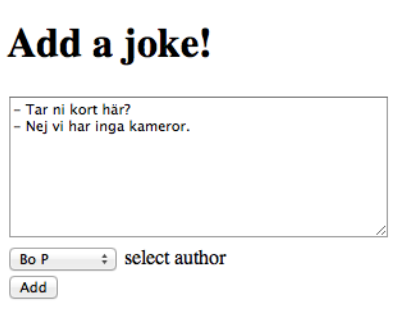
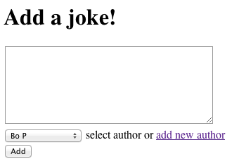
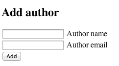
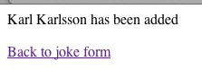
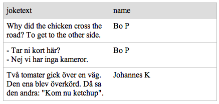

# Laboration 4

I laboration 2 gjorde vi ett formulär för att lägga till skämt i joke-tabellen och i laboration 3 gjorde vi formulär för att lägga till författare i author-tabellen. Nu ska vi knyta ihop dessa formulär.

## Uppgift 1

**Joke**-tabellen har nu följande struktur:

| <u>id</u> | joketext | jokedate | authorid |
| --- | --- | --- | --- |
| 1 | Why did the chicken cross... | 2013-09-16 | 1 |
| 2 | - Tar ni kort här... | 2013-09-20 | 1 |
| 3 | Två tomater... | 2014-09-15 | 2 |

**Author**-tabellen har följande struktur:

| <u>id</u> | name | email |
| --- | --- | --- |
| 1 | Bo P | bo.peterson@mah.se |
| 2 | Johannes K | johannes.karlsson@mah.se |
| 3 | Sebastian B | sebastian.bengtegard@mah.se |

Gör ett formulär precis som i laboration 2, uppgift 1, där man kan lägga till skämt, men här ska man även kunna välja *author* i en dropdown-meny. Alla authors som finns med i tabellen author ska visas i menyn. 

Komplettera *index.php* så att man kan lägga till skämt som i laboration 2 uppgift 3 men så att sidan även visar en dropdown-meny där man kan välja användare. Formuläret ska precis som i laboration 2 leda vidare till sidan *add.php* som lägger till skämtet, datumet, och även id för *author*. 

 
Detta kräver en sökning i author-tabellen, och varje rad i dropdown-meny skapas av en loop. Det gäller alltså att skriva PHP-kod som skapar följande HTML-kod. Om nya namn läggs till i author ska de automatiskt dyka upp i dropdown-menyn. Om tex Bo P (id=1), Johannes K (id=2) och Sebastian B (id=3) finns i author-tabellen, ska HTML-koden som PHP producerar bli så här:


<select name='authorid'>
<option value='1'>Bo P</option>
<option value='2'>Johannes K</option>
<option value='3'>Sebastian B</option>
</select>


## Uppgift 2

Lägg till en länk add new author som leder till formulär för att lägga till author.

Länken add new author ska leda till sidan *autorform.html* som in sin tur leder till sidan *authoradded.php* som tar emot data från formuläret och lägger in i tabellen author.

Sidan *authoradded.php* ska ha en länk tillbaka till *index.php* så att man kan lägga till ett skämt med den nytillagda författaren. 

Nu finns ett komplett system för att lägga till författare och skämt och koppla dem till varandra. 

## Uppgift 2

Fundera över systemets användbarhet. Vad händer om matat in ett skämt, upptäcker att författaren inte finns i menyn, klickar *add new author* och sedan tillbaka till formuläret för att lägga till skämt. Lämna kortfattat in dina tankar om detta på It's learning.  

## Uppgift 3

Nu ska MySQL Qurey Browser användas för att testa att söka i tabellerna joke och author samtidigt. 

Ange SQL-kod för att söka samtliga skämt med författare och vem som är författare till skämten. Använd 


SELECT * FROM joke INNER JOIN author... 


för att göra sökningen. Redovisa SQL-koden på It's learning. 

## Uppgift 4

Använd sedan INNER JOIN för att  söka alla skämt i joketabellen som  har ditt eget namn som författare. Redovisa korrekt SQL-kod för detta på it's learning. 

## Uppgift 5

Gör en PHP-sida som listar alla skämt som finns i databasen inklusive författare. Sidan kan heta *showalljokes.php* och visa följande (men med era egna skämt):

