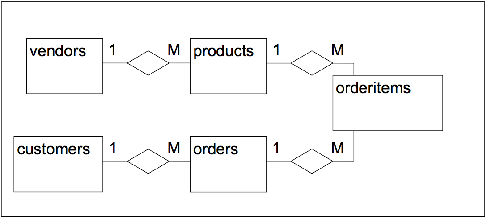

<style>
pre {white-space: pre-wrap;}
</style>

# Laboration 5

I denna labb ska vi skapa tabeller för ett orderhanteringssystem, och sedan göra olika sökningar i systemet. Ordersystemet har ett E/R-diagram enligt nedan. Attributen är utelämnade men framgår av tabellerna nedan. Vi kommer uteslutande att arbeta med MySQL Query Browser idag (inga PHP-sidor alltså). All SQL-kod du skapar i uppgifterna lämnas in på [peergrade.io](http://peergrade.io). **OBS: se till att du genom hela labben sparar all SQL-kod i en textfil som du sedan kan lämna in!**. Lämna in SQL-koden till uppgift 1 samt uppgift 3-10. Svara även på frågorna i de uppgifter där det även ställs en fråga. 



Detta diagram kan översättas till följande tabeller. Typen för varje kolumn framgår också, och primärnycklarna är understrukna. Både kolumner av typen TEXT och CHAR(10) kan innehålla text, men med vissa skillnader. CHAR(10) kan endast innehålla upp till 10 tecken, men kan i gengäld användas som primärnyckel. Kolumner av typen TEXT kan inte vara primärnyckel.

 **vendors** | 
 --- | ---
<u>vend_id</u> | CHAR(10)
vend_name	 | TEXT
vend_address | TEXT
vend_city | TEXT
vend_state | TEXT
vend_zip | TEXT
vend_country | TEXT

**products** | 
 --- | ---
<u>prod_id</u> | CHAR(10)
vend_id | CHAR(10)
prod_name | TEXT
prod_price | DECIMAL(8,2)
prod_desc | TEXT



**customers** | 
 --- | ---
<u>cust_id</u> | CHAR(10)
cust_name | TEXT
cust_address | TEXT
cust_city | TEXT
cust_state | TEXT
cust_zip | TEXT
cust_country | TEXT
cust_contact | TEXT
cust_email | TEXT

**orders** | 
 --- | ---
<u>order_num</u> | INT
order_date | DATETIME
cust_id | CHAR(10)

**orderitems** | 
 --- | ---
<u>order_num</u> | INT
order_item | INT
<u>prod_id</u> | CHAR(10) 
quantity | INT
item_price | DECIMAL(8,2)

**OBS** att orderitems har två kolumner som tillsammans utgör primärnyckeln. 

## Uppgift 1

Börja med att logga in på MySQL Query Browser. Skriv SQL-kod i inmatningsfältet för att skapa alla tabellerna ovan! Skapa en tabell åt gången. Det är mycket viktigt att tabell- och kolumnnamn stavas exakt som i tabellerna ovan, samt att prmary key anges korrekt. Observera att orderitems har två kolumner tillsammans som primary key. 

- Lämna in SQL-kod på Peergrade.

## Uppgift 2

Mata in data i de olika tabellerna. Till detta finns färdig SQL-kod sist i handledningen. OBS: om du i uppgift 1 gjort något fel när du skapat någon tabell kommer det kanske inte att fungera att lägga till data. Gå då tillbaka till uppgift 1, ta bort tabellen med DROP TABLE.... och skapa en ny som är korrekt. 

## Uppgift 3

Visa en lista med namn på alla produkter samt landet (vend_country) för produktens försäljare (vendor). Ledtråd: man måste söka i både products och vendors och koppla ihop dem med INNER JOIN

- Lämna in SQL-kod på Peergrade.
- Lämna även in en lista över alla produkter som hittas i sökningen. *Tips*: Klicka orangea nedåtpilen ovanför sökresultatet och sedan *Export* för att enklare kunna kopiera sökresultatet. 



## Uppgift 4

Visa en lista med namn på alla kunder (customers) och orderdatum (order_date) för alla beställningar som gjorts till och med januari 2001. Ledtråd: börja med att koppla ihop customers och orders med INNER JOIN. Lägg till ett villkor med WHERE som kollar att datum är mindre än '2001-02-01'

- Lämna in SQL-kod på Peergrade.
- Lämna även in en lista över alla kunder som hittas. 

## Uppgift 5

Vem (dvs vilket customer name) har gjort order nr 20007?

- Lämna in SQL-kod på Peergrade.
- Lämna även in namn på kunden som gjorde ordern. 

## Uppgift 6

Visa en lista över ordernummer på alla beställningar som Village Toys gjort.

- Lämna in SQL-kod på Peergrade.
- Lämna även in en lista över de ordernummer som hittades. 

## Uppgift 7

Hur många ordrar har Village Toys gjort?

- Lämna in SQL-kod på Peergrade.
- Ange även hur många ordrar Village Toys gjort.

## Uppgift 8

Visa en lista med order_num, prod_desc och order_date för samtliga beställda objekt. Ledtråd: här måste orders och products kopplas ihop via orderitems. Man måste alltså göra alltså först koppla ihop products och orderitems med INNER JOIN, och sedan koppla vidare till orders, också med INNER JOIN.

- Lämna in SQL-kod på Peergrade.
- Lämna även in en lista över alla order_num, prod_desc och order_date som hittades.

## Uppgift 9

Visa namnet på alla customers som beställt en 'Raggedy Ann'

- Lämna in SQL-kod på Peergrade.
- Lämna även in en lista över alla customers som hittades. 


## Uppgift 10

Visa sorterat i bokstavsordning namn och beskrivning för alla produkter där beskrivningen innehåller ordet 'doll'

- Lämna in SQL-koden för alla uppgifter på Peergrade.
- Lämna även in den sorterade listan.


## SQL-kod för att lägga till data i tabellerna

```sql
#customers
INSERT INTO customers(cust_id, cust_name, cust_address, cust_city, cust_state, cust_zip, cust_country, cust_contact, cust_email)
VALUES('1000000001', 'Village Toys', '200 Maple Lane', 'Detroit', 'MI', '44444', 'USA', 'John Smith', 'sales@villagetoys.com');

INSERT INTO customers(cust_id, cust_name, cust_address, cust_city, cust_state, cust_zip, cust_country, cust_contact)
VALUES('1000000002', 'Kids Place', '333 South Lake Drive', 'Columbus', 'OH', '43333', 'USA', 'Michelle Green');

INSERT INTO customers(cust_id, cust_name, cust_address, cust_city, cust_state, cust_zip, cust_country, cust_contact, cust_email)
VALUES('1000000003', 'Fun4All', '1 Sunny Place', 'Muncie', 'IN', '42222', 'USA', 'Jim Jones', 'jjones@fun4all.com');

INSERT INTO customers(cust_id, cust_name, cust_address, cust_city, cust_state, cust_zip, cust_country, cust_contact, cust_email)
VALUES('1000000004', 'Fun4All', '829 Riverside Drive', 'Phoenix', 'AZ', '88888', 'USA', 'Denise L. Stephens', 'dstephens@fun4all.com');

INSERT INTO customers(cust_id, cust_name, cust_address, cust_city, cust_state, cust_zip, cust_country, cust_contact)
VALUES('1000000005', 'The Toy Store', '4545 53rd Street', 'Chicago', 'IL', '54545', 'USA', 'Kim Howard');

#orderitems
INSERT INTO orderitems(order_num, order_item, prod_id, quantity, item_price)
VALUES(20005, 1, 'BR01', 100, 5.49);

INSERT INTO orderitems(order_num, order_item, prod_id, quantity, item_price)
VALUES(20005, 2, 'BR03', 100, 10.99);

INSERT INTO orderitems(order_num, order_item, prod_id, quantity, item_price)
VALUES(20006, 1, 'BR01', 20, 5.99);

INSERT INTO orderitems(order_num, order_item, prod_id, quantity, item_price)
VALUES(20006, 2, 'BR02', 10, 8.99);

INSERT INTO orderitems(order_num, order_item, prod_id, quantity, item_price)
VALUES(20006, 3, 'BR03', 10, 11.99);

INSERT INTO orderitems(order_num, order_item, prod_id, quantity, item_price)
VALUES(20007, 1, 'BR03', 50, 11.49);

INSERT INTO orderitems(order_num, order_item, prod_id, quantity, item_price)
VALUES(20007, 2, 'BNBG01', 100, 2.99);

INSERT INTO orderitems(order_num, order_item, prod_id, quantity, item_price)
VALUES(20007, 3, 'BNBG02', 100, 2.99);

INSERT INTO orderitems(order_num, order_item, prod_id, quantity, item_price)
VALUES(20007, 4, 'BNBG03', 100, 2.99);

INSERT INTO orderitems(order_num, order_item, prod_id, quantity, item_price)
VALUES(20007, 5, 'RGAN01', 50, 4.49);

INSERT INTO orderitems(order_num, order_item, prod_id, quantity, item_price)
VALUES(20008, 1, 'RGAN01', 5, 4.99);

INSERT INTO orderitems(order_num, order_item, prod_id, quantity, item_price)
VALUES(20008, 2, 'BR03', 5, 11.99);

INSERT INTO orderitems(order_num, order_item, prod_id, quantity, item_price)
VALUES(20008, 3, 'BNBG01', 10, 3.49);

INSERT INTO orderitems(order_num, order_item, prod_id, quantity, item_price)
VALUES(20008, 4, 'BNBG02', 10, 3.49);

INSERT INTO orderitems(order_num, order_item, prod_id, quantity, item_price)
VALUES(20008, 5, 'BNBG03', 10, 3.49);

INSERT INTO orderitems(order_num, order_item, prod_id, quantity, item_price)
VALUES(20009, 1, 'BNBG01', 250, 2.49);

INSERT INTO orderitems(order_num, order_item, prod_id, quantity, item_price)
VALUES(20009, 2, 'BNBG02', 250, 2.49);

INSERT INTO orderitems(order_num, order_item, prod_id, quantity, item_price)
VALUES(20009, 3, 'BNBG03', 250, 2.49);

#orders
INSERT INTO orders(order_num, order_date, cust_id)
VALUES(20005, '2001/5/1', '1000000001');

INSERT INTO orders(order_num, order_date, cust_id)
VALUES(20006, '2001/1/12', '1000000003');

INSERT INTO orders(order_num, order_date, cust_id)
VALUES(20007, '2001/1/30', '1000000004');

INSERT INTO orders(order_num, order_date, cust_id)
VALUES(20008, '2001/2/3', '1000000005');

INSERT INTO orders(order_num, order_date, cust_id)
VALUES(20009, '2001/2/8', '1000000001');

#products
INSERT INTO products(prod_id, vend_id, prod_name, prod_price, prod_desc)
VALUES('BR01', 'BRS01', '8 inch teddy bear', 5.99, '8 inch teddy bear, comes with cap and jacket');

INSERT INTO products(prod_id, vend_id, prod_name, prod_price, prod_desc)
VALUES('BR02', 'BRS01', '12 inch teddy bear', 8.99, '12 inch teddy bear, comes with cap and jacket');

INSERT INTO products(prod_id, vend_id, prod_name, prod_price, prod_desc)
VALUES('BR03', 'BRS01', '18 inch teddy bear', 11.99, '18 inch teddy bear, comes with cap and jacket');

INSERT INTO products(prod_id, vend_id, prod_name, prod_price, prod_desc)
VALUES('BNBG01', 'DLL01', 'Fish bean bag toy', 3.49, 'Fish bean bag toy, complete with bean bag worms with which to feed it');

INSERT INTO products(prod_id, vend_id, prod_name, prod_price, prod_desc)
VALUES('BNBG02', 'DLL01', 'Bird bean bag toy', 3.49, 'Bird bean bag toy, eggs are not included');

INSERT INTO products(prod_id, vend_id, prod_name, prod_price, prod_desc)
VALUES('BNBG03', 'DLL01', 'Rabbit bean bag toy', 3.49, 'Rabbit bean bag toy, comes with bean bag carrots');

INSERT INTO products(prod_id, vend_id, prod_name, prod_price, prod_desc)
VALUES('RGAN01', 'DLL01', 'Raggedy Ann', 4.99, '18 inch Raggedy Ann doll');

INSERT INTO products(prod_id, vend_id, prod_name, prod_price, prod_desc)
VALUES('RYL01', 'FNG01', 'King doll', 9.49, '12 inch king doll with royal garments and crown');

INSERT INTO products(prod_id, vend_id, prod_name, prod_price, prod_desc)
VALUES('RYL02', 'FNG01', 'Queen doll', 9.49, '12 inch queen doll with royal garments and crown');

#vendors
INSERT INTO vendors(vend_id, vend_name, vend_address, vend_city, vend_state, vend_zip, vend_country)
VALUES('BRS01','Bears R Us','123 Main Street','Bear Town','MI','44444', 'USA');

INSERT INTO vendors(vend_id, vend_name, vend_address, vend_city, vend_state, vend_zip, vend_country)
VALUES('BRE02','Bear Emporium','500 Park Street','Anytown','OH','44333', 'USA');

INSERT INTO vendors(vend_id, vend_name, vend_address, vend_city, vend_state, vend_zip, vend_country)
VALUES('DLL01','Doll House Inc.','555 High Street','Dollsville','CA','99999', 'USA');

INSERT INTO vendors(vend_id, vend_name, vend_address, vend_city, vend_state, vend_zip, vend_country)
VALUES('FRB01','Furball Inc.','1000 5th Avenue','New York','NY','11111', 'USA');

INSERT INTO vendors(vend_id, vend_name, vend_address, vend_city, vend_state, vend_zip, vend_country)
VALUES('FNG01','Fun and Games','42 Galaxy Road','London', NULL,'N16 6PS', 'England');

INSERT INTO vendors(vend_id, vend_name, vend_address, vend_city, vend_state, vend_zip, vend_country)
VALUES('JTS01','Jouets et ours','1 Rue Amusement','Paris', NULL,'45678', 'France');
```

