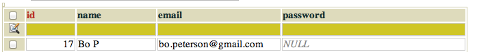
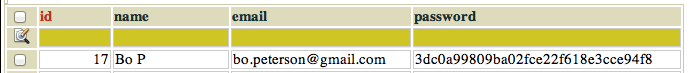
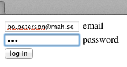
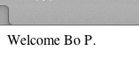
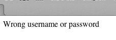
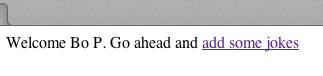
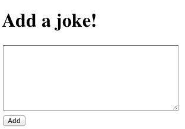
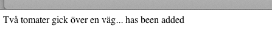

#Laboration 6

##Uppgift 1

Uppgiften går ut på att göra inloggning med lösenord, där vi använder tabellen author för att hantera användarnamn och lösenord.
Först måste vi förbereda tabellen author så att den kan innehålla lösenord. 

Steg 1:  lägg till kolumnen password av typen CHAR(32) i tabellen author:


ALTER TABLE author ADD COLUMN password CHAR(32);


Steg 2: vi ska använda email som användarid, och då måste denna kolumn definieras om så att den bara får innehålla unika värden. Gör på följande sätt:


ALTER TABLE author ADD UNIQUE(email)


OBS här kanske du får ett felmeddelande om kolumnen email redan innehåller dubletter (samma email på flera rader). Ta då bort dublettraderna och försök igen. 

Steg 3: 

Troligtvis har du en rad i author-tabellen med ditt namn och epost-adress, men där password-kolomnen är tom: (om inte måste du lägga till en sådan rad)

Nu ska du komplettera den raden med ett kodat lösenord. Det görs med funktionen MD5, som kodar lösenordet så att lösenordet inte sparas i klartext i tabellen. Följande sql-kod kan användas


UPDATE author SET password=MD5('lösenordijdb') WHERE id=17


men id=17 måste bytas ut mot det id som du har i din tabell, och lösenord måste bytas ut till ett lösenord som du själv väljer. Det är viktigt att du kommer ihåg det lösenordet under resten av labben! När du har gjort detta kan det se ut så här:

Steg 4: Gör sidan /me105/laboration6/uppgift1/login.php med ett formulär som leder vidare till /me105/laboration6/uppgift1/check.php som är sidan som kollar lösenordet mot databasen:

Sidan check.php får olika utseende om man använt rätt lösenord eller inte:
 

##Uppgift 2

Komplettera sidan check.php så att den sätter följande sessionsvariabler:


$_SESSION['authorname']=...
//ska innehålla namnet på den som loggat in, 
//eller vara tom om inloggningen misslyckats

$_SESSION['authorid']=...
//ska innehålla authorid för den som loggat in 
//eller vara tom om man misslyckats

$_SESSION['loggedin']=...
//ska var true om man lyckats och 
//false om man misslyckats


Sidan check.php ska även ha en länk som leder vidare till formuläret jokeform.php. Sidan ska då se ut som till första alternativet om man lyckas logga in och som andra om man misslyckas:

Sidan jokeform.php innehåller ett formulär leder vidare till add.php. Formuläret ska se ut så här:

Slutligen gör vi sidan add.php som är den sida som tar hand om formulärinnehållet och lägger till skämtet i joke-tabellen. OBS: i joketabellen ska även authorid på den som loggat in fyllas i. 

##Uppgift 3

Se till att du har minst två korrekta epost-adresser med tillhörande lösenord i author-tabellen. Testa att logga in med först ena adressen och lägg till ett skämt, sedan med andra adressen och lägg till ett skämt. Du kan nu söka alla skämt i tabellen med


SELECT joketext,name FROM joke INNER JOIN author 
ON author.id=authorid


för att få fram alla skämt och deras författare. Testa att sökningen funkar. 

##Uppgift 4

Vi har nu sett till så att man måste ha lösenord för att kunna logga in. Vi har däremot inte säkrat databasen mot sql-injections. Komplettera formulärhanteringen så att databasen har ett grundläggande skydd mort det. 

