

# Laboration 7

I denna lab ska vi exportera produkterna i tabellerna products i olika format. Först som en vanlig html-sida, sedan som en tab-separerad fil och slutligen i xml-format.

## Uppgift 1

Uppgiften är att söka alla produkter i tabellen products, och visa en rubrik med produktnamn och pris, sedan en bild, sedan produktbeskrivning. Ni har tillgång till en [zip-fil](im7/images.zip) med en bild för varje produkt, och filnamnet är *prod_id.jpg*. För tex Bird bean bag toy med produktid *BNBG02* är filnamnet på bilden *BNBG02.jpg*. **OBS** Ibland har skolans datorer problem med att packa upp zip-filer. Bilderna finns var för sig i en bilaga i slutet av handledningen som kan användas istället. 

Webbsidan kan till exempel se ut så här:

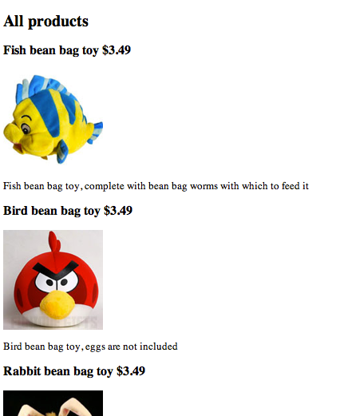

## Uppgift 2

Uppgiften är att skriva en php-sida som skapar en tab-separerad fil med kolumnerna prod_id, prod_price, prod_name och prod_desc för alla produkter i tabellen products. Sidan ska med funktionen file_put_contents() skapa en textfil samt visa en länk till filen. Sidan kan se ut så här:

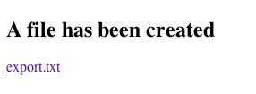

När man klickar export.txt ska man få fram den tab-separerade filen:

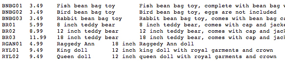

## Uppgift 3

**OBS UPPGIFT 3 KOMMER ATT ÄNDRAS FRÅN XML TILL JASON!!! KLART SENAST TISDAG FÖRMIDDAG**

~~Nu ska istället en xml-fil skapas med samma data som i tab-filen i förra uppgiften. Målet är att filen ska ha följande struktur:~~

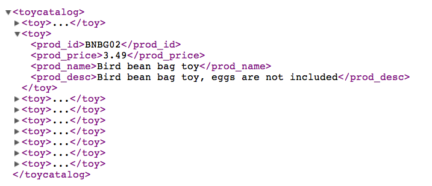

Rotelementet heter alltså `<toycatalog>`. Varje rad i tabellen products motsvaras av elementet `<toy>`. Varje `<toy>...</toy>` innehåller i sin tur elementen `<prod_id>`, `<prod_price>`, `<prod_name>` och `<prod_desc>`. 

Gör en php-sida som skapar xml-filen export1.xml och visar en länk till den: 

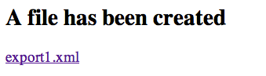

Börja med en variabel som tex heter `$export` och får rotelementet som startvärde:

	
$export="<toycatalog>";


bygg sedan på denna variabel i en while-loop som loopar igenom resultatet från sökningen i products:


$export.="<toy>";
$export.="<prod_id>";
$export.= här ska ett värde ur tabellen products komma
$export.="</prod_id>";
//etcetera


När man klickar länken ska xml-sidan visas:

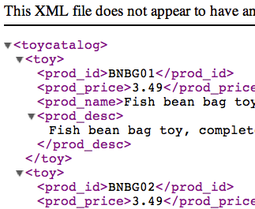

## Uppgift 4 - frivillig

PHP har ett antal färdiga funktioner för att bygga upp xml-dokument. 

Ett rotelement med namnet toycatalog kan skapas med följande rader kod:


$xml=new SimpleXMLElement("<toycatalog></toycatalog>");


För varje rad i tabellen (dvs inne i en loop) skapas ett toy-element:


$toy = $xml->addChild("toy");


För varje kolumn i tabellen skapas ett child-element till toy-elementet enligt följande grundexempel:


$toy->addChild('prod_name',$row['prod_name']);


För prod_price ska vi även lägga till ett attribut "currency". Vi måste då tillfälligt lagra prod_price-noden i en variabel, för att sedan lägga till attributet:


$price = $toy->addChild('prod_price',$row['prod_price']);
$price->addAttribute("currency","dollars");


När alla rader och kolumner är tillagda finns hela xml-strukturen i variabeln `$xml`. Denna kan exporteras till en fil med funktionen `asXML()`.


$xml->asXML("$filename");


Skapa en php-sida som i 3 men som använder funktionerna ovan för att skapa själva xml-dokumentet. 

<!--START SHOW/HIDE-->
<input type="button" value="visa/göm lösning till frivillig uppgift" onclick="toggle('answer4');">

{::options parse_block_html="true" /}



<!doctype html>
<html>
<head>
<meta charset="UTF-8">

<title>Xml</title>
</head>

<body>

<?php
include $_SERVER['DOCUMENT_ROOT'] . "/k3bope/me105a/connect.php";
$sql="SELECT prod_price,prod_id,prod_name,prod_desc FROM products";
$result=$pdo->query($sql);

$output="<h2>A file has been created</h2>";

$filename="products.xml";

//skapa xml med rot
$xml=new SimpleXMLElement("<toycatalog></toycatalog>");
foreach ($result as $row) {
	//lägg till toy-element för varje produkt
	$toy = $xml->addChild("toy");
	
	//lägg till id.
	$toy->addChild('prod_id',$row['prod_id']);
	
	//lägg till produktnamn
	$toy->addChild('prod_name',$row['prod_name']);
	
	//lägg till pris. Obs: eftersom vi behöver lägga till attributet
	//currency måste vi mellanlagra noden i variabeln $price
	$price = $toy->addChild('prod_price',$row['prod_price']);
	$price->addAttribute("currency","dollars");
	
	//lägg till beskrivning
	$toy->addChild('prod_desc',$row['prod_desc']);
	
}
$xml->asXML("$filename");

$output.="<a href='$filename'>$filename</a>";

echo $output;

?>

</body>
</html>


<!--END SHOW/HIDE-->

## Bilaga med bilder att använda

### zip-arkiv med samtliga bilder

[images.zip](im7/images.zip)

### samma bilder som o i zip-arkivet men var för sig

BNBG01.jpg
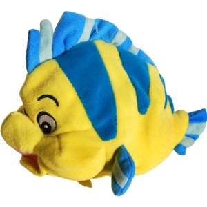
BNBG02.jpg
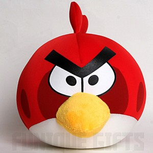
BNBG03.jpg

BR01.jpg

BR02.jpg
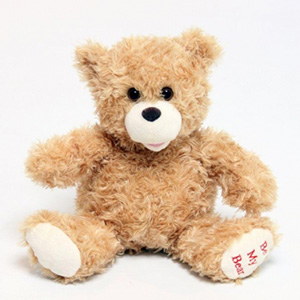
BR03.jpg

RGAN01.jpg
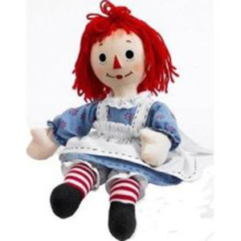
RYL01.jpg
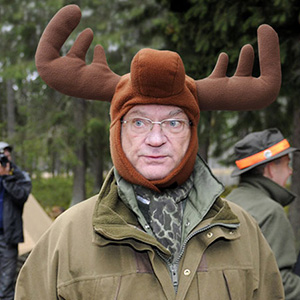
RYL02.jpg

