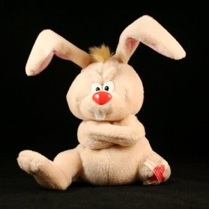
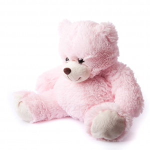

<style>
pre {white-space: pre-wrap;}
img { 
   border:1px solid #CCCCCC;
}
</style>

<script>
  var toggle = function(id) {
  var mydiv = document.getElementById(id);
  if (mydiv.style.display === 'block' || mydiv.style.display === '')
    mydiv.style.display = 'none';
  else
    mydiv.style.display = 'block'
  }
</script>


# Laboration 7

I denna lab ska vi exportera produkterna i tabellerna products i olika format. Först som en vanlig html-sida, sedan som en tab-separerad fil och slutligen i json-format.

## Uppgift 1

Uppgiften är att söka alla produkter i tabellen products, och visa en rubrik med produktnamn och pris, sedan en bild, sedan produktbeskrivning. Ni har tillgång till en [zip-fil](im7/images.zip) med en bild för varje produkt, och filnamnet är *prod_id.jpg*. För tex Bird bean bag toy med produktid *BNBG02* är filnamnet på bilden *BNBG02.jpg*. **OBS** Ibland har skolans datorer problem med att packa upp zip-filer. Bilderna finns var för sig i en bilaga i slutet av handledningen som kan användas istället. 

Webbsidan kan till exempel se ut så här:


## Uppgift 2

Uppgiften är att skriva en php-sida som skapar en tab-separerad *export.txt* fil med kolumnerna prod_id, prod_price, prod_name och prod_desc för alla produkter i tabellen products. Sidan ska med hjälp av funktionen fputcsv() skapa en textfil samt visa en länk till filen. Sidan kan se ut så här:


När man klickar på *export.txt* ska man få fram den tab-separerade filen:


## Uppgift 3

Vi ska nu göra en sida liknande den i uppgift 2 men som exporterar i json-format. Servern ddwap kan skapa filer med fil-ändelsen json, men om man försöker öppna en json-fil blir det ibland problem. För att undvika detta döper vi vår exportfil till *export.json.txt*. 

Den resulterande json-filen kan se ut så här:

```json
{
    "products": [
        {
            "prod_id": "BNBG01",
            "vend_id": "DLL01",
            "prod_name": "Fish bean bag toy",
            "prod_price": "3.49",
            "prod_desc": "Fish bean bag toy, complete with bean bag worms with which to feed it"
        },
        {
            "prod_id": "BNBG02",
            "vend_id": "DLL01",
            "prod_name": "Bird bean bag toy",
            "prod_price": "3.49",
            "prod_desc": "Bird bean bag toy, eggs are not included"
        },
        {
            "prod_id": "BNBG03",
            "vend_id": "DLL01",
            "prod_name": "Rabbit bean bag toy",
            "prod_price": "3.49",
            "prod_desc": "Rabbit bean bag toy, comes with bean bag carrots"
        },
        {
            "prod_id": "BR01",
            "vend_id": "BRS01",
            "prod_name": "8 inch teddy bear",
            "prod_price": "5.99",
            "prod_desc": "8 inch teddy bear, comes with cap and jacket"
        },
        {
            "prod_id": "BR02",
            "vend_id": "BRS01",
            "prod_name": "12 inch teddy bear",
            "prod_price": "8.99",
            "prod_desc": "12 inch teddy bear, comes with cap and jacket"
        },
        {
            "prod_id": "BR03",
            "vend_id": "BRS01",
            "prod_name": "18 inch teddy bear",
            "prod_price": "11.99",
            "prod_desc": "18 inch teddy bear, comes with cap and jacket"
        },
        {
            "prod_id": "RGAN01",
            "vend_id": "DLL01",
            "prod_name": "Raggedy Ann",
            "prod_price": "4.99",
            "prod_desc": "18 inch Raggedy Ann doll"
        },
        {
            "prod_id": "RYL01",
            "vend_id": "FNG01",
            "prod_name": "King doll",
            "prod_price": "9.49",
            "prod_desc": "12 inch king doll with royal garments and crown"
        },
        {
            "prod_id": "RYL02",
            "vend_id": "FNG01",
            "prod_name": "Queen doll",
            "prod_price": "9.49",
            "prod_desc": "12 inch queen doll with royal garments and crown"
        }
    ]
}
```

## Uppgift 4 - frivillig

PHP har ett antal färdiga funktioner för att bygga upp xml-dokument. Det resulterande xml-dokumentet kan se ut så här:


Ett rotelement med namnet toycatalog kan skapas med följande rader kod:


$xml=new SimpleXMLElement("<toycatalog></toycatalog>");


För varje rad i tabellen (dvs inne i en loop) skapas ett toy-element:


$toy = $xml->addChild("toy");


För varje kolumn i tabellen skapas ett child-element till toy-elementet enligt följande grundexempel:


$toy->addChild('prod_name',$row['prod_name']);


För prod_price ska vi även lägga till ett attribut "currency". Vi måste då tillfälligt lagra prod_price-noden i en variabel, för att sedan lägga till attributet:


$price = $toy->addChild('prod_price',$row['prod_price']);
$price->addAttribute("currency","dollars");


När alla rader och kolumner är tillagda finns hela xml-strukturen i variabeln `$xml`. Denna kan exporteras till en fil med funktionen `asXML()`.


$xml->asXML("$filename");


Skapa en php-sida som använder funktionerna ovan för att skapa själva xml-dokumentet. 


<!--START SHOW/HIDE-->
<input type="button" value="visa/göm lösning till frivillig uppgift" onclick="toggle('answer4');">

{::options parse_block_html="true" /}
<div id="answer4" style="display:none">



<!doctype html>
<html>
<head>
<meta charset="UTF-8">

<title>Xml</title>
</head>

<body>

<?php
include $_SERVER['DOCUMENT_ROOT'] . "/k3bope/me105a/connect.php";
$sql="SELECT prod_price,prod_id,prod_name,prod_desc FROM products";
$result=$pdo->query($sql);

$output="<h2>A file has been created</h2>";

$filename="products.xml";

//skapa xml med rot
$xml=new SimpleXMLElement("<toycatalog></toycatalog>");
foreach ($result as $row) {
	//lägg till toy-element för varje produkt
	$toy = $xml->addChild("toy");
	
	//lägg till id.
	$toy->addChild('prod_id',$row['prod_id']);
	
	//lägg till produktnamn
	$toy->addChild('prod_name',$row['prod_name']);
	
	//lägg till pris. Obs: eftersom vi behöver lägga till attributet
	//currency måste vi mellanlagra noden i variabeln $price
	$price = $toy->addChild('prod_price',$row['prod_price']);
	$price->addAttribute("currency","dollars");
	
	//lägg till beskrivning
	$toy->addChild('prod_desc',$row['prod_desc']);
	
}
$xml->asXML("$filename");

$output.="<a href='$filename'>$filename</a>";

echo $output;

?>

</body>
</html>


</div>
<!--END SHOW/HIDE-->

## Bilaga med bilder att använda

### zip-arkiv med samtliga bilder

[images.zip](im7/images.zip)

### samma bilder som o i zip-arkivet men var för sig

BNBG01.jpg

BNBG02.jpg

BNBG03.jpg

BR01.jpg

BR02.jpg

BR03.jpg

RGAN01.jpg

RYL01.jpg

RYL02.jpg


