
# Laboration 8

I förra labben gjorde vi en webbsida med produkterna i tabellen products:

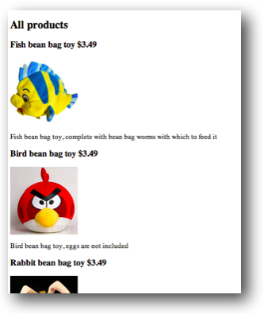

I denna labb ska vi göra ett liknande dokument med InDesign. Då måste vi först exportera innehållet i tabellen, som InDesign sedan kan importera. En sådan export påbörjades i förra labben, men måste kompletteras något.

## Redovisning

Lämna in ett zip-arkiv med följande på <http://peergrade.io>.

- Uppgift 1: minst två indesign-mallar och tillhörande resulterande pdf-kataloger
- Uppgift 2: en indesign-mall och resulterande pdf-katalog

## Uppgift 1

Vi ska använda InDesigns inbyggda Data Merge-funktion för att importera data till InDesign. För att InDesign ska kunna använda data från databasen måste den tab-separerade filen från förra labben kompletteras så att den dels innehåller en rubrikrad med namnet på de olika kolumnerna, dels en kolumn med sökväg till de olika bilderna. Kolumnnamn för bildkolumnen måste börja med ett @-tecken. Komplettera uppgift 2 från laboration 7 så att tab-filen får utseende enligt figur nedan. Skapa en fil */me105a/laboration8/uppgift1.php* som skapar filen *export1.txt*:

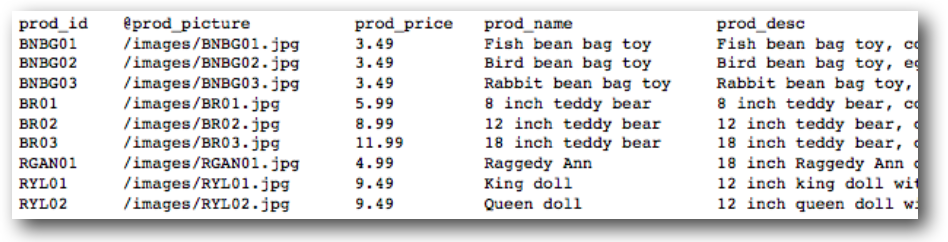

Filen export1.txt skapas på webbservern. Se till att hämta den till hårddisken på din dator, och lägg den lokalt i en mapp någonstans som du döper till *laboration8*. 

Lägg även mappen med bilder från förra labben i mappen *laboration8* och döp den mappen till *images*. Det är mycket viktigt att mappen med bilder heter *images* och att den mappen ligger i *laboration8*. 

Nästa steg är att skapa ett InDesign-dokument som kan importera export1.txt. Skapa ett nytt dokument i InDesign, döp det till *products.indd* och lägg även detta dokument i mappen *laboration8*. 

Skapa tre textramar med *Type tool* och en rektangelram med *Rectangle **Frame** Tool* (inte *Rectangle Tool*). Välj sedan *Window->Utilities->Data Merge*. Klicka pilen i övre högra hörnet av Data Merge-fönstret och välj *Select Data Source*. Välj filen som exporterats från databasen. 

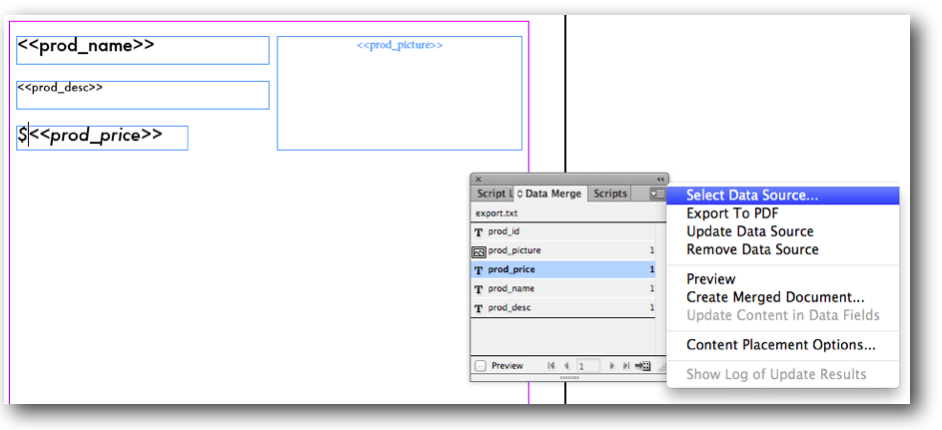

Nu går det att dra de olika kolumnerna till textramaramarna och bilden till rektangelramen. Genom att nu välja *Create Merged Document* skapas automatiskt ett nytt dokument med layouten du just gjort, och med innehållet från databasen. Välj även *Multiple Records* så att det blir flera produkter på varje sida. 

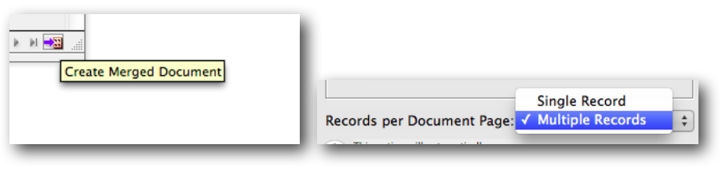

Resultatet bör bli så här:

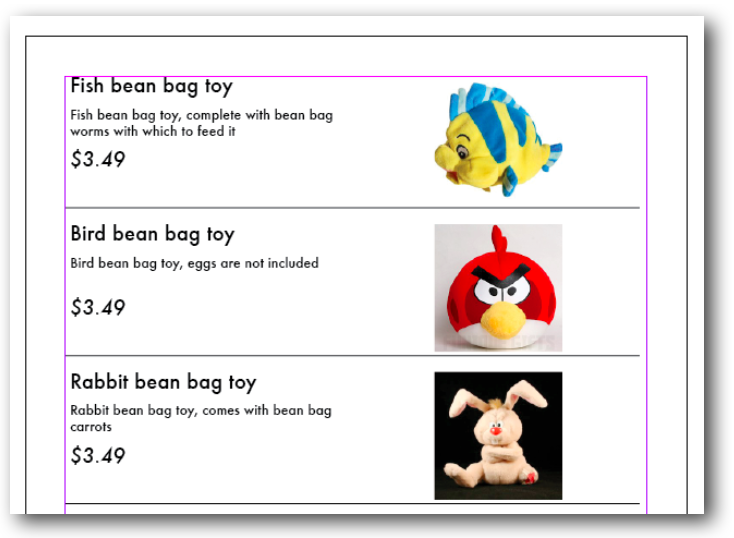

Experimentera fritt med layouten i mallen och skapa nya kataloger:

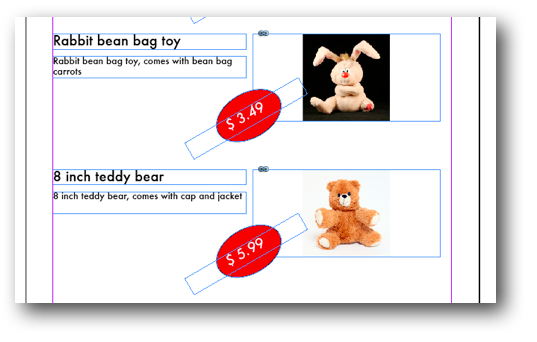

När du är nöjd med en katalog, dvs resultatet av en mall sparar du den som en pdf. Lämna in minst två indesign-mallar och tillhörande resulterande pdf-kataloger. 

## Uppgift 2

Data Merge-funktionen i InDesign är bra om man snabbt ska upprepa samma layout flera gånger, men räcker inte till för mer avancerade layout-uppgifter. Vi kommer nu att titta på en plug-in till InDesign som heter InData. Med InData kan man bland annat göra vilkorsstyrd import och på så vis få en bättre anpassad layout. Även här behöver vi en tab-separerad exportfil, men med några viktiga skillnader jämfört med uppgift 1:

- exportfilen ska *inte* innehålla en *rubrikrrad*. 
- det får *inte* vara något *inledande snedstreck* i bildens sökväg. 

Gör en ny php-fil *uppgift2.php* i mappen */me105a/laboration8/* som skapar filen *export2.txt* enligt nedan:

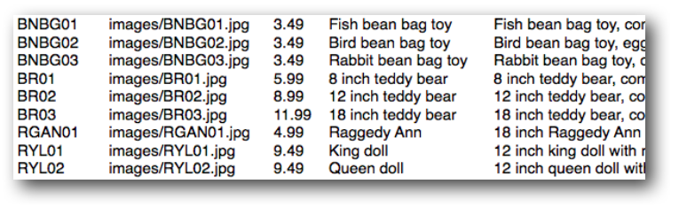

Ladda ner *export2.txt* till mappen *laboration8*.

Skapa ett nytt InDesign-dokument, döpt till *mall.indd*, och placerat i mappen *laboration8*. Här är det viktigt att *Primary Text Frame **är** förbockat*, att *Facing Pages **inte** är förbockat* och att *två kolumnner* är valda:

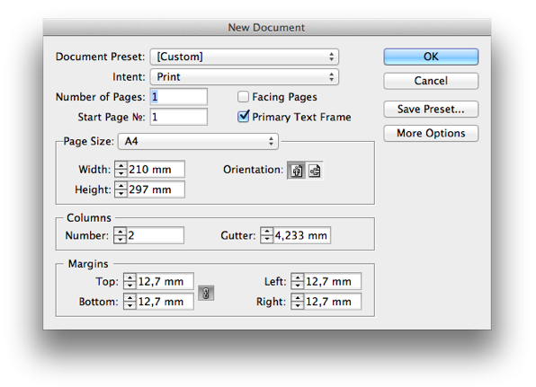

När detta är gjort ska vi göra en *InData-prototyp*, dvs en mall för hur vår exportfil ska visas. Eftersom vi inte har tabellrubriker i vår exportfil måste vi börja med att tala om vilka kolumner vi har. Gör det genom att först i InDesign-dokumentet, på sidan 1, skriva:


«fields prod_id, prod_picture, prod_price, prod_name, prod_desc


Tecknet « får man genom att skriva alt-shift-v. Tecknet » får man av alt-shift-b. 

Sedan ska vi presentera hur vår bild ska visas. Skriv på nästa två rader:


«set filename of picture 1 to prod_picture
«set pictureposition of picture 1 to aspectratiofit


Andra raden säger att bilden ska visas i rätt bredd-höjd-förhållande och rymmas i angiven bildram. 
Slutligen ska vi tala om vilka fält vi vill visa, och hur de ska visas. Genom att skriva «kolumnnamn»
definierar vi hur kolumnerna ska visas. Här kan vi även ändra typsnitt och annan formattering, som sedan kommer att visas i det färdiga dokumentet. 	

«prod_name»
«prod_desc»
$«prod_price»


Slutligen ska vi lägga till en bild, vilket är lite bökigt. Börja med att lägga till en bildram *var som helst på sidan* med Rectangle Frame Tool. Markera hela ramen och klipp ut den (cut). Ställ sedan textmarkören på en tom rad efter prod_price och välj klistra in (paste). Det bör nu se ut ungefär som nedan:

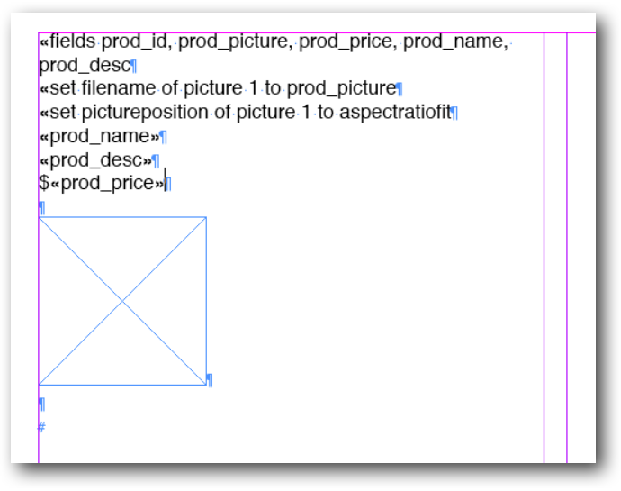

Ändra storlek och typsnitt på *prod_name*, *prod_desc* och *prod_price*.

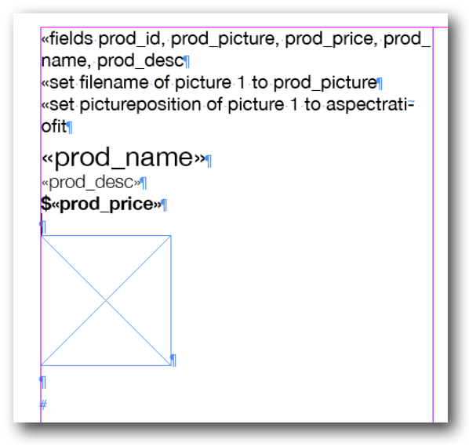

Nu är snart dags att importera data, **men allra först måste dokumentet sparas, annars går ändringar förlorade!** 

Välj *InData->Import from file* och välj filen *export2.txt*. Om alternativet *comma-delimited* är förvalt måste detta ändras till *tab-delimited*. 

När detta är gjort är det bara att starta importen, och resultatet bör bli ungefär så här:

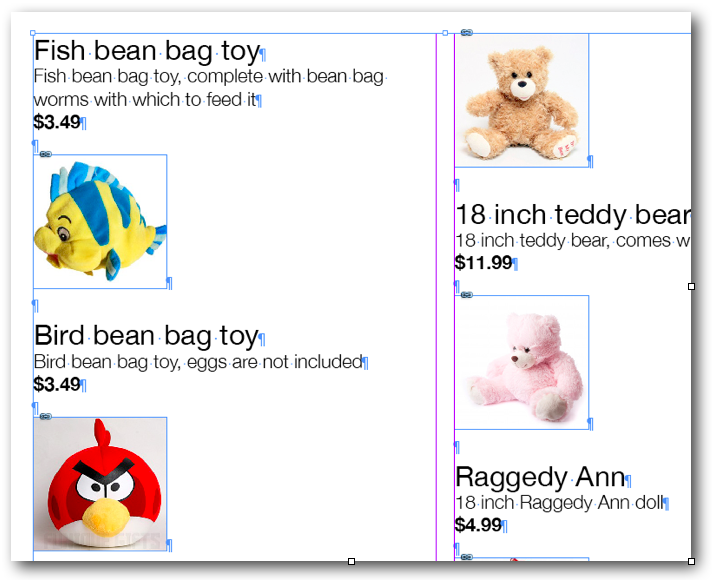

Spara resultet med *Save as...* och ge dokumentet namnet *resultat.indd*. Om man inte väljer *Save as...* kommer mallen att skrivas över och kan inte återanvändas. 

När du är nöjd med en katalog, dvs resultatet av en mall sparar du den som en pdf. Lämna in en indesign-mall och resulterande pdf-katalog. 

