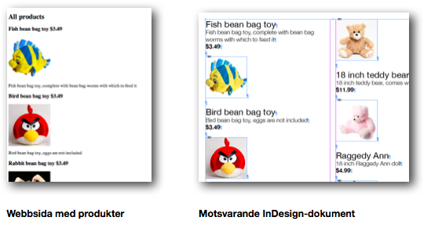
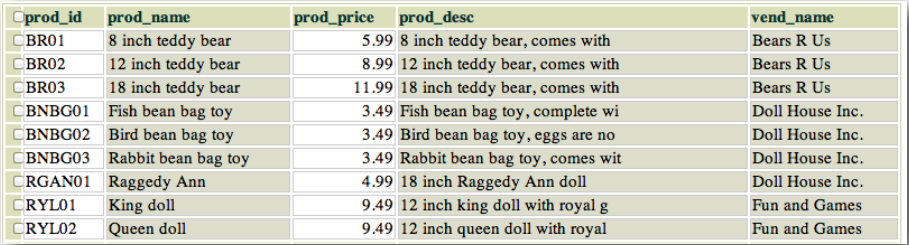
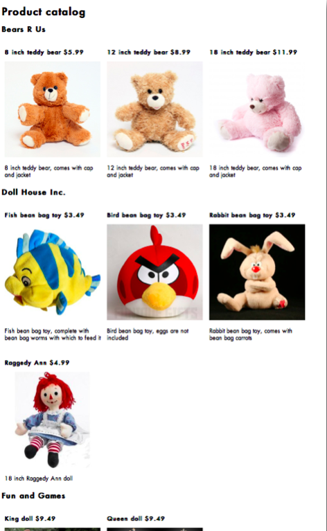
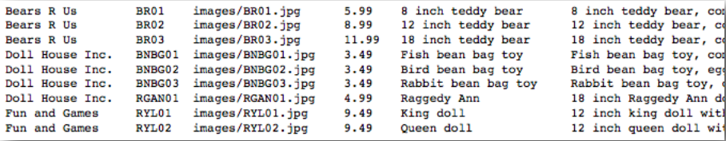
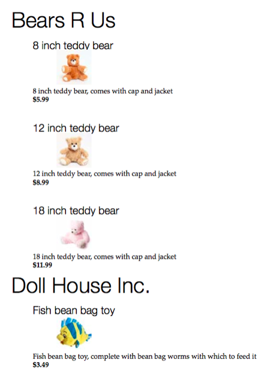
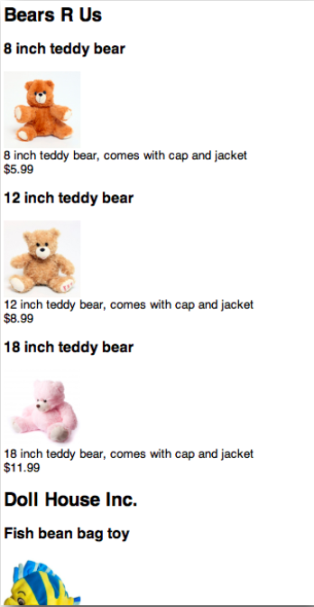

#Laboration 9

I labb 7 gjorde vi en webbsida med produkter. I labb 8 gjorde vi en liknande layout i InDesign och importerade data från databasen. 

I denna labb ska vi göra både en liknande webbsida och ett liknande InDesign-dokument, men nu ska produkterna grupperas efter vilken leverantör som tillhandahåller produkterna. I laboration 4 lärde vi oss att man med INNER JOIN kan söka i flera tabeller som är relaterade till varandra. Vi ska göra en sökning i tabellerna products och vendors så att vi får fram alla produkter med tillhörande leverantör. Sökningen 


SELECT prod_id,prod_name,prod_price,prod_desc,vend_name 
FROM products INNER JOIN vendors ON products.vend_id=vendors.vend_id 
ORDER BY vendors.vend_id


resulterar i följande resultat

där **vend_name** upprepas för varje produkt. Dagens uppgift går ut på att göra en webbsida och ett InDesign-dokument där varje leverantör visas som en rubrik, följt av de produkter som leverantören kan tillhandahålla. 

##Uppgift 1

Gör en webbsida liknande uppgift 1 i laboration 7, men med produkterna grupperade under levarantörsnamnet. (här nedan har css med float:left använts för att få produkterna bredvid varandra, men det går även att ha produkterna under varandra om man inte vill använda css)

##Uppgift 2

Nu ska en liknande sida göras med InDesign med InData-plugin. Första steget blir att komplettera exportfilen från laboration 8, uppgift 2, så att den även innehåller *vend_name*. Filen export.txt ska innehålla i tur och ordning 


vend_name,prod_id, prod_picture, prod_price, prod_name, prod_desc


Nästa steg är att lägga till en if-sats även i InData-koden från förra labben. I förra labben såg vår InData-kod ut så här:


«fields prod_id, prod_picture, prod_price, prod_name, prod_desc
«set filename of picture 1 to prod_picture
«set pictureposition of picture 1 to aspectratiofit
«prod_name»
«prod_desc»
$«prod_price»


Vi måste dels komplettera första raden med vend_name, 


«fields vend_name,prod_id, prod_picture, prod_price, prod_name, prod_desc


Vi måste också, före prodname, lägga till vend_name, men bara om det skiljer från produkten innan. Det kan man göra med följande if-sats i InData:


«if vend_name is not prev vend_name»«vend_name»«endif»


Vi får då vår kompletta InData-kod:


«fields vend_name,prod_id, prod_picture, prod_price, prod_name, prod_desc
«set filename of picture 1 to prod_picture
«set pictureposition of picture 1 to aspectratiofit
«if vend_name is not prev vend_name»«vend_name»«endif»
«prod_name»
«prod_desc»
$«prod_price»


Skapa ett InDesign-dokument precis som i laboration 8, uppgift 2, lägg in ny InData-kod och importera export.txt. OBS en bugg i InData gör att man först måste byta namn på export.txt till export.tab. Resultatet ska bli något i stil med:

## Uppgift 3 - frivillig men rekommenderad

Vi ska nu göra ungefär samma ska igen men med xml och xslt. En färdig xml-fil, products.xml (filens innehåll finns sist i uppgiften), finns tillgänglig som har skapats ur databasen. Denna fil måste kompletteras med en länk till xslt-fil:

<?xml-stylesheet type="text/xsl" href="products.xsl"?>

Dessutom måste xslt-filen, products.xsl skapas. 

Använd samma teknik som på w3schools,  http://www.w3schools.com/xsl/default.asp där xslt-filen har en loop,  `<xsl:for-each select="catalog/cd">` men här måste vi använda  
`<xsl:for-each select="catalog/vendor">` för att loopa igenom varje vendor istället för CDU. Vi behöver också en inre loop,  `<xsl:for-each select="product">` för att loopa igenom varje produkt för respektive vendor. Strukturen blir något i stil med


<xsl:for-each select="catalog/vendor">
  <!--visa vend_name här-->      
  <xsl:for-each select="product">
    <!--visa info om produkten här-->        
  </xsl:for-each>
</xsl:for-each>


Att få in bilden är lite knepigt men följande kod kan användas:


<xsl:element name="img">
<xsl:attribute name="src">
<xsl:value-of select="prod_image"/>
</xsl:attribute>
</xsl:element>


Resultatet kan se ut ungefär så här:

Filen *products.xml*:


<?xml version="1.0" encoding="UTF-8"?>
<catalog>
<vendor>
<vend_name>Bears R Us</vend_name>
<product>
<prod_name>8 inch teddy bear</prod_name>
<prod_price>5.99</prod_price>
<prod_image>images/BR01.jpg</prod_image>
<prod_desc>8 inch teddy bear, comes with cap and jacket</prod_desc>
</product>
<product>
<prod_name>12 inch teddy bear</prod_name>
<prod_price>8.99</prod_price>
<prod_image>images/BR02.jpg</prod_image>
<prod_desc>12 inch teddy bear, comes with cap and jacket</prod_desc>
</product>
<product>
<prod_name>18 inch teddy bear</prod_name>
<prod_price>11.99</prod_price>
<prod_image>images/BR03.jpg</prod_image>
<prod_desc>18 inch teddy bear, comes with cap and jacket</prod_desc>
</product>
</vendor>
<vendor>
<vend_name>Doll House Inc.</vend_name>
<product>
<prod_name>Fish bean bag toy</prod_name>
<prod_price>3.49</prod_price>
<prod_image>images/BNBG01.jpg</prod_image>
<prod_desc>Fish bean bag toy, complete with bean bag worms with which to feed it</prod_desc>
</product>
<product>
<prod_name>Bird bean bag toy</prod_name>
<prod_price>3.49</prod_price>
<prod_image>images/BNBG02.jpg</prod_image>
<prod_desc>Bird bean bag toy, eggs are not included</prod_desc>
</product>
<product>
<prod_name>Rabbit bean bag toy</prod_name>
<prod_price>3.49</prod_price>
<prod_image>images/BNBG03.jpg</prod_image>
<prod_desc>Rabbit bean bag toy, comes with bean bag carrots</prod_desc>
</product>
<product>
<prod_name>Raggedy Ann</prod_name>
<prod_price>4.99</prod_price>
<prod_image>images/RGAN01.jpg</prod_image>
<prod_desc>18 inch Raggedy Ann doll</prod_desc>
</product>
</vendor>
<vendor>
<vend_name>Fun and Games</vend_name>
<product>
<prod_name>King doll</prod_name>
<prod_price>9.49</prod_price>
<prod_image>images/RYL01.jpg</prod_image>
<prod_desc>12 inch king doll with royal garments and crown</prod_desc>
</product>
<product>
<prod_name>Queen doll</prod_name>
<prod_price>9.49</prod_price>
<prod_image>images/RYL02.jpg</prod_image>
<prod_desc>12 inch queen doll with royal garments and crown</prod_desc>
</product>
</vendor>
</catalog>


