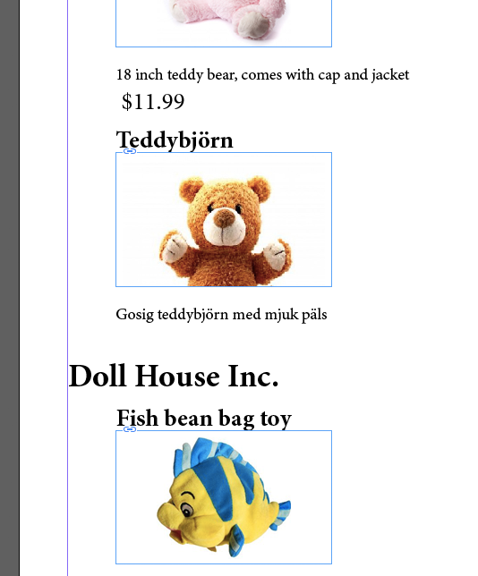

# Laboration 9

I labb 7 gjorde vi en webbsida med produkter. I labb 8 gjorde vi en liknande layout i InDesign och importerade data från databasen. 

I denna labb ska vi göra både en liknande webbsida och ett liknande InDesign-dokument, men nu ska produkterna grupperas efter vilken leverantör som tillhandahåller produkterna. I laboration 4 lärde vi oss att man med INNER JOIN kan söka i flera tabeller som är relaterade till varandra. Vi ska göra en sökning i tabellerna products och vendors så att vi får fram alla produkter med tillhörande leverantör. Sökningen 


SELECT prod_id,prod_name,prod_price,prod_desc,vend_name 
FROM products INNER JOIN vendors ON products.vend_id=vendors.vend_id 
ORDER BY vendors.vend_id


resulterar i följande resultat

där **vend_name** upprepas för varje produkt. Dagens uppgift går ut på att göra en webbsida och ett InDesign-dokument där varje leverantör visas som en rubrik, följt av de produkter som leverantören kan tillhandahålla. 

## Uppgift 1

Gör en webbsida liknande uppgift 1 i laboration 7, men med produkterna grupperade under levarantörsnamnet. (här nedan har css med float:left använts för att få produkterna bredvid varandra, men det går även att ha produkterna under varandra om man inte vill använda css)

## Uppgift 2

Nu ska en liknande sida göras med InDesign med InData-plugin. Första steget blir att komplettera exportfilen från laboration 8, uppgift 2, så att den även innehåller *vend_name*. Filen export.txt ska innehålla i tur och ordning 


vend_name,prod_id, prod_picture, prod_price, prod_name, prod_desc


Nästa steg är att lägga till en if-sats även i InData-koden från förra labben. I förra labben såg vår InData-kod ut så här:


«fields prod_id, prod_picture, prod_price, prod_name, prod_desc
«set filename of picture 1 to prod_picture
«set pictureposition of picture 1 to aspectratiofit
«prod_name»
«prod_desc»
$«prod_price»


Vi måste dels komplettera första raden med vend_name, 


«fields vend_name,prod_id, prod_picture, prod_price, prod_name, prod_desc


Vi måste också, före prodname, lägga till vend_name, men bara om det skiljer från produkten innan. Det kan man göra med följande if-sats i InData:


«if vend_name is not prev vend_name»«vend_name»«endif»


Vi får då vår kompletta InData-kod:


«fields vend_name,prod_id, prod_picture, prod_price, prod_name, prod_desc
«set filename of picture 1 to prod_picture
«set pictureposition of picture 1 to aspectratiofit
«if vend_name is not prev vend_name»«vend_name»«endif»
«prod_name»
«prod_desc»
$«prod_price»


Skapa ett InDesign-dokument precis som i laboration 8, uppgift 2, lägg in ny InData-kod och importera export.txt. Resultatet ska bli något i stil med:

Exportera resultatet i pdf-format. 

## Uppgift 3

Antag att det finns produkter som saknar prisuppgift. Då kommer det att visas ett ensamt dollar-tecken på en rad om vi använder mallen från uppgift 2. Använd InData-villkoret 


«if field is not empty»...«endif»


för att bara visa dollar-tecken + pris om det finns prisuppgift i exportfilen. Resultatet ska bli ungefär så här:

Vi passar även på att testa att åäö fungerar. Vi måste först lägga till en ny produkt som saknar prisuppgift. Problemet är att när vi skapade *products*-tabellen för flera labbar sedan satte vi som villkor att kolumnen *prod_price* alltid måste innehålla ett värde. Följande måste göras:

Använd *mysqlbrowser* för att ändra kolumnen *prod_price* så att den tillåts vara tom. Det görs med sql-kommandot `ALTER TABLE products MODIFY COLUMN prod_price DECIMAL(8,2)`. Lägg sedan till en ny produkt saknar pris, och dessutom innehåller svenska tecken:

- prod_id ska vara BR04 (eller något annat unikt prod_id)
- vend_id ska vara BRS01 (dvs kopplat till Bears R Us)
- prod_name ska vara Teddybjörn (eller något annat som innehåller svenska tecken)
- prod_desc kan vara Gosig teddybjörn med mjuk päls (eller något annat med svenska tecken)

Slutligen måste en ny bild som föreställer en teddybjörn in i mappen *images*. Döp bilden till BR04.jpg för att det ska fungera, om prod_id är BR04. 

Fungerar åäö? Om det inte fungerar, experimentera med importinställningar tills det fungerar. 

Exportera resultatet i pdf-format när det fungerar. 

**Redovisning** 

- Redovisa alla php-filer från uppgift 1 och 2
- Redovisa både InDesign-mallar och exporterade pdf-filer från uppgift 2 och 3.  

<!--## Uppgift 4 - frivillig men rekommenderad

JSON-->