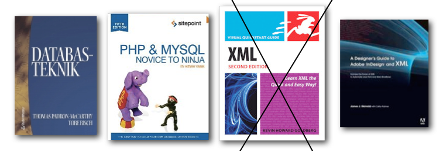
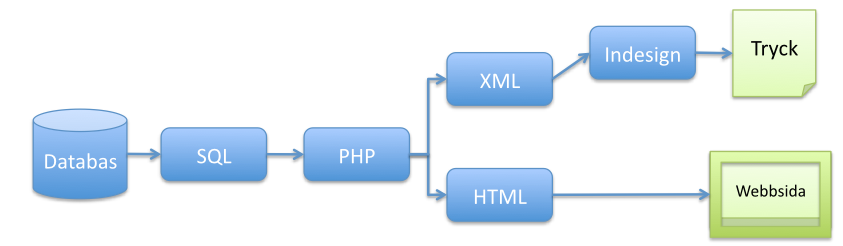
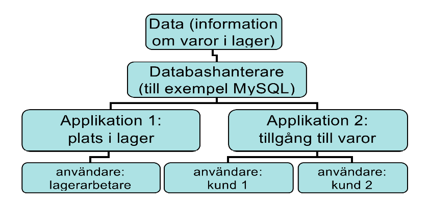
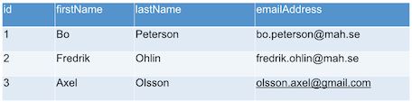
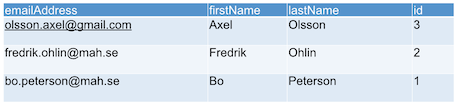

# Databasbaserad publicering

## Föreläsning 1

---

### Allmänt om kursen

#### Lärare

Bo Peterson och Sebastian Bengtegård

#### Webbplats

<http://mah-webb.github.io>

---

### Kurslitteratur

- Databasteknik
- PHP & MySQL - Novice to Ninja
- Dessutom rekommenderas: A Designers Guide to Adobe InDesign and XML
- Följande bok har utgått från förlaget och används inte mer: Howard Goldberg, Kevin: XML:Visual QuickStart Guide, Peachpit Press Publications 2008

---

### Om boken Databasteknik

Det för den här kursen viktigaste innehållet i boken Databasteknik finns även på webbplatsen

<http://www.databasteknik.se/webbkursen/>

---

### Kursinnehåll

Trebokstavsförkortningar!

- SQL
- PHP
- XML
- CSV
- TAB

---

### Kursinnehåll som flödesschema

---

### Vad är databas? 

En databas kan definieras som ett datorbaserat informationssystem där informationen (databasens data) lagras på ett strukturerat sätt vilket gör det möjligt för många olika tillämpningar att komma åt informationen.
 
---

### Strukturen på ett databassystem

Ett databassystem kan delas upp i följande komponenter:

- Systemets data
- Databashanterare (database management system eller DBMS)
- Användare
- Tillämpningsprogram eller applikationsprogram

---

### Exempel

Ett **lagerhanteringssystem** är ett typexempel på ett databassystem. 

Först har vi systemets **data**, dvs **information om varor** i lagret. 

Sedan har vi **databashanteraren** som **hanterar informationen** 

---

En lagerarbetaren och en kund är två olika **användare** av databasen. Båda använder samma bakomliggande data, men sett ur olika **vyer**.

Olika **tillämpningsprogram** kan användas för att på olika sätt att se på data i databasen. En lagerarbetare och en kund har olika behov och tillämpningsprogram kan därför skräddarsys så att de passar olika användare.

---

---

### Exempel på databashanterare

-   Oracle
-   MySQL
-   SQLite
-   Neo4j
-   Microsoft SQL Server

Fler exempel: se 
<http://en.wikipedia.org/wiki/Comparison_of_relational_database_management_systems>

---

### I kursen

Vi kommer att använda MySQL som databashanterare och bygga våra tillämpningsprogram med PHP

---

### Relationsdatabaser

Kursen kommer endast att behandla relationsdatabaser. Utöver relationsdatabaser finns det exempelvis grafdatabaser (se tex http://en.wikipedia.org/wiki/Graph_database)

**Relationsdatabaser** består av en **samling tabeller**. Den korrekta termen för en tabell är egentligen relation men oftast används begreppet tabell. Tabeller (relationer) kan vara relaterade till varandra dvs kopplade till varandra, och det är en av styrkorna hos relationsdatabaser. 

---

### Enkelt exempel på tabell

En viktig egenskap i en tabell är att det inte spelar någon roll vilken ordning kolumner och rader visas i. Följande tabell är identisk med tabell ovan:

---

### Terminologi

-   Varje **rad** i en tabell kallas även för en **tupel**
-   Varje **kolumn** kallas även för **attribut** eller **fält** 
-   **Nycklar** används för att ange hur tabeller är **relaterade** till varandra.

--- 

### SQL

SQL, Structured Query Language används vanligtvis för att hantera relationsdatabaser. Med SQL kan man skapa tabeller, spara data i tabeller, ändra data i tabeller, söka och sortera data. En tabell kan skapas på följande sätt:


CREATE TABLE classroom (
  id INT NOT NULL AUTO_INCREMENT PRIMARY KEY,
  roomnumber CHAR(4),
  seats INT
)


**classroom** är namnet på **tabellen**

**id, roomnumber** och **seats** är namn på **kolumner**

