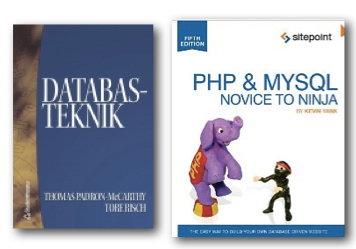

# Databasbaserad publicering

## Föreläsning 1

Obs lägg till tre streck och layout: instructions

---

### Allmänt om kursen

#### Lärare

Bo Peterson och Sebastian Bengtegård

#### Webbplats

<http://mah-webb.github.io>

---

### Kurslitteratur

- Databasteknik
- PHP & MySQL - Novice to Ninja
- Dessutom rekommenderas: A Designers Guide to Adobe InDesign and XML
- Följande bok har utgått från förlaget och används inte mer: Howard Goldberg, Kevin: XML:Visual QuickStart Guide, Peachpit Press Publications 2008

---

### Om boken Databasteknik

Det för den här kursen viktigaste innehållet i boken Databasteknik finns även på webbplatsen

<http://www.databasteknik.se/webbkursen/>

---

### Kursinnehåll

Trebokstavsförkortningar!

- SQL
- PHP
- XML
- CSV
- TAB

---

### Kursinnehåll som flödesschema

---

### Vad är databas? 

En databas kan definieras som ett datorbaserat informationssystem där informationen (databasens data) lagras på ett strukturerat sätt vilket gör det möjligt för många olika tillämpningar att komma åt informationen.
 
---

### Strukturen på ett databassystem

Ett databassystem kan delas upp i följande komponenter:

- Systemets data
- Databashanterare (database management system eller DBMS)
- Tillämpningar
- Användare

---

### Exempel

xxx håller på här

Ett lagerhanteringssystem är ett typexempel på ett databassystem. 

Först har vi systemets data, dvs information om varor i lagret. 

Sedan har vi databashanteraren som hanterar informationen. 

Olika tillämpningar är olika sätt att se på data i databasen. En tillämpning kan vara att se var i lagret en vara finns, något som behövs för dem som jobbar på lagret. En annan tillämpning kan vara att se vad som finns på lagret vilket kan utnyttjas av en kund som vill ha en viss vara. 
 
	Lagerarbetaren och kunden är två användare av databasen. Båda använder samma bakomliggande data, men sett ur olika vyer eller synvinklar dvs med olika applikationer.
	
---

### tabell xxx

kan man göra tabeller i cleaver?

| Tables        | Are           | Cool  |
| ------------- | ------------- | ----- |
| col 3 is      | right-aligned | $1600 |
| col 2 is      | centered      |   $12 |
| zebra stripes | are neat      |    $1 |

ja, men inget rutnät som default. 

<table border="1"><tr><td>Hej</td></tr><tr><td>Hopp</td></tr></table>

---

### tabell utan header???

|         |            |   |
| ------------- | ------------- | ----- |
|**rubrik** | ** också rubrik ** | ** jadå ** |
| col 3 is      | right-aligned | $1600 |
| col 2 is      | centered      |   $12 |
| zebra stripes | are neat      |    $1 |

---

## De olika delarna i ett databassystem
### Vad behövs till ett databassystem?
En databashanterare, till exempel
Access
Oracle
MySQL
SQLite
FileMaker
Neo4j
Fler exempel: se 
http://en.wikipedia.org/wiki/Comparison_of_relational_database_management_systems

Gränssnitt för att mata in och ut data, till exempel
Webbsidor med PHP
Inbyggt grafiskt gränssnitt
Skräddarsytt program

Vi kommer att använda MySQL som databashanterare och webbsidor 
med PHP som användargränssnitt.
### Relationsdatabaser
Kursen kommer endast att behandla relationsdatabaser. Utöver relationsdatabaser finns det exempelvis grafdatabaser (se tex http://en.wikipedia.org/wiki/Graph_database)

Relationsdatabaser består av en samling tabeller. Den korrekta termen för en tabell är egentligen relation men oftast används begreppet tabell. Tabeller (relationer) kan vara relaterade till varandra.
### Enkelt exempel på tabell

### Terminologi
Varje rad i en tabell kallas även för en tupel eller en post. 
Varje kolumn kallas även för attribut eller fält. 
Nycklar används för att ange hur tabeller är relaterade till varandra. Mer om det senare i kursen.
### Sammanfattning av terminologi
(engelsk term inom parentes)

## om phpmyadmin, om create
