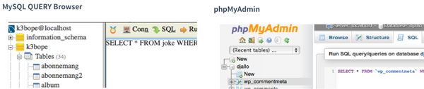

<div>

<script>
var left=0, imgObj=null;
function init(){
   imgObj = document.getElementById('myImage');
   imgObj.style.position= 'absolute';
   imgObj.style.top = '1500px';//'window.innerHeight+450+'px';
   imgObj.style.left = '-300px';
   moveRight();
   imgObj.addEventListener("click", vanish);
}
function vanish() {
	this.style.visibility='hidden';
}
function moveRight(){
    left = parseInt(imgObj.style.left);
    imgObj.style.left = (left + 2) + 'px';
    setTimeout(function(){moveRight();},10); 
    if (left>window.innerWidth+50) {
        imgObj.style.left = '-300px'; 
    }    
}
window.onload = function() {init();};
init();
</script>
</div>


# Databasbaserad publicering

## Föreläsning 2

---

### Idag

- PHP-repetition
- Kommunicera med databas

---

### Arrayer och loopar


<?php
$list=array('januari','februari','mars');
//standard for-loop för att loopa igenom array
for ($i=0;$i<count($list);$i++) {
    echo $list[$i];
    echo "<br>";
}

//specialvariant av loop som passar bra för att gå igenom array
foreach ($list as $month) {
    echo $month;
    echo "<br>";
}
?>


Båda alternativen skriver ut


januari
februari
mars


---

### Associativ array


<?php
//associativ array (varje element får ett namn)
$row=array('id'=>1,'animal'=>'cat','color'=>'black');
echo $row['color'];
?>


Följande skrivs ut:


black


Vi kan se detta som en rad i en tabell, med rubrik och värde:

<style>
table {border-collapse: collapse;font-size:smaller}
th, td {border: 1px solid #BBBBBB}
th, td {text-align:left}
th, td {padding: 6px;}
</style>

| id  | animal  | color  |
|---|---|---|
| 1 | cat | black |

---

### Flerdimensionell array

I föregående exemplet hade vi bara en rad. Om vi vill spara flera rader i en array behöver vi en **tvådimensionell** array. 

| id  | animal  | color  |
|---|---|---|
| 1 | cat | black |
| 2 | dog | white |
| 3 | elephant | pink |

---

Denna tabell kan sparas så här i en tvådimensionell php-array


$cat=array('id'=>1,'animal'=>'cat','color'=>'black');
$dog=array('id'=>2,'animal'=>'dog','color'=>'white');
$elephant=array('id'=>3,'animal'=>'elephant','color'=>'pink');

$table=array($cat,$dog,$elephant);
//eftersom $cat, $dog och $elephant är arrayer, som i sin tur
//sparas i en array, blir $table en array av arrayer eller en 
//tvådimensionell array

//vi kan skriva ut färgen på andra djuret på följande vis:
echo "The color is " . $table[1]['color'];

//$table[1] motsvarar hela andra raden i tabellen ($dog)
//eftersom numrering börjar från ett.
//$table[1]['color'] motsvarar i sin tur innehållet 
//i kolumnen 'color' i andra raden


Följande skrivs ut: 


The color is white


---

Vi kan använda foreach-loopen för att loopa igenom hela tabellen:


foreach ($table as $row) {
    echo $row['animal'];
    echo "<br>";
}


Följande skrivs ut:


cat
dog
elephant


---

### Sökresultat från databas

Relationsdatabaser lagrar data i tabeller. Det normala när man gör en sökning i en databas med `select` är att resultatet blir en tvådimensionell array liknande `$table` i exemplet. 

Här är en komplett sökning som söker i tabellen `animals`:


$pdo=new PDO('mysql:host=localhost;dbname=k3bope','k3bope','lösenord'); 
$sql='SELECT * FROM animals';
$result=$pdo->query($sql);
//foreach som i exemplet innan men med $result istället för $table
foreach ($result as $row) {
    echo $row['animal'];
    echo "<br>";
}


---

### PHPMyAdmin och MySQL Query Browser

I kursen kommer vi att använda MySQL Query Browser, ett webb-baserat verktyg för att administrera MySQL-databaser. I boken beskrivs ett liknande verktyg, phpMyAdmin. 





---

### BILAGA

SQL-kod för att skapa tabellen animals och lägga in data:


CREATE TABLE animals (
id INT NOT NULL PRIMARY KEY AUTO_INCREMENT,
animal TEXT,
color TEXT);

INSERT INTO animals (animal,color) VALUES ('cat','black');
INSERT INTO animals (animal,color) VALUES ('dog','white');
INSERT INTO animals (animal,color) VALUES ('elephant','pink');




### Kodexempel från föreläsning 2016-09-05

#### form.html

```html
<!doctype html>
<html>
<head>
<meta charset="UTF-8">
<title>Untitled Document</title>
</head>

<body>
<form method='post' action='add.php'>
<input type='text' name='animal'> Djur <br>
<input type='text' name='color'> Färg <br>
<input type='submit' value='Lägg till'> 
</form>

</body>
</html>
```

#### add.php

```html
<!doctype html>
<html>
<head>
<meta charset="UTF-8">
<title>Untitled Document</title>
</head>

<body>

<?php
//första steget är att ansluta till databasen
include $_SERVER['DOCUMENT_ROOT'].'/k3bope/me105a/connect.php';

//nästa steg: hämta data från formulär

$animal=$_POST['animal'];
$color=$_POST['color'];

//nu ska vi skapa sql-kod
$sql="INSERT INTO animals (animal,color) VALUES ('$animal','$color')";
//nu måste vi skicka denna sql-kod till databasen
//det kan man göra med $pdo->exec eller $pdo->query
//exec används oftast när man ska lägga till någonting (tex INSERT)
//medan query används när man hämtar någonting (tex SELECT)
$result=$pdo->exec($sql);

echo "$animal med färgen $color har lagts till i tabellen";

</body>
</html>

?>
```
