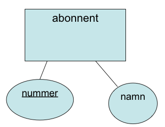
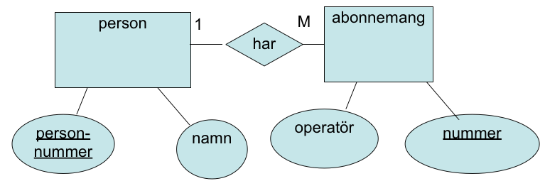
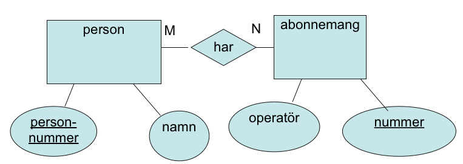

#Databasbaserad publicering
##Föreläsning 3

Dagens föreläsning går igenom **E/R-modellen**

Läs om E/R-diagram i kapitel 2-3 i boken "Databasteknik" eller motsvarande avsnitt på http://www.databasteknik.se/webbkursen/er/index.html

---

### Entity Relationship (E/R) modellen

E/R-diagram används för att visa strukturen hos en databas. E/R-diagram är ett kraftfullt designverktyg när man skapar en databas. 

Ett E/R-diagram består av

- **Entiteter**. En entitet är lite förenklat något det kan finnas unika exemplar av. 
- **Förhållanden** eller **relationships** mellan entiteter.

Entiteter representeras av rektanglar, förhållanden representeras av "diamanter" och linjer mellan entiteterna. 

En entitet kan ha olika **egenskaper**, oftast kallade **attribut**. Egenskaperna representeras av ellipser anslutna till entiteterna. 

---

###Exempel på E/R-diagram

Antag att vi vill ha en databas med telefonnummer till olika personer. Vi tänker oss att en person har endast ett nummer. Detta nummer kan inte delas av flera personer. Vi kan definerara entiteten *abonnent* som kan ha attributen nummer och namn. Ett E/R-diagram kan då få följande utseende. Attributet *nummer* är understruken eftersom det unikt kan identifiera varje entitet.

---

###Dåligt exempel på E/R-diagram
Antag att vi vill att varje person kan ha flera nummer. Vi kan då utöka vårt diagram tex så här:

Detta är vanligtvis en **mycket dålig lösning**, eftersom det sedan är svårt att bygga ut om det visar sig att man vill ha fyra, fem eller fler nummer till varje abonnent. 

---

###Bättre exempel på E/R-diagram
Det finns två naturliga entiteter som vi kan välja när vi ska modellera vår databas, *person* och *abonnemang*. Vi tänker oss till en början att en person kan ha flera telefonabonnemang (godtyckligt många), däremot kan inte ett abonnemang delas av flera personer. Ett E/R-diagram kan få följande utseende:

---

###Förhållanden (relationships)
Det finns några grundläggande typer av förhållanden mellan entiteter, förhållanden av olika *ordning* (*cardinality* på engelska)

- ett-till-ett
- ett-till-många
- många-till-ett
- många-till-många1

I exemplet på föregående sida såg vi ett förhållande av typen ett-till-många mellan abonnent och abonnemang. En abonnent kan ha många abonnemang. Det anges av ettan och bokstaven M i E/R-diagrammet.

Om vi vill att ett abonnemang ska kunna delas mellan flera personer behöver vi bara ändra ordningsbeteckningarna i diagrammet:

---

Bokstäverna M och N anger nu att vi har ett många-till-många-förhållande mellan person och abonnemang. En person kan ha flera nummer och ett nummer kan delas av flera personer. 

---

###Relational data structures
Relationsdatabaser eller relational data structures är den idag vanligast förekommande typen av databaser. Det finns alternativ, tex grafdatabaser som är på stark frammarsch. För relationsdatabser gäller att **alla data sparas i tvådimensionella tabeller**.

Varje tabell består av:

- **Heading**: Tabellnamn+kolumnnamn. Varje kolumn motsvarar ett attribut (egenskap) i E/R-modellen
- **Body**: ett antal ”tuples” (tupler, rader, poster) som innehåller tabellens egentliga data

En tabell är matematiskt sett en mängd av rader (poster). Varje rad (post) är ett distinkt, oordnat element.

Varje attribut är *atomärt*, dvs kan endast innehålla ett värde.

---

###Omvandling av E/R-modell till relationsdatabas
Det finns en strukturerad metod för att omvandla ett E/R-diagram till  en relationsdatabas. I stora drag går det ut på att låta varje entitet representeras av en tabell, där varje kolumn representerar ett attribut. Det krävs lite mer om man har många-till-många-förhållanden vilket vi kommer till på senare föreläsningar. 

---

###Omvandling av första E/R-exemplet till relationsdatabas:

**abonnent**

| <u>nummer</u> | namn |
|---|---|
| 046-123456 | Bo Peterson |
| 040-654321 | Sven Svensson |

---

###Omvandling av andra E/R-exemplet (det dåliga)

**abonnent**

| namn | <u>nummer1</u> | nummer2 | nummer 3 |
|---|---|---|---| 
| Bo Peterson | 046-123456 | 040-6657000 | |
| Sven Svensson | 040-654321 | 0739-654321 | 070-654321 |

---

### Omvandling av tredje E/R-exemplet

Här behöver vi två tabeller, en för person och en för abonnemang. 

---

Tabellen för person är rättfram:

**person**

| namn | <u>personnummer1</u> |
|---|---|
| Bo Peterson | 650201-9999 |
| Sven Svensson | 731212-5555 |

---

Tabellen för abonnemang kräver en extra kolumn som innehåller *främmande nyckel* (*foreign key*). Främmande nyckel används för att koppla en post i abonnemang till en post i person. Kopplingen sker mellan främmande nyckel i abonnemang och primärnyckel i person. Vi kan (men behöver inte) döpa kolumnen med främmande nyckeln till samma namn som primärnyckeln. 

---

Tabellen får då följande utseende:

**abonnemang**

| <u>nummer</u> | operatör | personnummer |
|---|---|---|
| 046-123456 | Tele 2 | 650201-9999 | 
| 040-654321 | Telia | 731212-5555 | 
| 040-6657000 | Telia | 650201-9999 |
| 0739-654321 | Tre | 731212-5555 |
| 070-654321 | Telenor | 731212-5555 |

Med denna struktur kan varje person ha godtyckligt antal abonnemang utan att databasen måste modelleras om.

Observera att ett personnummer endast får förekomma *en gång i tabellen person* men *flera gånger i tabellen abonnemang*. En post i person kan på så vis kopplas till många poster i abonnemang vilket kännetecknar just ett förhållande av typen ett-till-många.
