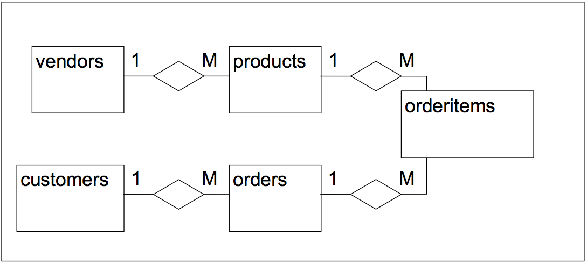
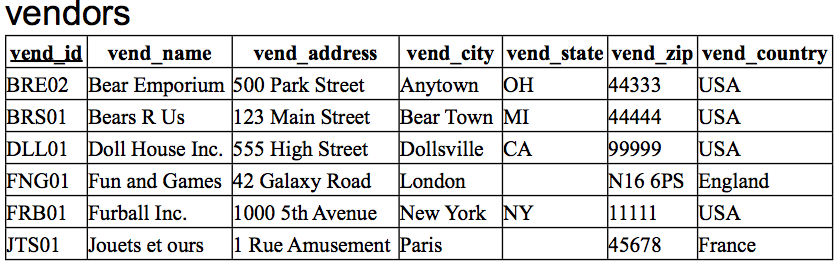
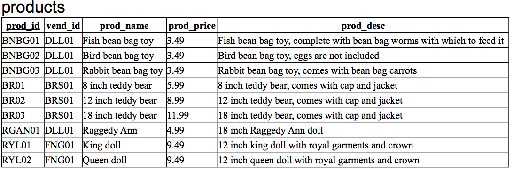
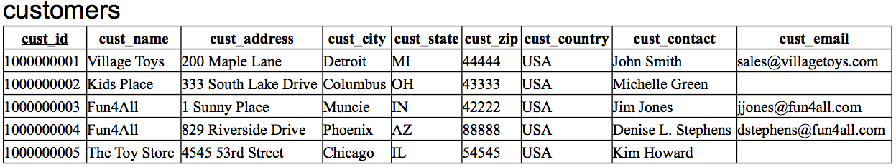
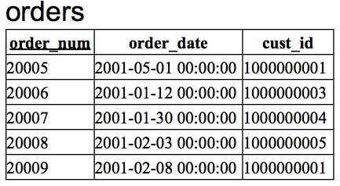
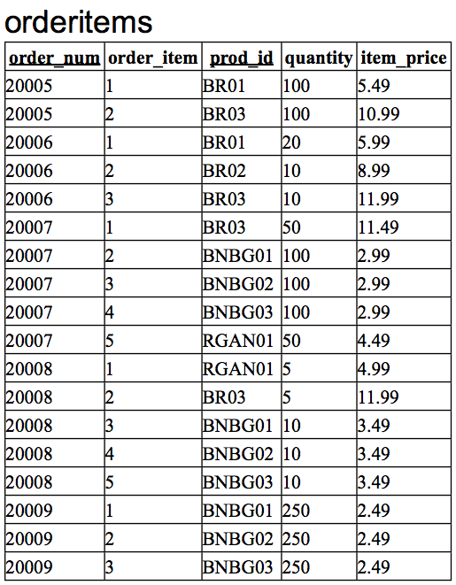

<style>
table {border-collapse: collapse;font-size:smaller}
th, td {border: 1px solid #BBBBBB}
th, td {text-align:left}
th, td {padding: 6px;}
hr {display: none}
pre {font-size:large}
</style>

# Databasbaserad publicering

## Föreläsning 5

---

### Dagens innehåll

Dagens föreläsning går igenom

- SQL-sammanfattning
- Komplett exempel, från E/R till tabeller och SQL

---

### SQL

Står för Structured Query Language och används för att hämta, uppdatera, lägga till och radera data och tabeller från en databas.

SQL är standard men existerar i olika variationer för olika databaser (Access, Oracle, MySQL, Sybase osv).

Följande exempel ger en SQL-överblick. 

Man skiljer på kommandon för *Data Manipulation* och kommandon för *Data Definition*. I korthet kan man säga att data manipulation innebär att man arbetar med data i tabeller medan data definition innebär att man definierar databasens struktur, dvs vilka tabeller som ska ingå och hur tabellerna ska se ut. SQL-kommandon skrivs vanligtvis med stora bokstäver.

---

### Data Manipulation

Följande fyra kommandon används huvudsakligen för datamanipulation: 

- SELECT (...FROM...WHERE) för att hämta och visa information från tabellen.
- UPDATE för att ändra och uppdatera information i tabellen.
- DELETE för att radera information i tabellen.
- INSERT INTO för att lägga till ny information i tabellen.


---

### SELECT

Hämtar rader och kolumner från en eller flera tabeller genom ett antal villkor, dvs *söker* i tabeller. 

```sql
SELECT kolumner (eller * för alla) FROM tabell/er  [ WHERE villkor ]
```

Exempel:

```sql
SELECT kursnamn FROM kurser WHERE kurskod='ME105A'
```

Hämtar kolumnen kursnamn från alla rader i tabellen kurser där kurskoden är ME105A

```sql
SELECT * FROM kurser
```

Hämtar alla kolumner från alla rader i tabellen kurser (eftersom WHERE-villkor saknades)

I villkor används ' ' runt text, dock ej kring heltal (integers)

---

### Jämförelser

Det går att kombinera villkor genom logiska operatorerna (AND OR NOT), samt jämförelse (<, >, <=, >=, <>)

Exempel:

```sql
SELECT fornamn, efternamn FROM Studenter 
WHERE (postnummer <= 21155 AND ort = 'Malmö') OR (ort = 'Lund');
```

Observera apostroferna runt Malmö och Lund (text) men inte runt 21155 (heltal).

---

### ORDER BY

Används för att sortera informationen

```sql
SELECT * FROM Kurser ORDER BY kurskod
```

Visar all information om alla kurser sorterat i bokstavsordning/nummerordning efter kurskod.

För att vända ordningen används DESC efter sorteringskolumnen; 

```sql
SELECT * FROM Kurser ORDER BY kurskod DESC;
```

---

### Mer om SELECT

Det finns ett antal funktioner som går att använda med SELECT;

```
COUNT (Räknar antalet rader)
MIN (Returnerar det lägsta värdet i kolumnen)
MAX (Returnerar det högsta värdet i kolumnen)
SUM (Returnerar en summa)
AVG (Returnerar ett medeltal)
```

---

Exempel:

```sql
SELECT COUNT(*) FROM Studenter;
#Returnerar antalet rader i tabellen Studenter.

SELECT MAX(skonummer) FROM Studenter;
#Returnerar det största skonumret i tabellen Studenter.

SELECT MIN(skonummer) FROM Studenter;
#Returnerar det minsta skonumret i tabellen Studenter.

SELECT SUM(skonummer) FROM Studenter;
#Returnerar summan av alla skonummer i tabellen Studenter.

SELECT AVG(skonummer) FROM Studenter;
#Returnerar medelvärdet  av skonumren i tabellen Studenter.
```

---

### BETWEEN ... AND ...

Används för att hitta värden inom ett visst intervall. Returnerar värden mellan och INKLUSIVE de angivna kriterierna.

... WHERE Kolumnnamn 
BETWEEN Värde1 AND Värde2;

Exempel:

```sql
SELECT * FROM Score WHERE score 
BETWEEN 5000 AND 10000;
```

Hittar alla förekomster där poängen är mellan 5000 och 10000 inklusive 5000 och 10000.

### DISTINCT

Används för att inte visa dubbletter

---

### NOT

Används för att negera ett villkor.

Exempel:

```sql
SELECT * FROM Account WHERE NOT Branchname='Crawley';
```

### UPDATE

Används för att ändra information i tabellen.

```sql
UPDATE Tabell SET kolumnnamn = 'Nytt värde'  WHERE (villkor);
```

Exempel:

```sql
UPDATE studenter SET gatuadress = 'Amiralsgatan' 
WHERE personnummer = '630126-2351';
```

### DELETE

Används för att ta bort rader i en tabell efter vissa givna villkor.

```sql
DELETE FROM tabell WHERE villkor;
```

Till exempel

```sql
DELETE FROM kurser WHERE examinator = 'Elisabeth Nilsson';
```

tar bort alla rader där Elisabeth Nilsson är examinator.

**OBS!**

**Om man inte har WHERE med i**

```sql
DELETE FROM tabell
```

**försvinner alla rader från tabellen!**

### INSERT INTO

Används för att lägga till nya rader i databasen.

```sql
INSERT INTO tabell 
(kolumnnamn1, kolumnnamn2) VALUES (värde1,värde2);
```

Exempel:

Antag att vi har en tabell *kurser* med tre kolumner, *kurskod*, *kursnamn* och *examinator*

```sql
INSERT INTO kurser 
(kurskod, kursnamn) VALUES 
('ME134A', 'Webbpublicering');
```

Nu skapas en ny rad i tabellen *kurser* med *kurskod* ME134A och *kursnamn* Webbpublicering men med ett tomt värde i kolumnen *examinator*.

```sql
INSERT INTO kurser 
(kursnamn,kurskod,examinator) VALUES 
('ME135A', 'Webbproduktion', 'Johannes Karlsson');
```

Nu skapas en ny rad i tabellen *kurser* med *kurskod* ME135A och *kursnamn* Webbproduktion och *examinator* Johannes Karlsson.

### SQL Data Definition

Används för att bygga databasens struktur

- CREATE TABLE för att skapa tabell
- ALTER TABLE för ändra tabell, tex lägga till nya kolumner
- DROP TABLE

### CREATE TABLE

Exempel:

```sql
CREATE TABLE students 
(firstname TEXT,
lastname TEXT,
shoesize INT,
id INT PRIMARY KEY NOT NULL)
```

### ALTER TABLE

Exempel:

Lägg till en kolumnen *hp* av typen INT till tabellen kurser

```sql
ALTER TABLE kurser
ADD hp INT
```

Ändra namn på kolumnen *hp* till *hogskolepoang*:

```sql
ALTER TABLE kurser CHANGE hp hogskolepoang INT
```

OBS att man måste ange gamla namnet på kolumnet, sedan nya namnet, och slutligen typen (även om man inte ändrar typen på kolumnen)

### DROP TABLE

Tar bort en hel tabell och all data som finns i den.

```sql
DROP TABLE tabellnamn
```

Exempel:

```sql
DROP TABLE game
```

**OBS Tar bort hela tabellen game och allt som finns i den, så använd med försiktighet…**

---

### Ett komplett exempel

Vi kommer att använda en exempeldatabas hämtad från boken SAMS Teach Yourself SQL in 10 minutes med följande ER-diagram (attributen utelämnade). 













### En massa exempel:

```sql
#sortering
#sortera dyraste varor först. om två varor har samma pris 
#sorteras de i bokstavsordning

SELECT prod_name, prod_price FROM products 
ORDER BY prod_price DESC, prod_name;

#filtrering med WHERE

SELECT prod_name, prod_price 
FROM products
WHERE prod_price<10;

#söka null-värden:

#följande funkar inte:
SELECT * FROM customers where cust_email='';

#följande funkar inte heller:
SELECT * FROM customers where cust_email=NULL;

#följande funkar däremot:
SELECT * FROM customers where cust_email IS NULL;

#BETWEEN kan användas istället för >= och <=

SELECT prod_name,prod_price 
FROM products 
WHERE prod_price BETWEEN 5 AND 10;

#samma resultat får man med

SELECT prod_name,prod_price 
FROM products 
WHERE prod_price>=5 and prod_price<=10;

#NOT operatorn
#Observera parenteserna kring det som ska negeras. 
#Det krävs av MySQL men inte av alla DBMS

SELECT prod_name FROM products WHERE NOT (prod_name='King Doll');

#<> kan användas iställer för NOT
SELECT prod_name FROM products WHERE prod_name<>'King Doll';

#LIKE operatorn fanvänds ör att hitta delar av texter
#sök poster där produktnamnet innehåller teddy
SELECT prod_name FROM products WHERE prod_name LIKE "%teddy%";

#sök produkter som börjar med bokstaven R
SELECT prod_name FROM products WHERE prod_name LIKE "r%";

#sök produkter som slutar med ordet bear
SELECT prod_name FROM products WHERE prod_name LIKE "%bear";

#beräknade fält. det finns ett stort antal funktioner och 
#operatorer som kan användas,
#tex + - * /  trim() etc. 

SELECT quantity,item_price,quantity*item_price
FROM orderitems 
WHERE quantity*item_price>500;

#statistikfunktioner (aggregate functions)
#det finns ett antal funktioner för att beräkna statistik på sökta data, 
#tex count() som räknar hittade poster och avg() som beräknar 
#medelvärdet av hittade värden och sum() som beräknar summan.

SELECT AVG(prod_price) AS avg_price FROM products;

SELECT 
COUNT(*) AS num_of_itemes,
MIN(prod_price) AS min_price,
MAX(prod_price) as max_price,
AVG(prod_price) as avg_price,
SUM(prod_price) as sum_price,
SUM(prod_price)/COUNT(*) as avg_price_v2
FROM products;

#det kanske viktigaste att förstå är hur man kopplar samman 
#tabeller med join.

#skapa en lista över alla försäljares produkter:

SELECT vend_name,prod_name,prod_price
FROM vendors INNER JOIN products 
ON vendors.vend_id = products.vend_id;

```
