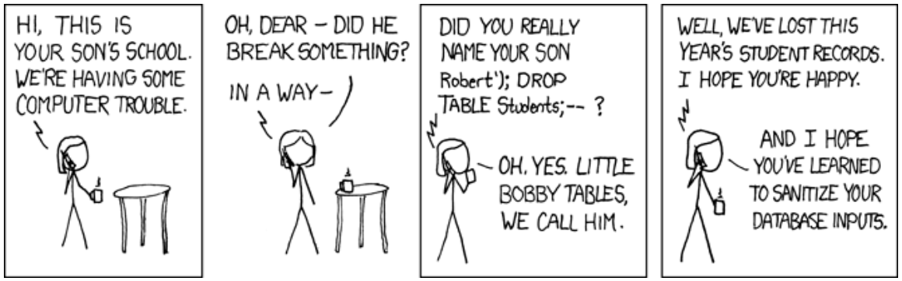

<style>
table {border-collapse: collapse;font-size:smaller}
th, td {border: 1px solid #BBBBBB}
th, td {text-align:left}
th, td {padding: 6px;}
hr {display: none}
pre {font-size:large}
</style>

# Databasbaserad publicering

## Föreläsning 6

### Dagens innehåll

**Databaser och säkerhet**


*<http://xkcd.com/327> Exploits of a Mom*

Läs kapitel 9 i boken PHP & MySQL: Novice to Ninja. Läs even kapitel 13 i boken Databasteknik eller kolla en sammanfattning av det kapitlet på 

<http://www.databasteknik.se/webbkursen/transaktioner/index.html>.
 
### Olika typer av säkerhet

- säkerhet mot intrång av obehöriga
- säkerhet mot olämpliga inmatningar/ändringar av behöriga
- säkerhet vid driftstörningar, datorkrascher, strömavbrott mm
- säkerhet kan dels hanteras av SQL, dels av PHP, vanligtvis av en kombination

### SQL-hantering av säkerhet mot intrång av obehöriga

#### Grant

Med SQL-kommandot GRANT kan man ge användare olika typer av rättigheter till tabeller:

- SELECT-rätt att hämta data ur tabeller
- UPDETE-rätt att ändra existerande poster i tabellen
- DELETE-rätt att ta bort poster
- INSERT-rätt att lägga in nya poster

Dessutom kan man få rättigheter till själva databasen:

- CREATE-rätt att lägga till tabeller i en databas
- DROP-rätt att ta bort tabeller ur en databas

Med kommandot REVOKE kan man ta bort rättigheter.

Exempel:

```sql
GRANT SELECT,INSERT ON album TO elev
```

ger användaren elev rätt att hämta data och lägga till data till tabellen album.

```sql
REVOKE INSERT ON album TO elev
```

tar bort möjligheten att lägga till poster för elev.

```sql
GRANT UPDATE(catalognumber) ON album TO elev
```

ger elev rätten att ändra kolumnen catalognumber (men inte övriga kolumner)

```sql
GRANT SELECT,INSERT,UPDATE,DELETE,CREATE
ON mytunes.* TO elev@localhost IDENTIFIED BY 'heMLiG'
```

ger elev rätt att hämta poster, lägga till poster, ändra poster, ta bort poster för *alla* tabeller i databasen mytunes samt skapa nya tabeller i mytunes. Det förutsätter att elev ansluter från localhost, dvs samma dator som databashanteraren samt att lösenordet 'heMLiG' används.

```sql
GRANT SELECT ON mytunes.* TO elev@'%'
```

ger elev rätt hämta data oavsett vilken dator han ansluter ifrån.
```sql
GRANT SELECT ON mytunes.* TO elev@'%.mah.se'
```

ger elev rätt att hämta data om han ansluter från godtycklig dator inom mah.se. 

**OBSERVERA:** Om man ansluter till SQL-servern via en PHP-server, är det PHP-serverns adress som är det intressanta. I exemplet ovan kan man hämta data från mytunes även från datorer utanför mah om man går via en PHP-server inom mah. 

```sql
GRANT ALL ON mytunes.* TO elev
```

ger elev i stort sett alla rättigheter. 

#### ROLE

Ofta behöver en hel grupp av användare samma rättigheter till en databas. Man kan då skapa *roller* med kommandot CREATE ROLE. En grupp kan tex vara kurssekreterare som kan ha vissa rättigheter, en annan grupp kan vara kursansvariga lärare som har andra rättigheter. Alla som tillhör en viss grupp (roll) kan då ges samma rättigheter. MySQL v 4 stöder inte roller.

### SQL-injection attacks

SQL-injection betyder att obehöriga användare försöker lura ett system genom att infoga SQL-kod i inmatningsfält, vanligtvis i ett webbformulär.

Antag att man har ett formulär med fälten user och password. Om man i fältet password matar in texten

```
user:elev
password: xxx' or 'a'='a
```

Antag vidare att fälten user går vidare till PHP-variabeln $user och password går vidare till $password. Om nu detta hanteras av mottagande PHP-sida på följande vis:

```php
$sql="SELECT privileges FROM security WHERE
user='$user' and password='$password' ";
```

kommer SQL-kommandot att bli

```sql
SELECT privileges FROM security WHERE
user='elev' and password='xxx' or 'a'='a'
```

Eftersom `'a'` alltid är lika med `'a'` kommer `SELECT` att hitta poster även om man angivit fel lösenord för elev, och eventuellt få rättigheter trots att man egentligen saknar det. 

PHP har ett antal funktioner man kan använda för att undvika apostrofer kommer med i inmatningsfält. Bland annat kan man använda sig av *prepared statements*. Läs mer om det på sidan 123-124 i boken PHP and MySQL - Novice to Ninja. 

### Säkerhet mot olämpliga inmatningar/ändringar av behöriga användare

Att skydda mot detta kan vara väl så svårt eller till och med svårare än att skydda mot intrång av obehöriga. Användare med rättighet att ändra data kan ställa till stor skada om de ändrar data på olämpligt sätt. 

Det finns inget generellt sätt att skydda sig mot detta, men följande försiktighetsåtgärder kan man vidta:

- Regelbunden backup. Om en användare råkat ta bort en post kan man förhoppningsvis återskapa den från en backup.
- Loggning av alla ändringar. Om en post tas bort eller ändras kan en kopia av den sparas i en historik-tabell.
- Väl utformat gränssnitt med lämpliga varningsmeddelanden. 


### Säkerhet vid driftstörningar, datorkrascher, strömavbrott mm

I första hand bör man naturligtvis undvika att det sker datorkrascher och strömavbrott med UPS (uninterruptable power supply) och liknande. Trots försiktighetsåtgärder kan man inte skydda sig helt mot till exempel hårdvarufel. Vissa av säkerhetsåtgärderna är de samma som tidigare, till exempel backup, men det finns några viktiga fall där man använder en teknik som kallas *transactions* eller *transaktioner*. 

En transaktion är en serie av SQL-kommandon som måste utföras tillsammans. 

**Ett klassiskt exempel:** antag att vi ska överföra pengar (785 kr) från ett konto  till ett annat. Då börjar vi med att dra pengar från ett konto:

```sql
UPDATE konto SET saldo=saldo-785 WHERE kontonr='113-335-7891';
```

Sedan sätter vi in på annat konto:

```sql
UPDATE konto SET saldo=saldo+785 WHERE kontonr='113-684-4322';
```

Vad händer om servern kraschar efter att vi dragit pengar men inte hunnit sätta in? Jo, pengarna försvinner helt och hållet!

Om en databas är inställd för att hantera transaktioner utförs inte SQL-kommandon förrän man ger kommando COMMIT. 

Vi kan då komplettera vårt exempel:

```sql
UPDATE konto SET saldo=saldo-785 WHERE kontonr='113-335-7891';
UPDATE konto SET saldo=saldo+785 WHERE kontonr='113-684-4322';
COMMIT;
```

Raderna är till en början transitoriska dvs de sparas inte permanent i databasen förrän man utför commit. Om servern kraschar mellan rad 1 och rad 2 kommer inga ändringar att ha sparats i databasen eftersom man inte utfört COMMIT.

Tidigare versioner av mysql saknade transaktioner men det finns i de senaste versionerna. Transaktioner påverkar prestanda, och ibland väljer man att ha det avstängt för att öka prestanda. Ett skäl till att prestandan minskar är att man vanligtvis måste låsa tabeller under en transaktion, så att en andra användare inte kan komma in och ändra i en tabell innan en första användare har avslutat en transaktion.

Det kan vara andra skäl till att man avbryter en transaktion än hårdvarufell. Om det visar sig efter att man dragit pengar från ett konto och det visar sig att det inte fanns tillräckligt med pengar på kontot kan man göra ROLLBACK.

```sql
UPDATE konto SET saldo=saldo-785 WHERE kontonr='113-335-7891';
SELECT saldo FROM konto W HERE kontonr='113-335-7891';
ROLLBACK;
```

Eftersom vi här gör ROLLBACK innan vi hunnit göra COMMIT kommer inte ändringen på rad 1 att sparas.

### Säkerhetshantering PHP

Se kapitel 9 i PHP & MySQL: Novice to Ninja. Cookies, sessions and access control.

Spara aldrig lösenord i klartext i tabeller. Spara kodade lösenord. Boken använder en kodningsmetod som kallas MD5, som har vissa säkerhetsbrister men som vi kommer att använda som exempel i labbarna. En säkrare metod finns beskriven på <http://php.net/manual/en/book.password.php>.

MD5 finns både i PHP och i MySQL. 
 
### Exploits of a Mom - Mer om SQL injection

Antag att vi har tabellen **Students** med kolumnerna **id**, **name**, **class** och **address**:

```sql
CREATE TABLE Students (
id INT NOT NULL PRIMARY KEY AUTO_INCREMENT,
adress TEXT,
class TEXT,
name TEXT)
```

Lägg till några rader:

```sql
INSERT INTO Students (adress,class,name) VALUES 
('4A','Bråkmakargatan 6','Lotta');
INSERT INTO Students (adress,class,name) VALUES 
('3B','Lönneberga','Emil');
```

Prova sedan att lägga till lille *Bobby Tables* med fullständiga namnet *Robert');DROP TABLE Students;--* med hjälp av en PHP-fil, där namnet finns i variablen $name:

```php
<?php
include $_SERVER['DOCUMENT_ROOT'].'/k3bope/me105a/connect.php';
$name="Robert');DROP TABLE Students;--";
$class="1C";
$adress="Östra Varvsgatan 11";
$sql="INSERT INTO Students (adress,class,name) VALUES ('$adress','$class','$name')";
$result=$pdo->exec($sql);
echo "$name has been added";
?>
```

Resultatet blir att tabellen Students med hela sitt innehåll försvinner!