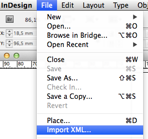
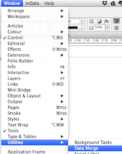
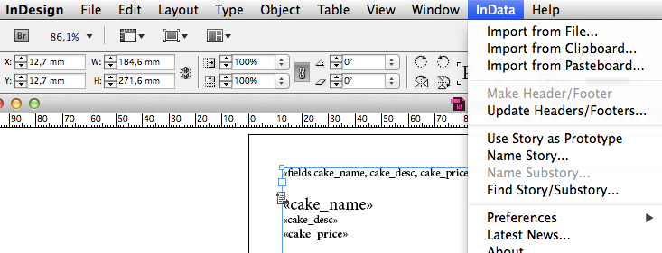
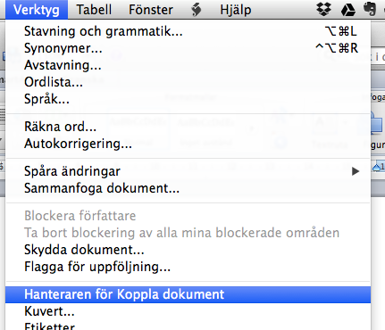

# Databasbaserad publicering

## Föreläsning 8

### Dagens innehåll

- Normalisering - läs mer på <http://www.databasteknik.se/webbkursen/normalisering/index.html>
- Export av data

### Normalisering

För att databaser ska vara säkra och effektiva krävs:

- Frånvaro av redundans (undvik samma data upprepade gånger)
- Minimalt antal null-värden (undvik tomma fält)
- Hinder för att data går förlorade

Sträva efter att alla tabeller uppfyller tredje normalformen!

### Funktionellt beroende

Funktionellt beroende mellan kolumner i en tabell innebär att en kolumn, eller en kombination av kolumner entydigt bestämmer en annan kolumn. 

**Exempel, funktionellt beroende**

studentnamn | <u>studentid</u> | <u>labnr</u> | labstatus | postnr | stad
--- | --- | --- 
Pär Pärsson | ad123456 | 1 | G | 22240 | Lund
Stina Stenhammar | ad654321 | 1 | VG | 22240 | Lund
Pär Pärsson | ad123456 | 2 | G | 22240 | Lund
Ola Olasson | ad314159 | 1 | G | 20506 | Malmö
Ola Olasson | ad314159 | 2 | VG | 20506 | Malmö
Pär Pärsson | ad999999 | 1 | VG | 20507 | Malmö

OBS att det finns två olika Pär Pärsson i tabellen

Exempel på funktionella beroenden: 

**studentnamn** är funktionellt beroende av **studentid**. Det kan skrivas

	studentid -> studentnamn


Det gäller även att **labstatus** är funktionellt beroende av **studentid** och **labnr** tillsammans. Det skrivs 

    {studentid,labnr} -> labstatus. 

### Första normalform 1NF

- Varje attribut i en tabell får endast innehålla ett värde


### Andra normalform 2NF

- Måste vara i 1NF samt
- Alla attribut som är *icke-nycklar* måste vara funktionellt beroende av *hela* *primärnyckeln*. Detta är endast ett problem då man har sammansatta primärnycklar.

Ett icke-nyckelattribut definieras som ett attribut som inte ingår i primärnyckeln.

### Tredje normalform 3NF

- Måste vara 2NF samt
- Attribut som är icke-nycklar får inte vara funktionellt beroende av andra attribut som är icke-nycklar


### Exempel

Följande exempel uppfyller inte första normalformen. Förutsättningen är att en person kan ha endast en adress men flera telefonnummer.

|  <u>id</u> | namn | adress | telefonnummer
| --- | --- | --- | --- 
| 1 | Bo P | Sofiavägen 3C | 133816, 6657619
| 2 | Sebastian B | Stora Östergatan | 3460010

Ej 1NF eftersom telefonnummer innehåller flera värden (inte *atomär*)

Lösning: dela upp i två tabeller

| namn | <u>id</u>
| --- | --- 
| Bo P | 1
| Sebastian B | 2

| <u>id</u> | person_id | adress | telefonnummer
| --- | --- | --- | ---
| 1 | 1 | Sofiavägen 3C | 133816
| 2 | 2 | Stora Östergatan | 3460010
| 3 | 1 | Sofiavägen 3C | 6657619

### Exempel

Följande exempel uppfyller 1NF men innehåller redundanta data

| studentnamn | <u>studentid</u> | <u>labnr</u> | labstatus | postnr | stad | 
| --- | --- | --- 
| Pär Pärsson | ad123456 | 1 | G | 22240 | Lund | 
| Stina Stenhammar | ad654321 | 1 | VG | 22240 | Lund | 
| Pär Pärsson | ad123456 | 2 | G | 22240 | Lund | 
| Ola Olasson | ad314159 | 1 | G | 20506 | Malmö | 
| Ola Olasson | ad314159 | 2 | VG | 20506 | Malmö | 
| Pär Pärsson | ad999999 | 1 | VG | 20507 | Malmö

OBS 1: två olika Pär Pärsson i tabellen.

OBS 2: tabellen har sammansatt primärnyckel, studentid och labnr tillsammans

Vi har följande funktionella beroenden:


studentid -> studentnamn
studentid -> postnr
studentid -> stad


Ej 2NF eftersom den har sammansatt primärnyckel, men studentnamn, postnr och stad beror inte av hela nyckeln, utan bara av studentid. De kolumnerna ska bort och in egen tabell!


| <u>studentid</u> | <u>labnr</u> | labstatus
| --- | --- | --- 
| ad123456 | 1 | G
| ad654321 | 1 | VG
| ad123456 | 2 | G
| ad314159 | 1 | G
| ad314159 | 2 | VG
| ad999999 | 1 | VG

| studentnamn | <u>studentid</u> | postnr | stad
| --- | --- | --- 
| Pär Pärsson | ad123456 | 22240 | Lund
| Stina Stenhammar | ad654321 | 22240 | Lund
| Ola Olasson | ad314159 | 20506 | Malmö
| Pär Pärsson | ad999999 | 20507 | Malmö

Tabellerna är nu i 2NF!

Vi har följande funktionella beroende:


postnr -> stad

Men de är inte i 3NF eftersom stad är beroende av postnr och båda är icke-nycklar.

Lösning: stad in i egen tabell

| <u>studentid</u> | <u>labnr</u> | labstatus
| --- | --- | --- 
| ad123456 | 1 | G
| ad654321 | 1 | VG
| ad123456 | 2 | G
| ad314159 | 1 | G
| ad314159 | 2 | VG
| ad999999 | 1 | VG

| studentnamn | <u>studentid</u> | postnr
| --- | --- | --- 
| Pär Pärsson | ad123456 | 22240
| Stina Stenhammar | ad654321 | 22241
| Ola Olasson | ad314159 | 20506
| Pär Pärsson | ad999999 | 20507

| <u>postnr</u> | stad
| --- | --- | --- 
| 22240 | Lund
| 22241 | Lund
| 20506 | Malmö
| 20507 | Malmö

Nu är tabellen i 3NF.

OBS:  i vissa fall kan 2NF vara att föredra framför 3NF. I exemplet ovan kan till exempel prestanda bli lidande när man delar upp i flera tabeller - det tar ofta längre tid att söka i flera än i en tabell. 

Utöver 1NF, 2NF och 3NF finns det ytterligare normalformer, tex Boyce-Codds normalform, *BCNF*. Den kan ni läsa om på 

<http://www.databasteknik.se/webbkursen/normalisering/index.html>

### Import av data

Hur importerar man data från en databas till InDesign eller annat layoutprogram?

Första steget är att exportera data på något av de sätt som beskrevs på förra föreläsningen, tex som xml, csv, tsv eller json

Andra steget är att antingen någon av InDesigns inbyggda importfunktioner, eller att använda en plugin. 

Den funktionen är kraftfull och flexibel men svåranvänd. Ett enklare men mer begränsat sätt är att använda InDesigns Data Merge-funktion:

Data Merge-funktionen kan importera tab-separerade filer (tsv) och skapa ett innehåll med konsistent layout. 

Det finns även olika plugins till InDesign, som ger ytterligare möjligheter till automatiserad layout. Några sådana exempel  är [InData](http://emsoftware.com/products/emdata/), [CatBase](https://www.catbase.com/) och [Easy Catalog](http://www.65bit.com/software/easycatalog/). 

Vi kommer att använda dels inbyggda Data Merge, dels InData i veckans laboration. 



Även Word innehåller en data merge-funktion liknande den i InDesign, "Koppla dokument" på svenska:

/Bo