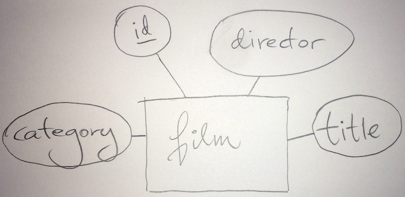
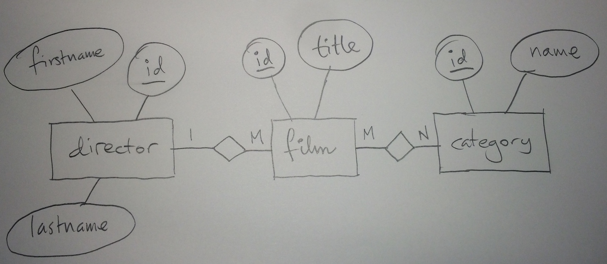
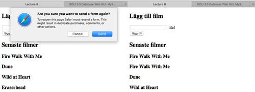

# Databasbaserad publicering

## Föreläsning 8

### Dagens innehåll

- Från E/R till tabeller och php-sidor
- Prepared statements
- En sida, flera ändamål

### En filmdatabas

#### E/R-diagram

Vi ska nu göra en förenklad filmdatabas, med följande förutsättningar:

Vi vill kunna spara följande uppgifter om en film:

- titel
- regissör
- kategori

Vilka entiteter har vi? Det finns inte ett enda svar på frågan, men vi gör ett försök att få en struktur som inte begränsar oss om vi vill få med mer information vid ett senare skede.

En grundläggande entitet är entiteten **film**. 

Entiteten film kan då ha attributen id, titel, regissör och kategori:

I princip funkar detta men problemet med detta är att varje film bara kan ha en titel, en regissör och en kategori. Vi får ta ett steg tillbaka och ställa oss några frågor:

- kan en film ha flera titlar? (tex svensk och engelsk titel)
- kan en film ha flera regissörer?
- kan en film tillhöra flera kategorier?

Låt oss för enkelhetens skull anta följande:

- En film kan endast ha **en titel**
- En film kan endast ha **en regissör**
- En film kan tillhöra **många kategorier**

Vi gör ett nytt försök, med tre entiteter istället för en, entiteterna *film*, *director* och *category*. 

Nu börjar det likna något. Ett-till-många-förhållandet mellan regissör och film gör att en regissör kan ha gjort många filmer. Däremot kan inte en film ha flera regissörer. Många-till-många-förhållandet mellan film och kategori gör att en film kan tillhöra många kategorier, samtidigt som en många filmer kan tillhöra samma kategori. 

Ett problem även med denna lösning är att en och samma person kan förutom att vara regissör även vara  till exempel skådespelare. Vi kan ha en entitet *person* istället för director, med två förhållande mellan *person* och *film*, förhållandena *directs* (ett-till-många) och *plays in* (många-till-många):

Nu har vi fått en ganska flexibel struktur som vi kan nöja oss med (men vi får vara beredda på problem om vi vill utöka lösningen så att titlar kan vara på flera språk). 

#### Tabeller

Nästa steg är att omvandla E/R-diagrammet till tabeller. Vi hoppar över förhållandet *plays in* så länge, eftersom vi inte behöver ha med information om skådespelare. 

Entiteten *person* blir en tabell med lika många kolumner som attribut:

**person**

| <u>id</u>  | firstname  | lastname  |
|---|---|---|
|   |  | &nbsp; |

Tabellen film är *många*-tabellen i ett ett-till-många-förhållande och behöver därför en extra kolumn som vi kan kalla *directorid* utöver attributen:

**film**

| <u>id</u>  | title  | directorid  |
|---|---|---|
|   |  | &nbsp; |

Entiteten *category* får lika många kolumner som attribut:

**category**

| <u>id</u>  | name  |
|---|---|
|   | &nbsp; |

Slutligen behöver vi en tabell för att hantera många-till-många-förhållanden mellan film och category:

**filmcategory**

| <u>filmid</u>  | <u>categoryid</u>  |
|---|---|
|   | &nbsp; |

Nu är det bara att ta fram lämplig sql-kod för att skapa tabellerna:


CREATE TABLE person (
id INT NOT NULL PRIMARY KEY AUTO_INCREMENT,
firstname TEXT,
lastname TEXT);

CREATE TABLE film (
id INT NOT NULL PRIMARY KEY AUTO_INCREMENT,
title TEXT,
directorid INT);

CREATE TABLE category (
id INT NOT NULL PRIMARY KEY AUTO_INCREMENT,
name TEXT);

CREATE TABLE filmcategory (
firstname INT,
lastname INT,
PRIMARY KEY(firstname,lastname));


Låt oss skapa dessa tabeller, samt lägga till några kategorier i tabellen *category*:


INSERT INTO category (name) VALUES ('sci-fi');
INSERT INTO category (name) VALUES ('komedi');
INSERT INTO category (name) VALUES ('thriller');


Låt oss även lägga till några regissörer:


INSERT INTO person (firstname,lastname) VALUES ('Quentin','Tarantino');
INSERT INTO person (firstname,lastname) VALUES ('Alfred','Hitchcock');
INSERT INTO person (firstname,lastname) VALUES ('David','Lynch');


#### PHP-sidor

Nu är vi redo att göra PHP-sidor som kan lägga till filmer. 

Vi kan börja med en sida som bara lägger till filmer, men inga kategorier, och inga regissörer. Vi gör sidan film.php som leder vidare till filmadded.php. Sidan film.php visar dels ett formulär för att lägga till en ny film, dessutom en lista med de 10 senast tillagda filmerna. 

**film.php**


<?php
//anslut till databas
include $_SERVER['DOCUMENT_ROOT'] . "/k3bope/me105a/connect.php";
?>
<!doctype html>
<html>
<head>
<meta charset="UTF-8">
<title>Lecture 8</title>
</head>

<body>
<h2>Lägg till film</h2>
<form action='filmadded.php' method='post'>
<input name='title' > titel 
<input type='submit' value='lägg till'>
</form>

<h2>Senaste filmer</h2>
<?php
//visa 10 senaste filmerna
$sql="SELECT * FROM film ORDER BY id DESC LIMIT 10";
$result=$pdo->query($sql);
foreach ($result as $row) {
	$title=$row['title'];
	echo '<h3>' . $title . '</h3>';
}
?>
</body>
</html>


**filmadded.php**


<?php
//anslut till databas
include $_SERVER['DOCUMENT_ROOT'] . "/k3bope/me105a/connect.php";
?>
<!doctype html>
<html>
<head>
<meta charset="UTF-8">
<title>Lecture 8 - added</title>
</head>

<body>
<h2>Lägg till film</h2>
<?php
$title=$_POST['title'];
$sql="INSERT INTO film (title) VALUES ('$title')";
$pdo->query($sql);
echo "$title har lagts till";
?>

</body>
</html>


Vi kan förbättra denna lösning genom att slå ihop de två filerna till en fil som "känner av" om vi kommer direkt till sidan eller om vi kommer dit genom formuläret för att lägga till ny film. Vi känner av det med följande kod som vi lägger i början av filen:


if (isset($_POST['title']))


Ny version av **film.php**:


<?php
//anslut till databas
include $_SERVER['DOCUMENT_ROOT'] . "/k3bope/me105a/connect.php";
if (isset($_POST['title'])) {
	$title=$_POST['title'];
	$sql="INSERT INTO film (title) VALUES ('$title')";
	$pdo->query($sql);
}
?>
<!doctype html>
<html>
<head>
<meta charset="UTF-8">
<title>Lecture 8</title>
</head>

<body>
<h2>Lägg till film</h2>
<!--formuläret leder tillbaka till samma sida-->
<form action='' method='post'>
<input name='title'> titel 
<input type='submit' value='lägg till'>
</form>

<h2>Senaste filmer</h2>
<?php
//visa 10 senaste filmerna
$sql="SELECT * FROM film ORDER BY id DESC LIMIT 10";
$result=$pdo->query($sql);
foreach ($result as $row) {
	$title=$row['title'];
	echo '<h3>' . $title . '</h3>';
}
?>
</body>
</html>


Observera att action-attributet är tomt, detta gör att formulärsidan leder tillbaka till sig själv. Om man kommer till sidan genom att direkt skriva in url, eller om man kommer till sidan via en länk, då finns ingen `$_POST['title']`  och inget försök görs för att lägga till film i databasen. Däremot som kommer koden på slutet att köras och de 10 senast tillagda filmerna kommer att visas. 

Ett problem med denna lösning är om man försöker ladda om sidan efter att man lagt till en film. Filmen kommer då att läggas till en gång till:

Ett trick för att lösa detta är att ladda om sidan så fort man lagt till en ny film. Det finns ett sätt att lösa detta genom att lägga till *headers* till en html-sida. Följande kod tar reda på url till aktuell sida och laddar sedan om den:


$self=$_SERVER['PHP_SELF'];
header("Location: $self");


Detta är kod som skickas innan själva html-koden skickas och måste därför vara i början av koden, innan `<!doctype....`. Vi lägger till några rader som laddar om sidan så fort en film lagts till:


<?php
//anslut till databas
include $_SERVER['DOCUMENT_ROOT'] . "/k3bope/me105a/connect.php";
if (isset($_POST['title'])) {
	$title=$_POST['title'];
	$sql="INSERT INTO film (title) VALUES ('$title')";
	$pdo->query($sql);
	
	//PHP_SELF innehåller url till aktuell sida. 
	$self=$_SERVER['PHP_SELF']; 
	//ladda om sidan när en film lagts till
	header("Location: $self");
	//avsluta sedan scriptet
	exit();
}
?>
<!doctype html>
<html>
<head>
<meta charset="UTF-8">
<title>Lecture 8</title>
</head>

<body>
<h2>Lägg till film</h2>
<form action='' method='post'>
<input name='title' > titel 
<input type='submit' value='lägg till'>
</form>

<h2>Senaste filmer</h2>
<?php
//visa 10 senaste filmerna
$sql="SELECT * FROM film ORDER BY id DESC LIMIT 10";
$result=$pdo->query($sql);
foreach ($result as $row) {
	$title=$row['title'];
	echo '<h3>' . $title . '</h3>';
}
?>
</body>
</html>


Nu kan sidan laddas om utan att man får upp en dialogruta som undrar om man verkligen vill skicka formuläret igen, och utan att filmen läggs till en andra gång. 

Vi är inte klara än. Fortfarande är vår lösning osäker, och med sql-injection kan man förstöra tabellerna. Prepared statements är ett sätt att skydda sig mot sql-injections. Detta finns beskrivet i boken *PHP % MySQL - Novice to Ninja* på sidorna 123-125.


$sql="INSERT INTO film SET title = :title";
$s = $pdo->prepare($sql);
$s->bindValue(':title',$title);
$s->execute();


Sidan med *prepared statement* blir då så här:


<?php
//anslut till databas
include $_SERVER['DOCUMENT_ROOT'] . "/k3bope/me105a/connect.php";
if (isset($_POST['title'])) {
	$title=$_POST['title'];
	$sql="INSERT INTO film SET
	      title = :title";
	$s = $pdo->prepare($sql);
	$s->bindValue(':title',$title);
	$s->execute();
	
	//PHP_SELF innehåller url till aktuell sida. 
	$self=$_SERVER['PHP_SELF']; 
	//ladda om sidan när en film lagts till
	header("Location: $self");
	//avsluta sedan scriptet
	exit();
}
?>
<!doctype html>
<html>
<head>
<meta charset="UTF-8">
<title>Lecture 8</title>
</head>

<body>
<h2>Lägg till film</h2>
<form action='' method='post'>
<input name='title' > titel 
<input type='submit' value='lägg till'>
</form>

<h2>Senaste filmer</h2>
<?php
//visa 10 senaste filmerna
$sql="SELECT * FROM film ORDER BY id DESC LIMIT 10";
$result=$pdo->query($sql);
foreach ($result as $row) {
	$title=$row['title'];
	echo '<h3>' . $title . '</h3>';
}
?>
</body>
</html>


Nu har vi en väl fungerande sida. Det som återstår är att kunna lägga till regissör och kategori. 

<!--
xxx sedan med director-meny

xxx sedan med radiobuttons för kategori

xxx ev möjlighet att även lägga till ny director
-->
