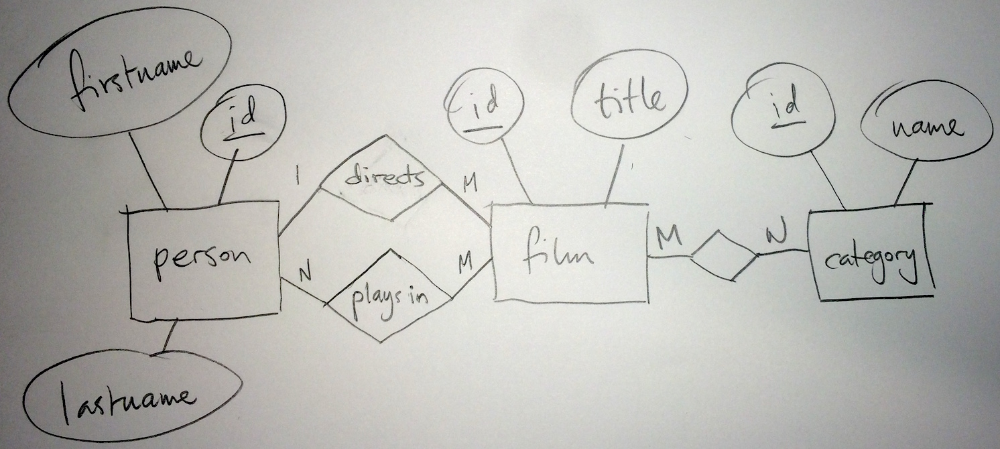

# Databasbaserad publicering

## Föreläsning 8

### Dagens innehåll

- Från E/R till tabeller och php-sidor
- Prepared statements
- En sida, flera ändamål

### En filmdatabas

Vi ska nu göra en förenklad filmdatabas, med följande förutsättningar:

Vi vill kunna spara följande uppgifter om en film:

- titel
- regissör
- kategori

Vilka entiteter har vi? Det finns inte ett enda svar på frågan, men vi gör ett försök att få en struktur som inte begränsar oss om vi vill få med mer information vid ett senare skede.

En grundläggande entitet är entiteten **film**. 

Entiteten film kan då ha attributen id, titel, regissör och kategori:

I princip funkar detta men problemet med detta är att varje film bara kan ha en titel, en regissör och en kategori. Vi får ta ett steg tillbaka och ställa oss några frågor:

- kan en film ha flera titlar? (tex svensk och engelsk titel)
- kan en film ha flera regissörer?
- kan en film tillhöra flera kategorier?

Låt oss för enkelhetens skull anta följande:

- En film kan endast ha **en titel**
- En film kan endast ha **en regissör**
- En film kan tillhöra **många kategorier**

Vi gör ett nytt försök, med tre entiteter istället för en, entiteterna *film*, *director* och *category*. 

Nu börjar det likna något. Ett-till-många-förhållandet mellan regissör och film gör att en regissör kan ha gjort många filmer. Däremot kan inte en film ha flera regissörer. Många-till-många-förhållandet mellan film och kategori gör att en film kan tillhöra många kategorier, samtidigt som en många filmer kan tillhöra samma kategori. 

Ett problem även med denna lösning är att en och samma person kan förutom att vara regissör även vara  till exempel skådespelare. Vi kan ha en entitet *person* istället för director, med två förhållande mellan *person* och *film*, förhållandena *directs* (ett-till-många) och *plays in* (många-till-många):

Nu har vi fått en ganska flexibel struktur som vi kan nöja oss med (men vi får vara beredda på problem om vi vill utöka lösningen så att titlar kan vara på flera språk). 

Nästa steg är att omvandla E/R-diagrammet till tabeller. Vi hoppar över förhållandet *plays in* så länge, eftersom vi inte behöver ha med information om skådespelare. 

Entiteten *person* blir en tabell med lika många kolumner som attribut:

**person**

| <u>id</u>  | firstname  | lastname  |
|---|---|---|
|   |  | &nbsp; |

Tabellen film är *många*-tabellen i ett ett-till-många-förhållande och behöver därför en extra kolumn som vi kan kalla *directorid* utöver attributen:

**film**

| <u>id</u>  | title  | directorid  |
|---|---|---|
|   |  | &nbsp; |

Entiteten *category* får lika många kolumner som attribut:

**category**

| <u>id</u>  | name  |
|---|---|
|   | &nbsp; |

Slutligen behöver vi en tabell för att hantera många-till-många-förhållanden mellan film och category:

**filmcategory**

| <u>filmid</u>  | <u>categoryid</u>  |
|---|---|
|   | &nbsp; |

Nu är det bara att ta fram lämplig sql-kod för att skapa tabellerna:


CREATE TABLE person (
id INT NOT NULL PRIMARY KEY AUTO_INCREMENT,
firstname TEXT,
lastname TEXT);

CREATE TABLE film (
id INT NOT NULL PRIMARY KEY AUTO_INCREMENT,
title TEXT,
directorid INT);

CREATE TABLE category (
id INT NOT NULL PRIMARY KEY AUTO_INCREMENT,
name TEXT);

CREATE TABLE filmcategory (
firstname INT,
lastname INT,
PRIMARY KEY(firstname,lastname));


Låt oss skapa dessa tabeller, samt lägga till några kategorier i tabellen *category*:


INSERT INTO category (name) VALUES ('sci-fi');
INSERT INTO category (name) VALUES ('komedi');
INSERT INTO category (name) VALUES ('thriller');
