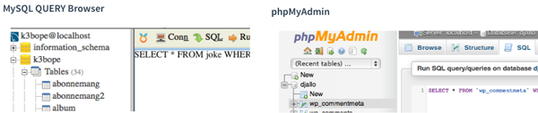

# Sida för att testa layout mm

## En rubrik


<?php
//kod som innehåller php-start-tagg
$list=array('januari','februari','mars');
//standard for-loop för att loopa igenom array
for ($i=0;$i<count($list);$i++) {
    echo $list[$i];
    echo " ";
}
?>


##En tabell med eget style-sheet

| id  | animal  | color  |
|---|---|---|
| 1 | cat | black |
| 2 | dog | white |
| 3 | elephant | pink |

## PHP-kod utan start-tag


$cat=array('id'=>1,'animal'=>'cat','color'=>'black');
$dog=array('id'=>2,'animal'=>'dog','color'=>'white');
$elephant=array('id'=>3,'animal'=>'elephant','color'=>'pink');

$table=array($cat,$dog,$elephant);
//eftersom $cat, $dog och $elephant är arrayer, som i sin tur
//sparas i en array, blir $table en array av arrayer eller en 
//tvådimensionell array

//vi kan skriva ut färgen på andra djuret på följande vis:
echo "The color is " . $table[1]['color'];

//$table[1] motsvarar hela andra raden i tabellen ($dog)
//eftersom numrering börjar från ett.
//$table[1]['color'] motsvarar i sin tur innehållet 
//i kolumnen 'color' i andra raden


##En bild utan bildtext

##Samma bild med bildtext

### När är det...
...slut

---

