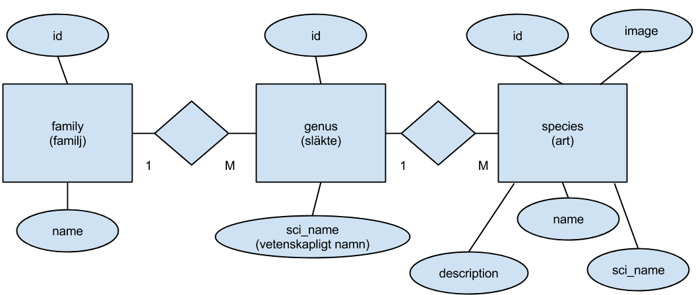
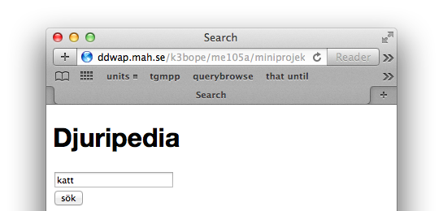
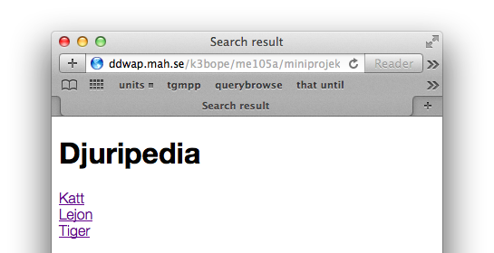
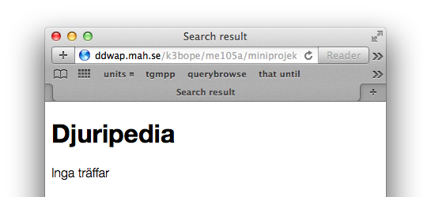
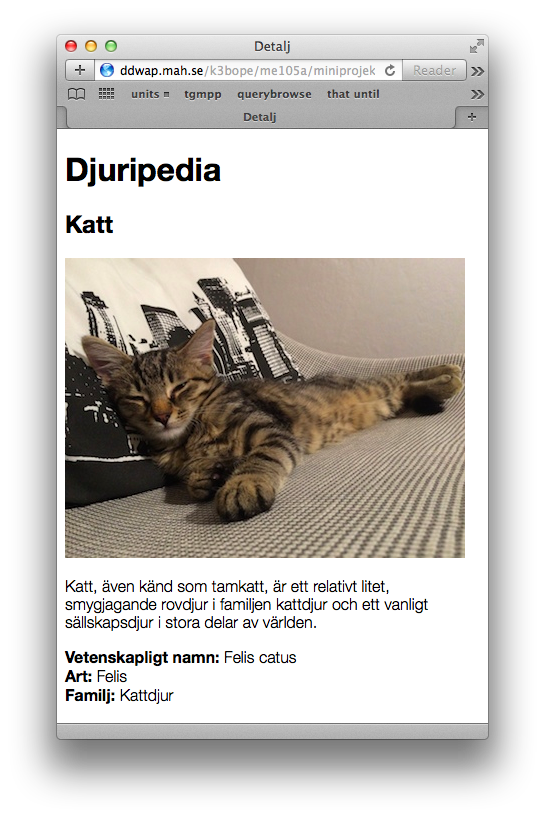
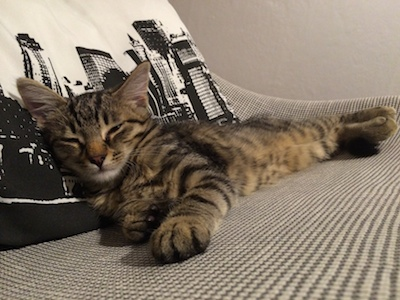
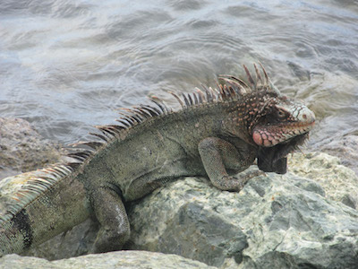
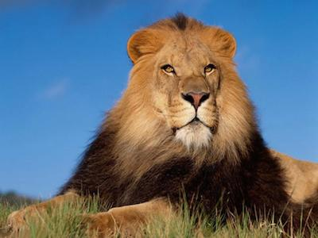
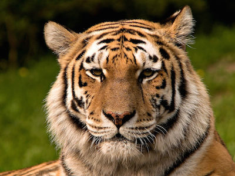
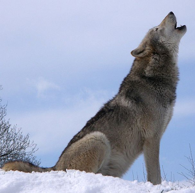

#Miniprojekt

Syftet med miniprojektet är att förbereda er på det slutliga projektet. Ni får en färdig databas som innehåller information om djur. Tre stycken PHP-sidor ska göras så att man kan söka information i djurdatabasen. 

Databasen beskrivs av följande ER-diagram:

SQL-koden på slutet i rapporten ska användas för att skapa tabeller som motsvarar ER-diagrammet, och för att mata in uppgifter om fem djur - katt, lejon, tiger, havsleguan och varg. 

Sidorna som ska skapas är *search.php*, *list.php* och *detail.php*. Man börjar på sidan *search.php* och matar in en sökterm:

Om texten man matat in finns med i *description* i tabellen *species* visas en lista över de djur som hittades på sidan *list.php*:

Om man däremot matar in ett ord som inte hittas...

...så visas meddelandet *Inga träffar* på sidan *list.php*.

Om man klickar på ett djurnamn i resultatlistan, till exempel Katt, kommer man vidare till sidan detalj, som visar all information om djuret:

Observera att denna sida hämtar information från alla tre tabellerna. 

Handledning kommer att ges under labbtillfällena, men det krävs att ni jobbar med projektet även på egen hand. 

Lämna in php-filerna ihopzippade, samt, **mycket viktigt**, en länk till ert miniprojekt, dvs något i stil med `http://ddwap.mah.se/userid/me105a/miniprojekt`

##Bilaga: Bilder och sql-kod

cat.jpg

iguana.jpg

lion.jpg

tiger.jpg

wolf.jpg


#skapa tabeller

CREATE TABLE family (
id INT PRIMARY KEY NOT NULL AUTO_INCREMENT,
name TEXT);

CREATE TABLE genus (
id INT PRIMARY KEY NOT NULL AUTO_INCREMENT,
sci_name TEXT,
family_id INT);

CREATE TABLE species (
id INT PRIMARY KEY NOT NULL AUTO_INCREMENT,
name TEXT,
sci_name TEXT,
description TEXT,
image VARCHAR(30) UNIQUE,
genus_id INT);

#lägg till data i family

INSERT INTO family (id,name) VALUES (1,'Kattdjur');
INSERT INTO family (id,name) VALUES (2,'Leguaner');
INSERT INTO family (id,name) VALUES (3,'Hunddjur');

#lägg till data i genus

INSERT INTO genus (id,sci_name,family_id) VALUES (1,'Felis',1);
INSERT INTO genus (id,sci_name,family_id) VALUES (2,'Panthera',1);
INSERT INTO genus (id,sci_name,family_id) VALUES (3,'Canis',3);
INSERT INTO genus (id,sci_name,family_id) VALUES (4,'Amblyrhynchus',2);

#lägg till data i species

INSERT INTO species (id,name,sci_name,description,image,genus_id) VALUES
(1,'Katt','Felis catus','Katt, även känd som tamkatt, är ett relativt litet, smygjagande rovdjur i familjen kattdjur och ett vanligt sällskapsdjur i stora delar av världen.','cat.jpg',1);

INSERT INTO species (id,name,sci_name,description,image,genus_id) VALUES
(2,'Havsleguan','Amblyrhynchus cristatus','Huvudet är kort och brett med trubbig nos samt har översidan beklädd med mosaikartad anordnade större och mindre sköldar. Den kraftiga bålen och den långa stjärten är på ryggsidan försedda med en kam. Svansen, som mot spetsen är starkt hoptryckt från sidorna, är beklädd med större fyrkantiga fjäll. Benen är korta och kraftiga; tårna försedda med små simhudar. Denna ödla uppnår en totallängd av 150 cm med svansen.','iguana.jpg',4);

INSERT INTO species (id,name,sci_name,description,image,genus_id) VALUES
(3,'Lejon','Panthera Leo','Lejon är ett kattdjur av släktet Panthera och världens näst största kattdjur, bara tigern är större. Lejonen lever i motsats till andra kattdjur i flockar. Två av artens viktigaste kännetecken är hanarnas man och dess rytande vilket är unikt bland kattdjuren. Lejon förekommer idag i Afrika och i den indiska delstaten Gujarat.','lion.jpg',2);

INSERT INTO species (id,name,sci_name,description,image,genus_id) VALUES
(4,'Tiger','Panthera tigris','Tiger är ett kattdjur som endast lever i Asien. Tigern är det största nu levande kattdjuret. Man delar upp de idag förekommande beståndet i sex underarter. Utöver detta känner man till tre utdöda underarter. De flesta tigrar lever i fuktig tropisk och subtropisk lövskog, men finns även i tempererade löv- och barrskogar. I denna miljö utgör pälsens mönster bra kamouflage. Tigern är en god simmare och badar ofta. Den jagar ensam och äter främst medelstora djur ur familjerna svindjur och hjortdjur, men tigern är opportunistisk och äter det den kommer över, så dieten inkluderar även fisk, fåglar, insekter, amfibier, reptiler, gnagare, piggsvin och primater. ','tiger.jpg',2);

INSERT INTO species (id,name,sci_name,description,image,genus_id) VALUES
(5,'Varg','Canis lupus','Varg, gråvarg eller ulv är ett rovdjur vars utbredningsområde sträcker sig över stora delar av världen. Vargen är det största hunddjuret och en fullvuxen varg väger vanligen 30 till 50 kg. En mängd underarter är beskrivna men det vetenskapligt faktiskt accepterade antalet är under diskussion. Vargen är även stamfader till hunden.','wolf.jpg',3);
