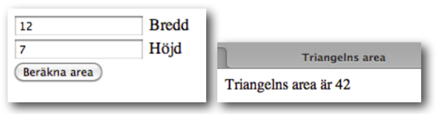
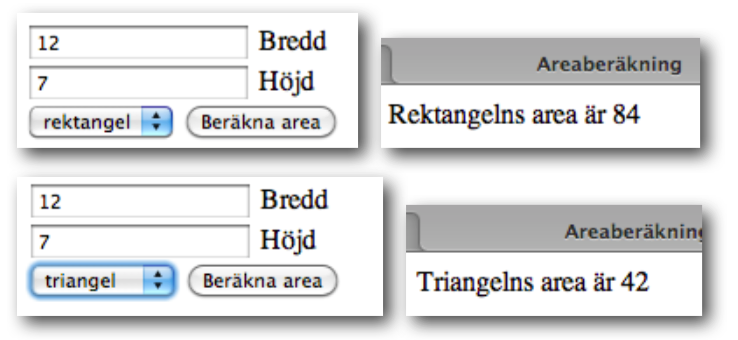
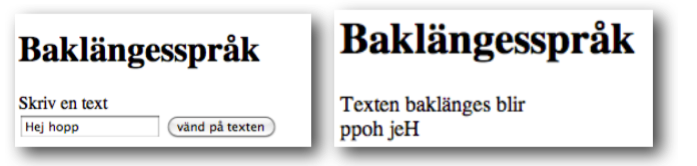
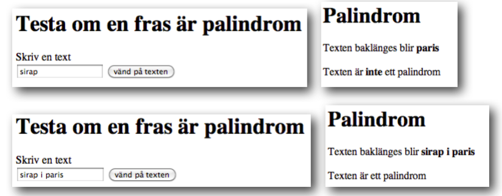
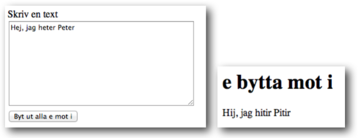

<script>
  var toggle = function(id) {
  var mydiv = document.getElementById(id);
  if (mydiv.style.display === 'block' || mydiv.style.display === '')
    mydiv.style.display = 'none';
  else
    mydiv.style.display = 'block'
  }
</script>

# Självstudier 1

## Uppgift 1

Vi har tidigare gjort en PHP-sida som beräknar en triangels area. Uppgiften nu är att göra en liknande sida men som får sin input från ett formulär:



<!--START SHOW/HIDE-->
<input type="button" value="visa/göm lösning 1" onclick="toggle('answer1');">

{::options parse_block_html="true" /}
<div id="answer1" style="display:none">

**upp1.html**

```html
<form action="upp1.php" method="post">
<input type="text" name="width"> Bredd <br>
<input type="text" name="height"> Höjd <br>
<input type="submit" value="Beräkna area">
</form>
```

**upp1.php**

```php
<?php
$width=$_POST["width"];
$height=$_POST["height"];

$area=$width*$height/2;

echo "Triangelns area är $area";

?>
```

</div>
<!--END SHOW/HIDE-->

## Uppgift 2

Komplettera uppgift 1 så att man kan välja om man vill beräkna area av triangel eller rektangel. Använd en if-sats för att avgöra om det är triangel eller rektangel. 



<!--START SHOW/HIDE-->
<input type="button" value="visa/göm lösning 2" onclick="toggle('answer2');">

{::options parse_block_html="true" /}
<div id="answer2" style="display:none">

**upp2.html**

```html
<form action="upp2.php" method="post">
<input type="text" name="width"> Bredd <br>
<input type="text" name="height"> Höjd <br>
<select name="type">
<option>rektangel</option>
<option>triangel</option>
</select>
<input type="submit" value="Beräkna area">
</form>

```

**upp2.php**

```php
<?php
$width=$_POST["width"];
$height=$_POST["height"];
$type=$_POST["type"];

if ($type=="triangel")
{
	$area=$width*$height/2;
	echo "Triangelns area är $area";
}
else
{
	$area=$width*$height;
	echo "Rektangelns area är $area";
}
?>
```

</div>
<!--END SHOW/HIDE-->

## Uppgift 3

Uppgiften går ut på att testa strängfunktioner. Det krävs inte att funktionerna fungerar för åäö, men testa vad som händer om man använder åäö. Gör ett formulär där man kan mata in en text. Gör en svarsida som visar inmatad text baklänges.




<!--START SHOW/HIDE-->
<input type="button" value="visa/göm lösning 3" onclick="toggle('answer3');">

{::options parse_block_html="true" /}
<div id="answer3" style="display:none">

**upp3.html**

```html
<form action="upp3.php" method="post">
Skriv en text <br>
<input type="text" width="50" name="text">
<input type="submit" value="vänd på texten">
</form>
```

**upp3.php**

```php
<?php
$text=$_POST["text"];

$reversetext=strrev($text);

echo "Texten baklänges blir <br>";
echo $reversetext;
?>
```

</div>
<!--END SHOW/HIDE-->

## Uppgift 4

Bygg vidare på förra uppgiften. Förutom att visa inmatad text baklänges ska man även få besked om texten är ett palindrom eller inte (palindrom är en text som blir samma sak baklänges)



Fungerar det med åäö? Fungerar det med blandade stora och små bokstäver? (testa tex med sirap i paris och med Sirap i Paris)

<!--START SHOW/HIDE-->
<input type="button" value="visa/göm lösning 4" onclick="toggle('answer4');">

{::options parse_block_html="true" /}
<div id="answer4" style="display:none">

**upp4.html**

```html
<form action="upp4.php" method="post">
Skriv en text <br />
<input type="text" width="50" name="text" />
<input type="submit" value="vänd på texten" />
</form>
```

**upp4.php**

````php
$text=$_POST["text"];

$reversetext=strrev($text);

echo "Texten baklänges blir <b>";
echo $reversetext;
echo "</b><br><br>";
if ($text==$reversetext) 
{
	echo "Texten är ett palindrom";
}
else
{
	echo "Texten är <b>inte</b> ett palindrom";
}
//obs att det inte funkar om man blandar stora och små bokstäver
//sirap i paris blir palindrom men inte Sirap i Paris
//lösning: ändra i if-satesen till
// if (strtoupper($text)==strtoupper($reversetext))
````

</div>
<!--END SHOW/HIDE-->


## Uppgift 5

Funktionen str_replace(sök, ersätt, text) byter ut alla förekomster av *sök* mot *ersätt* i *text*. Gör ett formulär där man kan mata in en text, och en svarsida som byter ut alla e mot i.



<!--START SHOW/HIDE-->
<input type="button" value="visa/göm lösning 5" onclick="toggle('answer5');">

{::options parse_block_html="true" /}
<div id="answer5" style="display:none">

**upp5.html**

```html
<form action="upp5.php" method="post">
Skriv en text <br>
<textarea rows="10" cols="40" name="text">
</textarea>
<br />
<input type="submit" value="Byt ut alla e mot i">
</form>
```

**upp5.php**

```php
<?php
$text=$_POST["text"];

$newtext=str_replace("e","i",$text);

echo $newtext;

//obs att det bara funkar för e men inte för E
//lösning: lägg till raden 
//$newtext=str_replace("E","I",$newtext);
//efter raden $newtext=str_replace("e","i",$text);
?>
```

</div>
<!--END SHOW/HIDE-->

Bygg gärna vidare så att alla vokaler byts ut mot i. 

