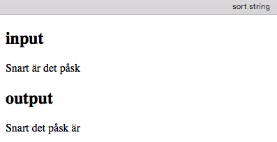
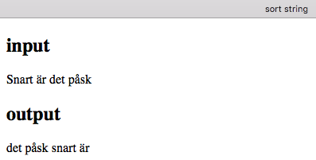
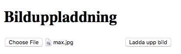
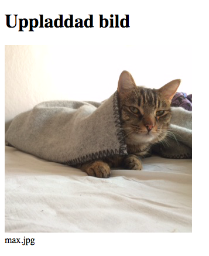

<script>
  var toggle = function(id) {
  var mydiv = document.getElementById(id);
  if (mydiv.style.display === 'block' || mydiv.style.display === '')
    mydiv.style.display = 'none';
  else
    mydiv.style.display = 'block'
  }
</script>

# Självstudier 2

## Uppgift 1

Denna uppgift handlar om att göra en egendefinierad funktion `sort_string($text)` som sorterar orden i en text. Funktionen ska ha en sträng som indata och en sorterad sträng som utdata. Om indata till exempel är "Sebastian Maria Johannes" ska utdata vara "Johannes Maria Sebastian" dvs samma ord men i bokstavsordning. 

Utgå från följande program. Det är bara innehållet i funktionen som behöver kompletteras. 

```php
<?php
function sort_string($text) {
    //använd först funktionen explode för att dela upp strängen $text i en array
    
    //använd sedan funktionen sort för att sortera array
    
    //använd slutligen funktionen join (motsatsen till explode) som fogar ihop vår array till en sträng

    //returnera den sorterade strängen som resultat
    return $text;
}

$text1 = "Snart är det påsk";

$text2 = sort_string($text1);

echo "<h2>input</h2>";
echo $text1;
echo "<h2>output</h2>";
echo $text2;
?>

```

När funktionen är klar ska resultatet bli följande: 



Observara att "Snart" kommer först. Det beror på att stora bokstäver sorteras före små bokstäver. 

<!--START SHOW/HIDE-->
<input type="button" value="visa/göm lösning 1" onclick="toggle('answer1');">

{::options parse_block_html="true" /}
<div id="answer1" style="display:none">

```php
<?php
function sort_string($text) {
    $arr=explode(" ",$text);
    sort($arr);
    $text=join(" ",$arr);
    return $text;
}

$text1 = "Snart är det påsk";

$text2 = sort_string($text1);

echo "<h2>input</h2>";
echo $text1;
echo "<h2>output</h2>";
echo $text2;
?>

```
</div>
<!--END SHOW/HIDE-->

## Uppgift 2

Komplettera uppgift 1 så att orden kommer i bokstavsordning oavsett om de börjar med små eller stora bokstäver. Använd funktionen `mb_strtolower()` för att omvandla texten till små bokstäver innan den sorteras. Resultatet blir då så här:



<!--START SHOW/HIDE-->
<input type="button" value="visa/göm lösning 2" onclick="toggle('answer2');">

{::options parse_block_html="true" /}
<div id="answer2" style="display:none">

```php
<?php
function sort_string_lower($text) {
    $text=mb_strtolower($text);
    $arr=explode(" ",$text);
    sort($arr);
    $text=join(" ",$arr);
    return $text;
}

$text1 = "Snart är det påsk";

$text2 = sort_string_lower($text1);

echo "<h2>input</h2>";
echo $text1;
echo "<h2>output</h2>";
echo $text2;
?>
```

</div>
<!--END SHOW/HIDE-->

## Uppgift 3

Gör ett formulär där man kan ladda upp en bild. Bilden ska visas direkt efter uppladdning. 

Formuläret:



Resultatet:




<!--START SHOW/HIDE-->
<input type="button" value="visa/göm lösning 3" onclick="toggle('answer3');">

{::options parse_block_html="true" /}
<div id="answer3" style="display:none">

**upload.html**

```html
<!doctype html>
<html>
<head>
<meta charset="UTF-8">
<title>Bilduppladdning</title>
</head>

<body>
<h1>Bilduppladdning</h1>
<form method="post" action="uploaded.php" enctype="multipart/form-data">
<input type="file" name="imagefile">
<input type="submit" value="Ladda upp bild">
</form>
</body>
</html>
```

**uploaded.php**

```php
<!doctype html>
<html>
<head>
<meta charset="UTF-8">
<title>Uppladdad bild</title>
</head>

<body>
<h1>Uppladdad bild</h1>
<?php
error_reporting(E_ALL);
ini_set('display_errors', 1);

$tempname=$_FILES["imagefile"]["tmp_name"];
$originalname=$_FILES["imagefile"]["name"];

copy($tempname,$originalname);

echo "";
echo "<br>";
echo $originalname;

?>
</body>
</html>

```


</div>
<!--END SHOW/HIDE-->


## Statistik

Jättesnällt om du talar om att du gjort eller försökt göra självstudien. Det är helt anonymt.

<iframe frameborder="0" src="http://ddwap.mah.se/k3bope/me132a/self/result.php?thisstudy=2" width="500" height="500">
</iframe>


