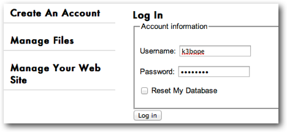
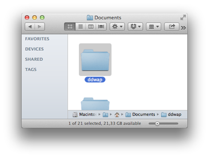
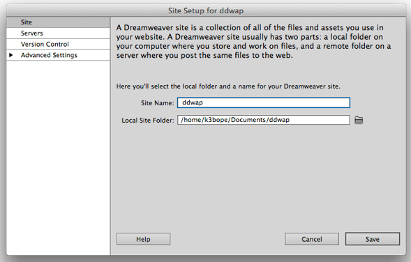
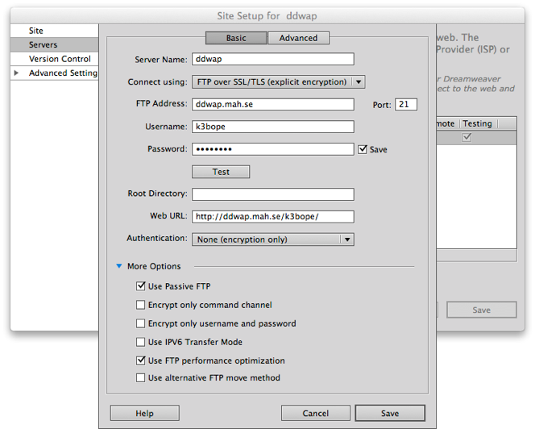
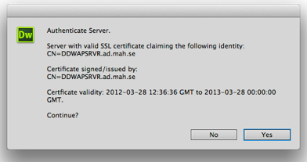
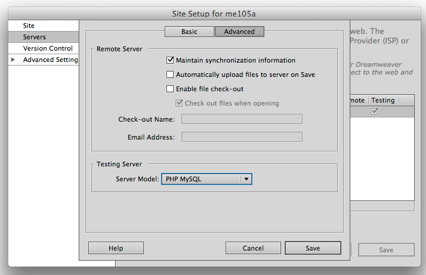
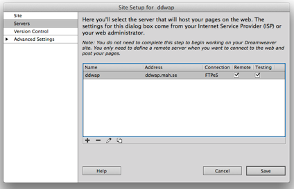
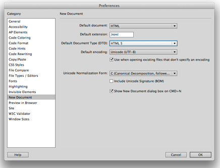
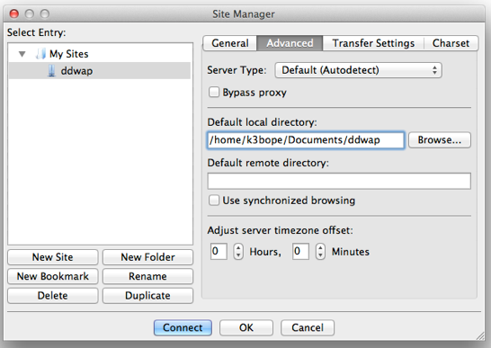
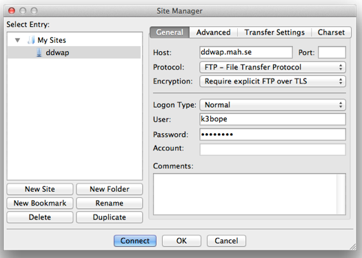

#Inställningar för Dreamweaver (steg 1, 2, 3 och 4) eller FileZilla (steg 1, 2 och 5)

När man gör webbsidor med PHP måste sidorna ligga på en server med stöd för PHP för att man ska kunna titta på dem. I kursen kommer vi att använda servern ddwap.mah.se. I detta dokument finns information om hur man ansluter till ddwap. **För att kunna fullfölja laborationerna i kursen är det viktigt att man får inställningarna att fungera**. Vi kommer huvudsakligen att använda Dreamweaver när vi skriver vår PHP-kod, och informationen här gäller huvudsakligen Dreamweaver. Om man hellre vill använda andra verktyg finns kortfattad information på slutet i dokumentet.

Gör så här för att kunna använda ddwap:

###Steg 1

Gå till <http://ddwap.mah.se> och välj Create an account. Använd ditt vanliga användarnamn och lösenord. 

###Steg 2

Skapa mappen *ddwap* på ett ställe där du enkelt kommer åt den framöver i kursen, tex i katalogen *Documents*. OBS: genom hela kursen är det mycket viktigt att tänka på följande när man *döper filer och kataloger*:

- Använd endast små bokstäver
- Undvik åäö
- Undvik mellanslag

###Steg 3 - endast för Dreamweaver

Starta Dreamweaver CS6. (Om du hellre vill använda valfri texteditor och FileZilla går du vidare till steg 5). 

Gör följande inställningar:

Definera en ny site genom att välja Site->New site… Ställ in enligt figurera nedan men byt ut *k3bope* mot ditt egna användarnamn. Döp din site till *ddwap* och välj mappen *ddwap* du skapat i steg 2 som Local Site Folder

Klicka *Servers* och gör följande inställningar. Det är viktigt att välja FTP over SSL/TLS (explicit encryption) samt Authentication: None (encryption only). Var som vanligt noga med att allt utom användarnamnet är exakt som i bilden nedan. 

Klicka **Test** och svara Yes om meddelandet nedan dyker upp. Förhoppningsvis kommer det en bekräftelse att det lyckades. Om inte, kolla att alla inställningar är korrekta och försök igen.

Välj sedan “Advanced” och välj Server Model: PHP MySQL 

Ange slutligen servern som både *Remote* och *Testing*. Klicka *Save* och du kan nu börja göra PHP-filer:

### Steg 4 - endast för Dreamweaver

Det är lämpligt men inte tvunget att ställa in Dreamweaver så att den autmatiskt jobbar med html5. Välj Dreamweaver->Preferences och välj sedan html 5 som Default Document Type:

### Steg 5 - endast för FileZilla

Detta gör du endast om du **inte vill använda Dreamweaver**.

Man kan istället för Dreamweaver använda godtycklig texteditor tillsammans med en ftp-klient, tex FileZilla. Följande FileZilla-inställningar kan användas:

##Att ansluta från egen dator

Samma inställningar för både Dreamweaver och Filezilla kan användas om man använder sin egen dator och jobbar hemifrån. Ibland kan man dock behöva ändra inställningen för passive/active ftp. Om det inte funkar med inställningarna ovan, prova att i Dreamweaver ta bort bocken vid "Use passive ftp" under More options, eller i Filezilla prova olika inställnignar på active och passive under Transfer Settings.