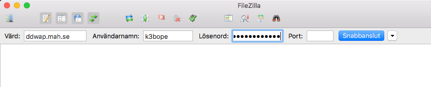
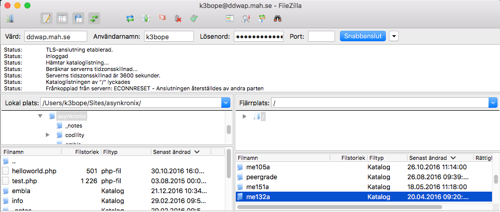

#Inställningar för FileZilla

##OBS

När man gör webbsidor med PHP måste sidorna ligga på en server med stöd för PHP för att man ska kunna titta på dem. I kursen kommer vi att använda servern ddwap.mah.se. I detta dokument finns information om hur man ansluter till ddwap. **För att kunna fullfölja laborationerna i kursen är det viktigt att man får inställningarna att fungera**. 

Gör så här för att kunna använda ddwap:

###Steg 1

Gå till <http://ddwap.mah.se> och välj Create Site. Följ instruktionerna för att skapa en site. 

### Steg 2

Man kan använda godtycklig texteditor tillsammans med en ftp-klient, tex FileZilla. Följande FileZilla-inställningar kan användas:

Fyll i uppgifterna och klicka "Snabbanslut"

Skapa sedan mappen **me132a** på ddwap-servern. 

Genom hela kursen är det viktigt att:

- endast använda små bokstäver samt siffror i fil- och mapp-namn
- aldrig använda svenska tecknen åäö i fil- och mapp-namn
- aldrig använda mellanslag i fil- och mapp-namn

##Att ansluta från egen dator

Samma inställningar kan användas om man använder sin egen dator från högskolan eller hemifrån. 