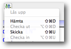

# Laboration 1
Syfte med laborationen:

- att få en första PHP-sida att fungera
- att se skillnaden mellan en statisk HTML-sida och en PHP-sida

Förberedelser:

- Läs kapitel 3 t.o.m sidan 53 i boken.

Lämna in följande på it's learning:

- Alla php- och html-filer ihopzippade
- Svar på alla frågor markerade med **Fråga** i labbhandledningen.

## Uppgift 1 – Dreamweaverinställningar

Ställ in Dreamweaver enligt instruktioner i *dwsettings.pdf*. De inställningar som gjorts nu kan behållas genom hela kursen. Se till att de funkar nu, annars kommer inte laborationerna att fungera framöver! Inställningarna går i korthet ut på att ställa in Dreamweaver så att alla php-sidor skapas lokalt på din Mac. För att kunna testa sidorna måste de skickas till webbservern ddwap.mah.se. När inställningarna är korrekt gjorda skickar man sidorna till servern genom att välja *Skicka/Put* under de gröna och blåa pilarna. 

Sidan är då skickad till servern ddwap.mah.se och kan testas genom att man klickar Förhandsgranska/Preview (jordgloben)

##Uppgift 2 – En enkel HTML-sida och PHP-sida

Uppgiften är att skapa en enkel HTML-sida som bara visar texten "Hello world!" och en PHP-sida som visar samma sak. 

I kursen kommer endast kodläget i Dreamweaver att användas. Skapa en ny html-sida. Spara sidan med namnet *hello.html* i katalogen *ddwap/me132a/lab1*. Sidan ska ha *Hello World! HTML* som title, och ha följande utseende:

**OBS:** använda små bokstäver, samt undvik åäö och mellanslag i fil- och katalognamn.

En likadan sida ska göras, men nu med PHP-kod. Skapa en ny PHP-sida och spara den som *hello.php* i katalogen *ddwap/me132a/lab1* . OBS: det är mycket viktigt att statiska sidor slutar med .html och att PHP-sidor slutar med .php

Jämför med exemplet echo.php på sidan 52 i boken. Anpassa hello.php så att den använder echo-funktionen för att visa *Hello world!* på samma sätt som echo.php visar *This is a test*. 

Ge även sidan *Hello World! PHP* som title. Den färdiga sidan ska ha följande utseende:

Titta på båda sidornas källkod. 

**Fråga:** Är det någon skillnad (förutom HTML respektive PHP i respektive titel)?

## Uppgift 3 – lägg till dynamiskt innehåll

I förra uppgiften vann vi inget på att använda PHP, men så fort man vill ha någon form av dynamiskt innehåll kommer PHP väl till pass. Dynamiskt innehåll i sin enklaste form kan vara dagens datum. 

Exemplet today.php använder PHP-funktionen `date('l, F dS Y.')` för att visa dagens datum. Skapa en ny PHP-fil, *hello2.php* som förutom texten Hello world visar dagens datum. Sidan ska ha följande utseende (men datumet ska uppdateras automatiskt):

##Uppgift 4 – anpassa datumformatet

Vad innebär egentligen `date('l, F dS Y.')` ? Jo, date(…) är en fördefinierad PHP-funktion som visar aktuellt datum och aktuell tid. Texten 'l, F ds Y.' mellan parenteserna anger formatet på datumet. En fullständig beskrivning av datumformat hittar man i PHP-manualen på <http://www.php.net>. Direktlänk till datumfunktionen är <http://se2.php.net/manual/en/function.date.php>

Där kan man läsa att bokstaven l (lilla L) innebär att dagen ska visas som text. Bokstaven F som följer innebär att månaden ska visas som text etc. 

Skapa en ny PHP-fil med namn hello3.php som visar datumet enligt formatet 

	2013-01-21
 
istället. 

Resultat ska bli följande (fast med dagens datum):

**Fråga:** Hur ser texten innanför parentesterna till funktionen date( ) ut för att detta resultat ska erhållas?