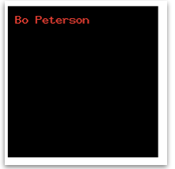
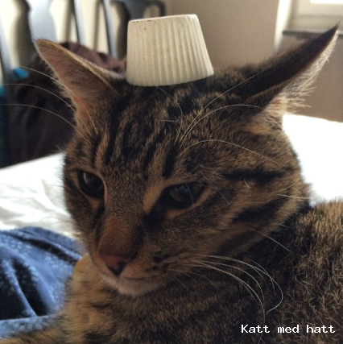

#Laboration 10

##Syfte med laborationen:

- att förstå hur man skickar mail med PHP
- att förstå hur man skapar bilder med PHP

##Lämna in följande:

- Alla php-filer ihopzippade

OBS: Använd samma katalogstruktur som i tidigare laborationer, dvs lägg alla filer i katalogen ddwap/me132a/lab10

##Uppgift 1

Två sidor ska göras och läggas i mappen lab10/upp1. Först *index.html* som innehåller ett formulär, som sedan leder till *sendmail.php*.

Sidan *index.html* innehåller ett formulär med följande utseende:

När man klickar *skicka* ska man komma vidare till sidan *sendmail.php* som skickar mail och visar följande meddelande: (eller ett felmeddelande om det inte lyckas)

##Uppgift 2

Sidan index.php ska göras och läggas i mappen *lab10/upp2*. Sidan ska hämta data från en textfil, *values.txt*, och rita ett stapeldiagram med staplar som motsvarar värdena i filen. Textfilen *values.txt* innehåller 10 st heltal separerade med kommatecken, och inget annat. Filen kan tex se ut så här:

Resultatet ska bli en sida som visar 10 staplar, så här:

Det är även tillåtet att göra diagrammet "uppochen" vilket är lite enklare. Det ser då ut så här:

Testa att ändra värden i values.txt (glöm inte ladda upp på servern efter ändringar) och kolla så att diagrammet ändras. 

##Uppgift 3

I denna uppgift ska vi låta inmatningen i ett formulär styra ett diagram. Tre värden matas in i diagrammet, rött, grönt och blått. När man klickar skicka ska man få upp ett tårtdiagram (pie chart) som visar fördelningen av de olika färgerna. Använd funktionen 


imagefilledarc($im, x-koordinat, y-koordinat, bredd, höjd, startvinkel, slutvinkel, färg,IMG_ARC_PIE);


för att visa varje tårtbit. 

##Uppgift 4

Gör en html-fil med följande innehåll: 


<!doctype html>
<html>
<head>
<meta charset="UTF-8">
<title>Untitled Document</title>
</head>

<body>

</body>
</html>


Denna sida ska visa bilden *image.php*, som trots att det är en php-fil i själva verket är en png-bild. Bilden ska bara vara en svart bakgrund, 200x200px med den text som står efter ?text= på html-sidan. Om texten på html-sidan ändras, ska texten på bilden ändras. 

Resultatet med texten ovan ska bli:

Sidan *image.php* får enbart innehålla php-kod (ingen html-kod alls). För att webbläsaren ska förstå att det är en bild måste en så kallad http-header skickas med följande PHP-kod:


header("Content-type: image/png");


Istället för att spara bilden som vi tidigare gjort med raden 


imagepng($im,”filnamn.png");


skriver vi nu bara


imagepng($im);


##Uppgift 5 - frivillig

Uppgiften ska vara precis som uppgift 4, men istället för att en svart bakgrund ska kompletteras med en text ska en befintlig bild kompletteras med samma text. Denna teknik kan bland annat användas för att lägga in vattenstämplar i foton. Resultatet kan bli följande:

