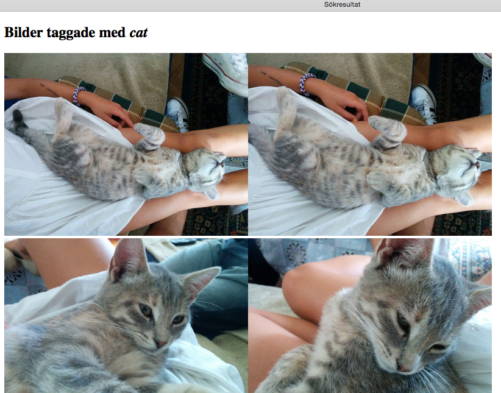
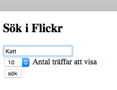

#Laboration 12 Flickr-API

##Förberedelse

1. Gå in på flickr.com och öppna ett konto om du inte redan har ett
2. Ladda upp minst 10 egna foton på flickr och tagga bilderna med sökord. Använd olika taggar men se till att flera bilder har samma tag.
3. Läs igenom avsnittet API authentication i instruktionerna på [Search for photos using PHP and the flickr API](http://www.web-development-blog.com/archives/search-for-photos-using-php-and-the-flickr-api/) och skaffa en egen API key. Spara den på ett ställe så att du kommer åt den under labben. 

## Uppgift 1

Följ instruktionerna på [Search for photos using PHP and the flickr API](http://www.web-development-blog.com/archives/search-for-photos-using-php-and-the-flickr-api/) för att göra en sida som visar 50 bilder som matchar en viss förbestämd söktext (Du väljer själv söktext. Ingen fantasi? Prova "cat", "dog", "rihanna")

Den servern vi använder stöder inte file_get_contents fullt för att hämta websidor. Därför måste raden 


$result = file_get_contents($search);


bytas ut mot


$result = curl_get($search);


Dessutom måste vi komplettera koden med funktionen curl_get enligt följande:


function curl_get($url){
    $return = '';
    (function_exists('curl_init')) ? '' : die('cURL Must be installed!');

    $curl = curl_init();
    $header[0] = "Accept: text/xml,application/xml,application/json,application/xhtml+xml,";
    $header[0] .= "text/html;q=0.9,text/plain;q=0.8,image/png,*/*;q=0.5";
    $header[] = "Cache-Control: max-age=0";
    $header[] = "Connection: keep-alive";
    $header[] = "Keep-Alive: 300";
    $header[] = "Accept-Charset: ISO-8859-1,utf-8;q=0.7,*;q=0.7";
    $header[] = "Accept-Language: en-us,en;q=0.5";

    curl_setopt($curl, CURLOPT_URL, $url);
    curl_setopt($curl, CURLOPT_HTTPHEADER, $header);
    curl_setopt($curl, CURLOPT_HEADER, 0);
    curl_setopt($curl, CURLOPT_RETURNTRANSFER, true);
    curl_setopt($curl, CURLOPT_FOLLOWLOCATION, true);
    curl_setopt($curl, CURLOPT_TIMEOUT, 30);
    curl_setopt($curl, CURLOPT_SSL_VERIFYPEER, false);
    $result = curl_exec($curl);
    curl_close($curl);
    return $result;
}


Resultatet ska bli något i stil med: 

## Uppgift 2

Gör ett formulär där du kan skriva in godtyckligt sökord, samt en dropdown-meny där du kan välja 10, 20, 50 eller 100 träffar. Du måste då ändra i funktionen search i flickr.php. Formuläret leder vidare till en likadan sida som i uppgift 1 men som inte visar resultatet av en förbestämd söktext, utan den text man matar in i formuläret. 

## Uppgift 3

Ändra så att sidan bara visar dina egna bilder. Gör det genom att lägga till en ny funktion i filen flickr.php som heter searchme. Den ska se ut som funktionen search, men variabeln $search måste kompletteras med user_id=ditt flickr-username. Full dokumentation för sökningen finns på <http://www.flickr.com/services/api/flickr.photos.search.html>

