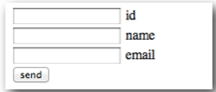
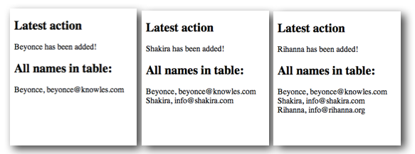
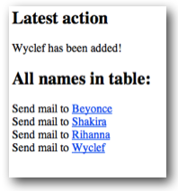

# Laboration 11

## Syfte med laborationen:

- att få en introduktion till databaser

## Förberedelser:

- läs föreläsningsanteckningar

## Lämna in följande:

- Alla php-filer ihopzippade

OBS: Använd samma katalogstruktur som i laboration 1, dvs lägg alla filer i katalogen *ddwap/me132a/lab11*

## Uppgift 1

Utgångspunkten är tabellen *friends* från föreläsningsanteckningarna till föreläsning 11. 

Skriv en PHP-fil *create.php* som skapar tabellen *friends* med hjälp av PHP-koden i exemplet *Skapa databas med PHP* i föreläsningsanteckningarna. Ladda upp filen på servern och öppna den sedan med en webbläsare.

Om allt funkar kommer en databas med namnet *friendbase* och tabellen *friends* skapats. OBS: denna sida behöver man inte öppna igen, tabellen behöver bara skapas en enda gång. 

Skapa sedan ett formulär i en fil med namnet index.html. Formuläret ska innehålla tre fält, id, name och email. 



När man klickar send ska man komma vidare till sidan *insert.php* som har två uppgifter:

1. Lägga till en rad i tabellen med det namn och epostadress som skrivits in i formuläret
2. Visa alla namn och adresser som finns i tabellen

För varje namn som läggs till i formuläret tillkommer en rad i databasen, och alla hittills inlagda namn visas.



## Uppgift 2

Ändra sidan insert.php så att den visar klickbara mailto-länkar:



Html-kod för länkarna ovan: 

```html
Send mail to <a href='mailto:wyclef@yele.org'>Wyclef</a>
```

## Uppgift 3

Testa att lägga till flera rader med samma id. Vad händer? Ett sätt att komma förbi detta är att använda AUTOINCREMENT. Ändra create.php så att en ny tabell med autoincrement skapas istället. Ändra sedan index.html och insert.php så att man inte behöver ange id. 

## Uppgift 4

Gör ett formulär där man kan söka fram epostadressen till en specifik person. Om man anger till exempel Beyoncé i sökfältet ska man bara få upp Beyoncés adress på resultatsidan. SQL-satsen måste då kompletteras med WHERE:

```sql
SELECT name,email FROM friends WHERE name = 'det man matat in i formuläret'
```
