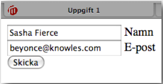
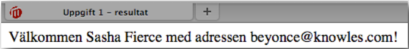
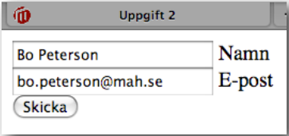
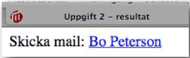
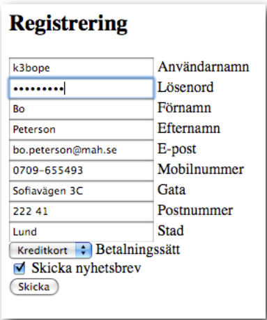
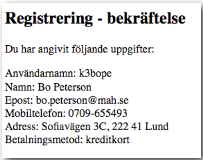
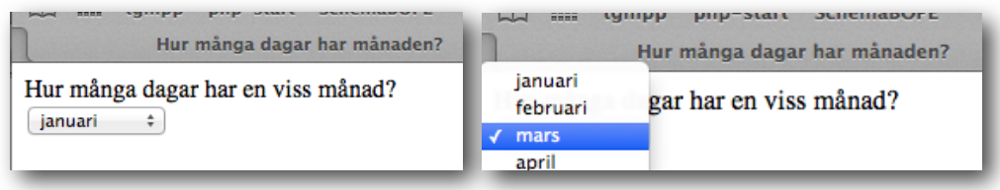
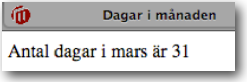

# Laboration 3

Syfte med laborationen:

- att förstå hur man använder formulär för att skicka data som behandlas av PHP-kod.

## Förberedelser:

Läs kapitel 3, s. 57-70 i boken PHP & MySQL

## Uppgift 1

Första uppgiften är att skapa ett formulär med två fält, ett för *namn* och ett för *epost-adress*. Döp filen till *upp1.html*.

När man klickar *skicka* ska man komma till en PHP-sida med filnamnet *upp1.php* som visar namn och e-postadress enligt följande:

## Uppgift 2

Skapa ett formulär som är identiskt med formuläret i uppgift 1 men döp den till *upp2.html*. 

När man klickar *Skicka* ska den leda vidare till sidan *upp2.php*:

Denna sida ska visa en klickbar mailto-länk. HTML-koden för en sådan länk ser ut enligt följande:


Skicka mail: <a href="mailto:bo.peterson@mah.se">Bo Peterson</a>


## Uppgift 3

Nu ska ett lite mer omfattande formulär göras, med följande utseende:

Formuläret ska leda vidare till 

## Uppgift 4

Om man inte använt sig av funktionen `htmlspecialchars()` kan man få konstiga och ibland rent av skadliga resultat om en användare matar in html-kod i formulären. 

Testa att mata in 

`<h1>dittnamn`

i fältet *förnamn* i formuläret (men ersätt *dittnamn* med det du heter). Klicka *Skicka*. Vad händer?

Komplettera lösningen till uppgift 3 så att den oskadliggör eventuell kod i inmatningsfält.

## Uppgift 5

Komplettera uppgift 5 i laboration 2 (förra laborationen) med ett formulär så att man kan välja en viss månad i en dropdownmeny och sedan få veta hur många dagar det är i den månaden. Svarsidan kan se nästan likadan ut som i laboration 2, men måste hämta rätt månad från formuläret. 

Följande sida

 

leder fram till denna:

**OBS** Sidan med månadsmenyn måste även ha en skicka-knapp som inte syns i bilden. 