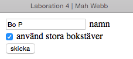

# Laboration 4

Syfte med laborationen:

- att förstå hur man använder och manipulerar strängar med PHP-kod.

OBS: Använd samma katalogstruktur som i laboration 1, dvs lägg alla filer i katalogen ddwap/me132a/lab4. För att sedan testas måste de skickas över till servern ddwap.mah.se.

Lämna in följande på peergrade:

Alla php-filer ihopzippade samt en textfil med länkar till de olika uppgifterna. 

## Uppgift 1

Två filer ska användas i uppgiften, upp1.html med ett formulär, och upp1.php som tar emot formuläret. 

Formuläret ska innehålla tre fält, ett med förnamn, ett med efternamn och en drop-down-meny med fem olika språkalternativ: Swedish, English, Danish, Norwegian och Finnish.

Resultatsidan ska visa texten `Välkommen Förnamn Efternamn.` om man har valt svenska. Om man valt något av de andra språkalternativen ska resultatet istället visa `Welcome Förnamn Efternamn.`

## Uppgift 2

Uppgiften nu är att göra ett formulär upp2.html som leder vidare till upp2.php och som klarar följande:

- Eventuella enkla och dubbla citationstecken som matas in formuläret ska visas korrekt på resultatsidan
- Eventuella html-taggar som matas in ska oskadliggöras så att de inte påverkar formatteringen
- Man ska med en checkbox kunna välja om resultattexten ska visas som den matas in eller enbart med stora bokstäver.

Om kryssrutan **inte** är förbockad:

Formuläret 

leder vidare till

Om kryssrutan **är** förbockad:

Formuläret 

leder vidare till

Det är *inte* tvunget att svenska tecken åäö hanteras korrekt. Observera att funktionen `isset()` kan behöva användas för att hantera kryssrutan. Se <http://php.net/manual/en/function.isset.php>. 

## Uppgift 3

Spara en kopia av upp2.html och upp2.php med namnen upp3.html respektive upp3.php. Fixa koden så att även svenska tecken hanteras. Många strängfunktioner finns även i så kallade multibyte-versioner som hanterar svenska tecken bättre. Istället för funktionen strtoupper($str) kan man använda mb_strtoupper($str,'UTF-8') för att omvandla strängen $str till stora bokstäver. 

## Uppgift 4

Komplettera uppgift 1 så att den visar korrekt välkommen-text för alla fem språkalternativen. Använd google-translate eller annat lämpligt verktyg om du inte vet vad välkommen heter på de olika språken. 

## Uppgift 5

Gör ett formulär med *radiobuttons*, med en fråga med tre svarsalternativ där endast ett alternativ är rätt. När man klickar "Skicka svar" ska man komma vidare till en sida som visar om man svarat rätt eller fel. Observera att man endast ska kunna välja ett svar. Om inget svar valts räknas det som fel svar. 

Några tips:

- alla radiobuttons måste ha samma name-attribut, annars kan man markera mer än ett alternativ
- använd funktionen isset på resultatsidan för att kolla att någon knapp är ifylld

## Uppgift 6

Gör ett formulär med checkboxes, med en fråga med fem svarsalternativ där mer än ett alternativ är korrekt. Om man fyllt i alla korrekta alternativ men inga felaktiga alternativ får man beskedet att man svarat rätt, annars att man svarat fel. 

Några tips:

- Här är det enklare att alla checkboxes får olika name-attribut (de kan ha samma name-attribut men då hamnar svaren i en array)
- Använd igen isset för att se om rutorna är ifyllda eller inte

Figurerna nedan visar vilka resultat olika svar ger. 

