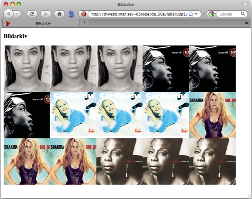
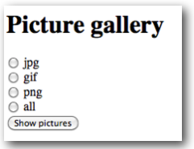
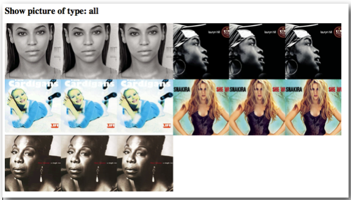
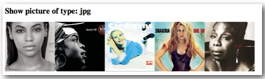
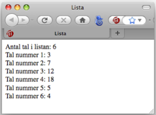
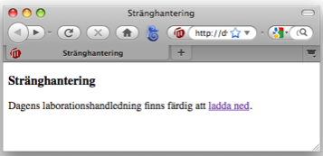
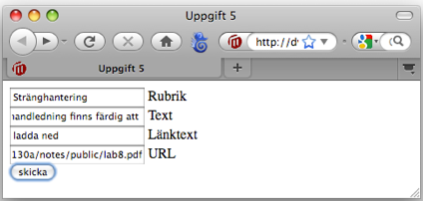
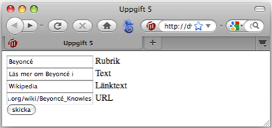
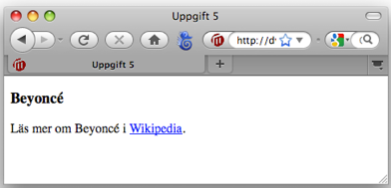

#Laboration 7

##Syfte med laborationen:

- att förstå enkel filhantering i PHP
- att repetera grundläggande PHP-begrepp såsom loopar, arrayer, stränghantering och formulär. 

VIKTIGT: uppgift 3-5 är repetitionsuppgifter som behandlar grundläggande byggstenar i programmering och som måste behärskas. Det är därför viktigt att uppgifterna görs självständigt. Målet är inte att ni ska hinna bli klara med uppgift 3-5 under laborationstillfället, utan att ni jobbar med dem tills ni verkligen förstått dem. 
{: .info}

##Förberedelser:

- lägg 5 valfria png-bilder, 5 jpeg-bilder och 5 gif-bilder 150 x 150 px i  ddwap/me132a/lab7/images. Se till att filnamnen endast innehåller små bokstäver a-z samt eventuellt siffror. 

##Lämna in följande:

- Alla php-filer ihopzippade.

OBS: Använd samma katalogstruktur som i laboration 1, dvs lägg alla filer i katalogen ddwap/me132a/lab7

##Uppgift 1

Uppgiften går ut på att skriva ett PHP-script som visar alla bilder av typen gif, jpg eller png i en katalog. 

Skapa filen *index.php* i mappen *upp1*. Skriv PHP-kod som gör följande:

- Definierar en variabel `$imagepath` som innehåller relativ sökväg från *upp1* till katalogen *images*.
- Sparar alla filnamn i katalogen *images* i en array-variabel `$files`.  Detta görs med funktionen `scandir`. 
- Loopar igenom array-variabeln `$files`, och för varje filnamn som slutar på jpg, gif eller png skapar lämplig html-kod för att visa bilden i filen. Man kan använda funktionen `pathinfo($filename, PATHINFO_EXTENSION)` som returnerar fil-ändelsen (tex jpg, gif eller png).

Om *images* innehåller 15 bilder, 5 jpg, 5 png (samma bilder som jpg) och 5 gif (också samma bilder som jpg) blir utskriften följande:

##Uppgift 2

Skapa ett formulär *upp2/index.html* där man med radiobuttons kan välja vilka bildformat som ska visas. Formuläret kan se ut så här:

När man klickar *Show pictures* ska man komma vidare till sidan *gallery.php*. Om *all* är förbockad ska utskriften bli följande:

Om istället *jpg* är förbockad blir utskriften

##Uppgift 3 - Repetitionsuppgift

Uppgiften går ut på att skriva ut några egenskaper hos en lista med tal:

- Antal tal i listan
- De olika talen i listan . 

För att skriva ut de olika talen måste man loopa igenom listan. Listan är att antal tal lagrade i en array, tex


$list = array(3, 7, 12, 18, 5, 4);


Utskriften ska i detta fall bli:

##Uppgift 4 - Repetitionsuppgift

Uppgiften går ut på att träna stränghantering. 

Filen *index.php* i *upp4* ska göra följande: Några variabler innehåller information om länk, dels texten i länken, dels url som länken leder till. Dessutom variabler som innehåller annan text och rubrik. Utgå från följande variabler:


$headline="Stränghantering";
$text="Dagens laborationshandledning finns färdig att ";
$linktext="ladda ned";
$url="http://dvwebb.mah.se/k3bope/me132a/public2014/lab7.pdf";


Kombinera utskrift av variablerna så att resultatet blir:

Källkoden ska se ut ungefär så här: 


<!doctype html>
<html>
<head>
<meta charset="UTF-8">
<title>Stränghantering</title>
</head>
<body>
<h3>Stränghantering</h3>
Dagens laborationshandledning finns färdig att 
<a href="http://dvwebb.mah.se/k3bope/me132a/public2014/lab7.pdf">ladda ned</a>.
</body>
</html>


##Uppgift 5 - Repetitionsuppgift

Gör ett formulär med fyra fält enligt nedan, döp filen till *index.html* och lägg i mappen *upp5*. 

När man skickar formuläret ska man komma till sidan *link.php* som innehåller php-kod som skapar en sida med samma uppbyggnad som i uppgift 4. Om man matar in *Stränghantering* i rubrik-fältet, *Dagens laborationshandledning finns färdig att* i text-fältet etc ska resultatet bli precis som i förra uppgiften. Om man istället matar in följande

ska utskriften bli

