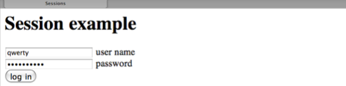

#Laboration 9

##Syfte med laborationen

- att förstå cookies och sessions
- att repetera grundläggande PHP-begrepp inom stränghantering. 

VIKTIGT: uppgift 3 är repetitionsuppgift som behandlar grundläggande byggstenar i programmering och som måste behärskas. Det är därför viktigt att uppgiften görs självständigt. Målet är inte att ni ska hinna bli klara med uppgift 3 under laborationstillfället, utan att ni jobbar med den tills ni verkligen förstått den.
{: .info}

##Förberedelser

- läs om cookies och sessions i kapitel 9 i boken. 

##Lämna in följande

- Alla php-filer ihopzippade

OBS: Använd samma katalogstruktur som i laboration 1, dvs lägg alla filer i katalogen *ddwap/me132a/lab9*

##Uppgift 1

Uppgiften går ut på att göra en sida som sätter en cookie med namnet *visitorname* som håller reda på besökarens namn. Första gången man kommer till webbplatsen (dvs om det inte finns någon cookie med namnet *visitorname*) ska man bli tillfrågad om namnet. Om man sedan besöker sidan inom ett år ska cookien komma ihåg besökarens namn och visa det. 

Första gången man går in på sidan **index.php** ska man se följande:

Om man fyller i sitt namn och klickar *continue* ska man komma vidare till sidan **setcookie.php** med följande utseende:

Sidan setcookie.php lagrar en det inmatade namnet i cookien *visitorname*. 

Nästa gång man går till sidan **index.php** ska man istället se följande:

Sammanfattningsvis: Sidan **index.php** visar ett formulär om det inte finns någon cookie *visitorname*. Om det finns en cookie *visitorname* visas istället en välkomsthälsning där även namnet som är lagrat i cookien visas. 

För att kunna testa lösningen behöver vi även en sida som tar bort cookien. Gör en sida **clearcookie.php** som tar bort cookien *visitorname* och visar följande:

##Uppgift 2

I denna uppgift ska vi använda oss av sessioner för att hantera inloggning. Totalt fyra sidor ska göras, i mappen *lab9/upp2* med namn enligt nedan. 

Först kommer man in på **index.php**. Om man inte är inloggad möts man av budskapet att man ska logga in samt en länk till inloggningssidan:

Om man klickar vidare till **login.php** möts man av ett inloggningsformulär:

Om man anger felaktigt användarnamn/lösenord blir resultatet av sidan **checkuser.php** följande:

Om man istället anger korrekt lösenord blir resultatet av samma sida **checkuser.php**:

Om man då går tillbaka till **index.php** är man inloggad och möts av följande sida:

Om man klickar log out visar sidan **logout.php** följande:

För att denna enkla inloggningssite ska fungera måste samtliga sidor använda sessionshantering. Det gör man med PHP-kod allra först på alla sidor i exemplet:


<?php
session_start();
?>
<!doctype html>
<html>
<head>


De olika sidorna ska sedan fungera enligt följande:

- Sidan **index.php** ska kolla om sessionsvariabeln `$_SESSION['loggedin']` är sann. Isåfall är man inloggad och *Congratulations... * visas. Om `$_SESSION['loggedin']` är falsk ska man få meddelandet *You must log in first* och länk till inloggningssidan. 
- Sidan **login.php** ska visa ett inloggningsformulär om man inte redan är inloggad. 
- Sidan **checkuser.php** ska visa *Wrong user...* om man angivit fel användarnamn eller lösenord. Om man gett rätt lösenord ska *You are now logged in. Please continue to main page* med länk till index.php visas. Dessutom ska sessionsvariabeln `$_SESSION['loggedin']` tilldelas värdet *true*. Använd din egen *datoridentitet* som *användarnamn* och *qwerty* som *password*. 
- Sidan **logout.php** ska avsluta sessionen så att man blir utloggad samt ge möjlighet till ny inloggning.
 
##Uppgift 3

Uppgiften går ut på att testa olika sätt att pussla ihop strängar. Målet med alla sätten är att skapa html-koden


En bild av en katt:  


Följande förutsättningar gäller:

Filnamn till bilden och alternativtexten finns lagrade i variablerna `$imagesource` och `$alttext`:


$imagesource="katt.png";
$alttext="en katt";


Variablerna måste användas för att få fram texten *en katt* och *katt.png*. Om variabelvärdena ändras ska text och bild ändras. Du måste också skaffa en egen bild, men den kan heta något annat än katt.png. Ändra då bara värdet på variabeln $imagesource till namnet på bilden. Ändra även alt-texten så att den stämmer med bilden. 

**Alternativ 1:**
I första alternativet får html-koden skapas med flera echo-satser, så många som behövs. Huvudsaken är att korrekt kod skapas.

**Alternativ 2:**
I andra alternativet ska en ny strängvariabel, $html, definieras som ska innehålla hela texten som skrivs ut. Använd gärna konkateneringsoperatorn .= (punkt följt av likhetstecken) för att gradvis bygga på $html. När $html är skapad kan korrekt kod skrivas ut med.


echo $html;


**Alternativ 3:**
I tredje alternativet ska koden skrivas ut med en echo-sats som börjar och slutar enligt nedan:


echo "En bild KOMPLETTERA MED LÄMPLIG PHP-KOD HÄR ";


Komplettera med lämplig kod för att fylla i saknad text. 

Lägg in samtliga tre alternativ i *lab9/upp3/index.php*. Resultatet ska bli:

