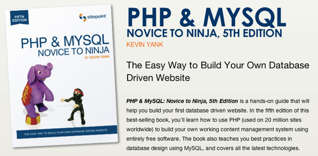

# Programmering för webben	

## Kurslitteratur

### PHP & MySQL – Novice to Ninja av Kevin Yank

Samma bok kommer att användas i fortsättningskursen *Databasbaserad publicering* nästa termin. 

## Vad innehåller kursen?

Grunder i programmering - generellt för olika programmeringsspråk

Programmering i programspråket PHP

### Vad är programmering?

**Kort defininition av programmering:** creating a sequence of instructions to enable the computer to do something 

**Från wikipedia:** Computer programming (often shortened to programming or coding) is the process of writing, testing, debugging/troubleshooting, and maintaining the source code of computer programs. This source code is written in a programming language. 

### Vad är webbprogrammering?

Webbprogrammering innebär vanligtvis att man skriver program som inte kan köras fristående, utan som kräver en webbläsare för att köras. 

### Vad är PHP?

PHP står för **PHP: Hypertext Preprocessor**  och är ett programmeringsspråk som är utvecklat för att passa bra ihop med HTML-kod och webbsidor. PHP är, till skillnad från JavaScript som också används med HTML-kod, ett språk för program som körs på *webservern*, så kallad *server-side scripting*. 

Officiell webbplats: <http://www.php.net/>

### Vad finns det mer för alternativ till PHP ?

Java, C, C++, C#, Python, Ruby är exempel på programmeringsspråk som kan användas till samma sak som PHP. 

PHP-kod används huvudsakligen för att ge webbsidor dynamiskt innehåll och interaktivitet. PHP-kod inbäddas vanligtvis i html-kod. 

PHP-kod börjar med `<?php` och avslutas med `?>`

`echo` används när man vill att något som PHP beräknat fram ska synas på en webbsida

### Exempel på en ren html-sida och en sida med inbäddad php-kod


<!doctype html>
<html>
<head>
<meta charset="UTF-8">
<title>HTML test</title>
</head>
<body>

This is a test!

</body>
</html>



<!doctype html>
<html>
<head>
<meta charset="UTF-8">
<title>PHP test</title>
</head>
<body>

<?php
$text="This is a PHP-test";
echo $text;
?>

</body>
</html>


