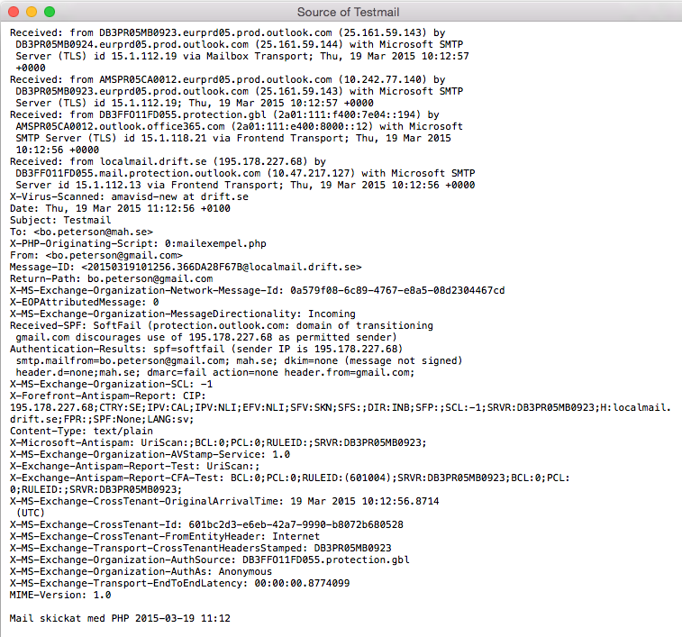
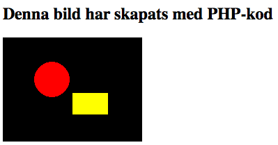
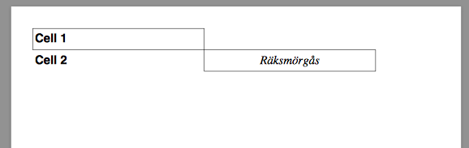
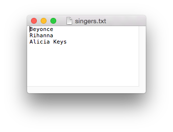

#Programmering för webben

##Föreläsning 10

###Dagens innehåll
- Skicka mail
- Skapa bilder
- Skapa pdf
- Spara en textfil

###Skicka mail

PHP kan användas för att skicka mail, förutsatt att PHP-servern har rättighet att skicka mail via en SMTP-server (simple mail transfer protocol). Vår PHP-server kan kommunicera med servern smtp.drift.se.

Mail skickas med funktionen [mail](http://php.net/manual/en/function.mail.php):

mail($to , $subject , $message, $additional_headers)

där `$additional_headers` vanligtvis måste innehålla en address till brevets  avsändare (from-adress). `$additional_headers` kan även innehålla annan information, t ex cc och bcc. 

**Exempel**: Kod för att skicka ett mail


<?php
//Ange vilken PHP-server som ska användas. Detta är ofta redan 
//konfigurerat på servern och behöver då inte anges
ini_set("SMTP","smtp.drift.se");
//Avsändaradress
$from="bo.peterson@gmail.com";
//Mottagaradress
$to="bo.peterson@mah.se";
$subject="Testmail";
$message="Mail skickat med PHP ".date('Y-m-d H:i');
//Avsändaradressen måste in i $additional_headers
$additional_headers="From: $from";
//Färadigt att skicka mailet!
$success=mail($to,$subject,$message,$additional_headers);

//Gick det bra?
if ($success) {
	echo "Mail has been sent ";
	echo "Message:  ";
	echo $message;
} else {
	echo "Could not send mail";
}
?>


###Skapa bilder

PHP har många inbyggda funktioner för att skapa och manipulera bilder. För att skapa en ny bild med svart bakgrund använder man funktionen `imagecreatetruecolor` och börjar med att ange storleken:


$im = imagecreatetruecolor(width, height);


Man har då en bild som kan kompletteras med grafiska element genom att ange vilken typ av element, tex rektangel eller ellips, och koordinater för elementet. Övre vänstra hörnet har koordinaterna (0,0). 

**Exempel**: Skapa en bild


<!doctype html>
<html>
<head>
<meta charset="UTF-8">
<title>Bildexempel</title>
</head>
<body>
<?php
//skapa en bild, 200 pixlar bred och 150 pixlar hög
$im=imagecreatetruecolor(200,150);

//definiera färgerna som ska användas
$yellow=imagecolorallocate($im,255,255,0);
$red=imagecolorallocate($im,255,0,0);

//skapa en röd cirkel med centrum i punkten 
//x=70, y=60, och med diametern 50 (bredd och höjd = 50)
imagefilledellipse($im,70,60,50,50,$red);

//skapa en gul rektangel med övre vänstra hörnet i 
//x=100, y=80 och nedre högra hörnet i x=150, y=110
imagefilledrectangle($im,100,80,150,110,$yellow);

//spara bilden i en fil på servern:
imagepng($im,"php_generated_image.png");
//ta bort bilden ur serverns minne
imagedestroy($im);
?>
<h2>Denna bild har skapats med PHP-kod</h2>

</body>
</html>


###Skapa pdf

PHP kan inte direkt skapa PDF-dokument, men det finns ett antal bibliotek som kan användas. Här är några exempel:

- [PDFlib](http://www.pdflib.com) - kraftfullt, kräver installation, kräver licensavgift
- [fpdf](http://www.fpdf.org) - mindre kraftfullt, enkel installation, gratis
- [tcpdf](http://www.tcpdf.org) - gratis
- [mpdf](http://www.mpdf1.com/mpdf/index.php) - mer kraftfull an fpdf men ger större filer, baserad på fpdf, gratis

**Exempel** Skapa pdf med fpdf:


<?php
//php-bibliotek måste laddas in (zip finns på http://www.fpdf.org -> Downloads -> v1.7)
require('fpdf17/fpdf.php');

//texter att visa
//i cell 1:
$text1="Cell 1";
$text2="Cell 2";
$text3="Räksmörgås";
$text3=utf8_decode($text3); //för att åäö ska fungera

//skapa variabel som innehåller pdf
$pdf=new FPDF();
//lägg till en sida
$pdf->AddPage();
//välj font, Hevetica, Bold, 16 punkter
$pdf->SetFont('Helvetica','B',16);

//gör en textruta på aktuell position, 80 x 10 mm, 
//en ram runt (1) och därefter flytta aktuell position till nästa rad (1)
$pdf->Cell(80,10,$text1,1,1);

//gör en textruta på aktuell position, 80 x 10 mm, 
//ingen ram runt (0) och därefter flytta aktuell position till höger (0),
$pdf->Cell(80,10,$text2,0,0);

//gör en textruta på aktuell position, 80 x 10 mm,
//ram runt (1), och därefter flytta aktuell position till nästa rad (1), 
//texten centrerad ('C')
//välj font, Times, Italic, 16 punkter
$pdf->SetFont('Times','I',16);
$pdf->Cell(80,10,$text3,1,1,'C');

//spara som fil
$pdf->Output('autogenerated.pdf');
echo 'Here is the file ';
echo '<a href="autogenerated.pdf">autogenerated.pdf</a>';
?>


###Skapa en textfil med PHP

Textfiler skapas med funktionen `file_put_contents()`.

**Exempel** Skapa en textfil


<!doctype html>
<html>
<head>
<meta charset="UTF-8">
<title>Filexempel</title>
</head>
<body>
<?php
//  \n betyder new line
$text="Beyonce\nRihanna\nAlicia Keys";
$filename="singers.txt";
file_put_contents($filename,$text);
?>
<h2>Textfil skapad av PHP</h2>
<a href="singers.txt">Singers</a>
</body>
</html>


###Mer avancerade mail-funktioner

Om man vill skicka bilagor, tex den pdf-filen som skapats i förra exemplet, är det svårt att göra med den inbyggda mail-funktionen i PHP. Det finns en kraftfull plugin, [PHPMailer](http://github.com/PHPMailer/PHPMailer) som gör det mycket enklare. 

**Exempel** Skicka attachment med PHPMailer


<?php
//download phpmailer from http://github.com/PHPMailer/PHPMailer
require_once('phpmailer/class.smtp.php');
require_once('phpmailer/class.phpmailer.php');

$mail = new PHPMailer();
$mail->IsSMTP(); //this line is usually not needed, but needed for ddwap.mah.se
$mail->Host      = "smtp.drift.se"; //this line is usually not needed, but needed for ddwap.mah.se
$mail->From      = 'bo.peterson@mah.se';
$mail->FromName  = 'Bo Peterson';
$mail->Subject   = 'PHPMailer test';
$mail->Body      = 'The Message '.date('Y-m-d H:i');
$mail->AddAddress('bo.peterson@gmail.com');

$file_to_attach = 'autogenerated.pdf';
$mail->AddAttachment($file_to_attach);

$result=$mail->Send();

if(!$result) {
	echo 'Message was not sent. ';
	echo 'Mailer error: ' . $mail->ErrorInfo;
} else {
	echo 'The message has been sent.';
}
?>


