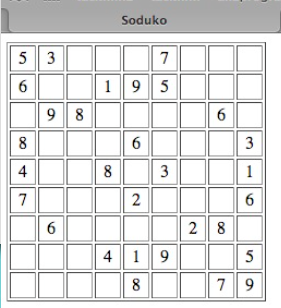

# Programmering för webben

## Föreläsning 12

### Dagens innehåll

- API
- Multidimensionella arrayer

### API - Application Programming Interface

API eller Application Programming Interface är en samling regler om hur en viss programvara kan kommunicera med annan programvara.

### Varför API?

API använder man oftast för att bygga egna program som kommunicerar med befintliga program, eller webbtjänster. Det finns exempelvis API för flickr, twitter, google mm. Med hjälp av dessa API kan man göra egna anpassade versioner av flickr, twitter, google etc.

### Exempel på API

- [Twitter API](https://dev.twitter.com/rest/public)
- [Facebook API](https://developers.facebook.com)
- [Google Maps API](https://developers.google.com/maps/web/)
- [Open Movie Database API](http://www.omdbapi.com)
- [Flickr API](https://www.flickr.com/services/api/)
- [Instagram API](https://www.instagram.com/developer/)

### Multidimensionell array

För en kort array-repetition, se [W3Schools](http://www.w3schools.com/php/php_arrays.asp) samt föreläsning 2.

En array har tidigare liknats vid en byrå

En multidimensionell array är en byrå där varje byrålåda i sin tur innehåller en byrå.

En tabell är ett typexempel på en 2-dimensionell array:

firstname | lastname
--- | ---
Peter | Griffin
Bo | Peterson
Glenn | Quagmire

```php
<?php
//först gör vi tre associativa arrayer
$name1=array('firstname'=>'Peter','lastname'=>'Griffin');
$name2=array('firstname'=>'Bo','lastname'=>'Peterson');
$name3=array('firstname'=>'Glenn','lastname'=>'Quagmire');

//sedan gör vi en ny array, där varje element är en associativ array
$names=array($name1,$name2,$name3);

echo $names[2]['lastname']; //Quagmire skrivs ut
echo "<br>";

echo $names[0]['firstname']; //Peter skrivs ut
?>
```

Ett spelbräde är ett annat exempel:



```php
<?php
$sudoku[0]=array('5','3',' ',' ',' ','7',' ',' ',' ');
$sudoku[1]=array('6',' ',' ','1','9','5',' ',' ',' ');
$sudoku[2]=array(' ','9','8',' ',' ',' ',' ','6',' ');
$sudoku[3]=array('8',' ',' ',' ','6',' ',' ',' ','3');
$sudoku[4]=array('4',' ',' ','8',' ','3',' ',' ','1');
$sudoku[5]=array('7',' ',' ',' ','2',' ',' ',' ','6');
$sudoku[6]=array(' ','6',' ',' ',' ',' ','2','8',' ');
$sudoku[7]=array(' ',' ',' ','4','1','9',' ',' ','5');
$sudoku[8]=array(' ',' ',' ',' ','8',' ',' ','7','9');

echo "<table border='1'>";
for ($row=0;$row<9;$row++) 
{
	echo "<tr>";
	for ($col=0;$col<9;$col++)
	{
		echo "<td>";
		echo $sudoku[$row][$col];
		echo "</td>";
	}
	echo "</tr>";
}
echo "</table>";
?>
```

