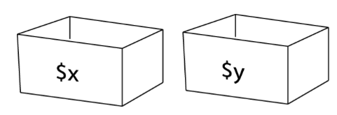

#Programmering för webben 

##Föreläsning 2 

###Dagens innehåll 

- Varför använda PHP? Var används PHP?
- Tilldelning
- Operatorer 
- Kommentarer 
- Arrayer 

###Varför använda PHP? Var används PHP 

- Där innehåll skräddarsys efter användaren, tex sociala medier som Facebook, [Facebook](http://www.facebook.com/login.php)
- Bloggar, tex bloggar gjorda med [Wordpress](http://wordpress.com) 
- Webbplatser där information ständigt uppdateras som nyheter och uppslagsverk, tex [Wikipedia](http://wikipedia.org) 

###Variabler

- Variabler används för att lagra data.
- Variabler kan liknas vid lådor som används för att förvara data 
- Data kan till exempel vara text eller tal. 
- Lagrade data kan ändras, dvs variablernas värde varierar. 
- Variabler har namn. 
- I PHP har man alltid ett dollartecken $ före variabelnamnet (alt-4 på mac- tangentbord). 
- Exempel på variabler: $x, $y, $weight 
- Till själva variabelnamnet (det som kommer efter dollartecknet) kan man använda stora eller små bokstäver, siffror samt _ (underscore). 
 - **OBS 1:** variabelnamn får inte inledas med en siffra. $4you är otillåtet men $me2 är tillåtet. 
- **OBS 2:** variabelnamn är skiftlägeskänsliga (case-sensitive) dvs $Weight, $WEIGHT och $weight är olika variabler. 
- **OBS 3**: svenska tecken åäö får användas i variabelnamn, men kan leda till problem om filer flyttas mellan olika datorsystem. Använd a-z för att undvika problem. 

###Tilldelning 

Variabler kan tilldelas (assign) numeriska värden. Tilldelning sker med likhetstecknet = 

**Exempel:** 

Variabeln weight tilldelas värdet 7 skrivs så här i PHP:


$weight = 7; 


Observera att de flesta rader i PHP avslutas med ett semikolon. 
 
Variabler kan även tilldelas textvärden. Texter kallas *strängar* (strings). Texter omsluts av enkla eller dubbla citationstecken (' eller "). 

Man kan välja om man använder enkla eller dubbla citationstecken, men i vissa fall blir det vissa skillnader beroende på vad man väljer. Mer om det senare.
{: .info}

**Exempel:**

Variabeln month tilldelas värdet April skrivs så här:


 $month = "April"; 


###Operatorer

Operatorer används för att utföra beräkningar och för att manipulera såväl numeriska värden som text. 

Exempel på *aritmetiska operatorer* dvs operatorer för numeriska värden är

`+` plus  
`-` minus  
`*` gånger  
`/` dividerat med

**Exempel**
Detta exempel beräknar och skriver ut aktuell ålder.


$birthyear = 1965;
$year = 2015; 
$age = $year - $birthyear;
echo $age; 


Det finns två *strängoperatorer* i PHP dvs operatorer för text. Den vanligaste är en punkt:

`.` används för *konkatenering* dvs slå ihop två strängar.

**Exempel** 


$firstname = "Sasha"; 
$lastname = "Fierce"; 
$fullname = $firstname . $lastname;
echo $fullname;


Resultat som skrivs ut: 

	
SashaFierce 


**Exempel**

Med mellanslag mellan för- och efternamn: 

 
$fullname = $firstname . " " . $lastname;

 
Resultat som skrivs ut: 

	
Sasha Fierce 


###Kommentarer
 
En viktig del av programmering är dokumentation och en viktig del av dokumentationen är kommentarer i koden. Kommentarer kan skrivas på två sätt, beroende på en kommentar omfattar en eller flera rader

En kommentar för en rad inleds med // och kan antingen stå ensamt på en rad, eller efter ett stycke kod. 

**Exempel**
 

//variablerna $height och $widht innehåller höjd och bredd på en rektangel
$area = $height * $width; //area för rektangel beräknas 


En kommentar för flera rader inleds med /* och avslutas med */- 

**Exempel** 


/* Följande program beräknar arean av en rektangel.
   Ingångsvärden: 
   rektangelns höjd, $height
   rektangelns bredd, $width
   Resultat: $area
*/ 
$area = $height * $width; 


###Arrayer 

Arrayer är speciella variabler som kan innehålla flera värden. Om en variabel kan liknas vid en låda, kan en array liknas vid en byrå med flera lådor. 

	
Själva arrayen ("byrån") har ett namn, och de olika elementen ("lådorna") är numrerade eller namngivna. 
 
- Numreringen börjar med 0. Numren kallas för index.
- Varje "låda" kan innehålla ett värde som en vanlig variabel, till exempel ett tal eller en sträng (dvs text).
- En array kan innehålla allt från ett fåtal element till tusentals eller fler element. 

Arrayer kan få sina värden tilldelade på olika sätt, tex så här: 


$drawer = array("nyckel","telefon","passagekort");

 
Ordet nyckel läggs i låda 0, telefon i låda 1, och passagekort i låda 2.
 
Värden kan hämtas ur en array genom att man anger index inom hakparenteser [ ] på följande sätt: 
	


echo $drawer[0]; //skriver ut nyckel 
echo $drawer[1]; //skriver ut telefon
echo $drawer[2]; //skriver ut passagekort

  
Värden kan läggas till i en befintlig array:


$drawer[3] = "plånbok";

 
Ett fjärde element (med index = 3) skapas med innehållet plånbok. 

Man kan även utelämna index för att lägga till ett element sist i en array: 


$drawer[] = "klocka";

 
Ett femte element skapas (om det redan fanns fyra) med innehållet klocka.

 
echo $drawer[3]; //skriver ut plånbok 
echo $drawer[4]; //skriver ut klocka 

 
Variabler kan användas som index: 
 
 
$i = 4;
echo $drawer[$i]; //skriver ut klocka

 

###Associativa arrayer

Istället för att numrera elementen i en array kan man ge dem namn. De kallas då associativa arrayer. 

De kan få värden så här:

 
$days['januari'] = 31; 
$days['februari'] = 28;
$days['mars'] = 31;


Eller så här: 

 
$days = array('januari'=>31,'februari'=>28,'mars'=>31);

 
Utskrift: 

 
echo $days['januari']; //31 skrivs ut
echo $days['februari']; //28 skrivs ut
echo $days['mars']; //31 skrivs ut

 
### Variabelvärden i strängar

Värdet på en variabel kan skrivas ut tillsammans med annan text enligt följande:

 
$firstname = "Sasha";
$lastname="Fierce"; 
echo "I am $firstname $lastname";


Utskriften blir


I am Sasha Fierce 


`I am` skrivs alltså ut, men istället för att $firstname och $lastname skrivs ut så skrivs *innehållet* i variabeln $firstname och $lastname ut, dvs `Sasha` och `Fierce`. 

Ofta spelar det ingen roll om man använder ' eller " men i exemplet ovan spelar det stor roll. Om man byter ut dubbla mot enkla citationstecken kommer *namnet* på variabeln istället för *innehållet* av variabeln att skrivas ut. 

 
$firstname = "Sasha";
$lastname="Fierce"; 
echo 'I am $firstname $lastname';


Utskriften blir


I am $firstname $lastname


### Exempel som visades på föreläsning 2016-01-25

#### f2.php


<!doctype html>
<html>
<head>
<meta charset="UTF-8">
<title>HTML test</title>
</head>
<body>

    
    
<!-- en html-kommentar-->
<?php
//variabeln antal lagrar antalet hundar
$antal = 23;

$vikt = 4.47; //variablen vikt lagrar hundarnas vikt

/*
allt mellan snedstreck-stjärnorna är kommentarer
*/

echo "<h2>Exempel 1</h2>";
echo $antal;
echo " hundar väger tillsammans ";
echo $antal*$vikt;
echo " kg om de väger ";
echo $vikt;
echo " kg var"; 

echo "<h2>Exempel 2</h2>";

echo "en sträng: ";
echo "x*y";

$x=15;
$y=17;
echo " en uträkning: ";
echo $x*$y;

echo "<h2>Exempel 3 - konkatenering</h2>";

$mellan=" ";

$ord1="Jag";
$ord2="har";
$ord3="inga";
$ord4="bilar";

$historia= $ord1.$mellan.$ord2.$mellan.$ord3.$mellan.$ord4;

echo $historia;

echo "<h2>Exempel 4</h2>";

$fet = "<strong>";
$slutfet="</strong>";

echo "PHP rockar ";
echo $fet;
echo "fett";
echo $slutfet;

echo "<h2>Exempel 5 - En array</h2>";

$vikter = array(4.3,5.2,7.1,8.2,1.2,3.5,3.7,7.3,8.2,12.3);

echo $vikter[3];

echo "<h2>Exempel 6</h2>";

echo $historia;

?>

</body>
</html>


#### f2_array.php


<!doctype html>
<html>
<head>
<meta charset="UTF-8">
<title>HTML test</title>
</head>
<body>

   
<?php

echo "<h2>Exempel 5 - En array</h2>";
//olika hundars vikter
$vikter = array(4.3,5.2,7.1,8.2,1.2,3.5,3.7,7.3,8.2,12.3);

//summan av alla hundars vikter
$summa =  $vikter[0]+$vikter[1]+$vikter[2]+$vikter[3]+$vikter[4]+$vikter[5]+$vikter[6]+$vikter[7]+$vikter[8]+$vikter[9];

//antalet hundar
$antal = 10;

//diverse statistik om hundarna
echo "Hundrna väger tillsammans ";
echo $summa;
echo " kg ";
echo "Hundarna väger i medel ";
echo $summa / $antal;
echo " kg";

//hundarnas namn
$namn = array("Bo","Sebastian","Johannes","Sven","Sara","Henriette","Caroline","Max","Carina","Pär");

//uppgifter om specifik hund nr x

$x = 9;
echo " ";
echo "Hunden ";
echo $namn[$x];
echo " väger ";
echo $vikter[$x];
echo " kg";

?>

</body>
</html>


#### f2_assoc_array.php


<!doctype html>
<html>
<head>
<meta charset="UTF-8">
<title>HTML test</title>
</head>
<body>

<?php
$hundar = array("Bo"=>4.3,"Sebastian"=>3.2,"Johannes"=>7.1,"Sven"=>4.2);
echo "En hund väger ";
echo $hundar["Sebastian"];
echo " kg";

echo " ";
$namn = "Johannes";

echo "Hunden ";
echo $namn;
echo " väger ";
echo $hundar[$namn];
echo " kg";

?>

</body>
</html>


