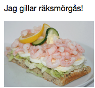
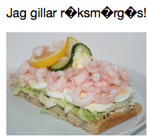
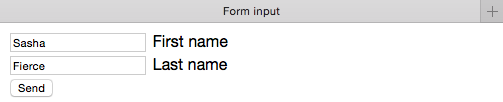
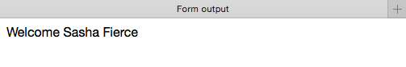
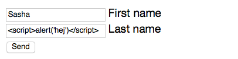
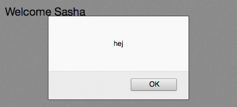
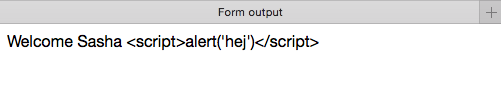

#Programmering för webben 

##Föreläsning 3

###Dagens innehåll 

- Teckenkodning 
- Formulär 
- PHP-kod för att ta hand om formulärdata

###Teckenkodning

Tecken som används i html-taggar och i URLer måste hanteras på ett speciellt sätt för att kunna visas på en webbsida:

| Tecken | Html-kod | Kommentar |
| --- | --- | --- |
| `<` | `&lt;` | lt står för less than |
| `>` | `&gt;` | gt står för greater than |
| `&` | `&amp;` | amp står för ampersand |
| `"` | `&quot;` | quot står för quotation |
| `'` | `&#039;` |   |

Antag att vi vill visa texten

`Du & jag <tillsammans>`

på en webbsida.

HTML-koden blir

`Du &amp; jag &lt;tillsammans&gt;`

Alla tecken i datorer representeras av koder. Det finns olika standarder för hur olika tecken ska kodas, tex 

- ASCII
- ISO-8859-1
- UTF-8

Olika standarder hanterar exempelvis svenska tecken (åäö) olika. Det är viktigt att man anger korrekt teckenkodning i meta-tagg i head och sparar sina filer i samma format. 


<!doctype html>
<html>
<head>
<meta charset="UTF-8">


Om man anger felaktig meta-tagg kan till exempel åäö visas felaktigt. 

Korrekt angiven meta-tagg:

Felaktigt angiven meta-tagg:

Den teckenkodning som rekommenderas är vanligtvis UTF-8, men ISO-8859-1 används också ofta. (se <http://articles.sitepoint.com/article/guide-web-character-encoding/> för en djupare analys)

 
###Formulär

HTML-formulär är ofta input till PHP-program


<form action="formoutput.php" method="get">
<input type="text" name="firstname"> First name 
<input type="text" name="lastname"> Last name 
<input type="submit" value="Send">
</form>


När man klickar Send går man vidare till sidan formoutput.php. 


<?php
$firstname=$_GET['firstname'];
$lastname=$_GET['lastname'];
echo "Welcome $firstname $lastname";
?>


Det som matats in i fälten skickas med som en del av adressen till formoutput.php:


http://ddwap.mah.se/k3bope/me132a/lecture3/formoutput.php?firstname=Sasha&lastname=Fierce


###Formulärrepetition

Vanligaste formulär-elementen: 

- input (type='text', 'checkbox', 'radio', 'password' eller 'submit')
- select (dropdown meny)
- textarea
 
###PHP-kod som tar hand om formulärdata

Sidan forminput.html innehåller ett formulär. När man klickar Send
kommer man till sidan formoutput.php. PHP-sidan skapar automatiskt
en associativ array med namnet $_GET som innehåller formulärdata.
 
Följande kod kan användas för att hämta det som skrivits in i ett formulär och spara i en vanlig variabel:


$firstname=$_GET['firstname'];


Det är viktigt att det namn som ett fält fått i formuläret är detsamma som det som står mellan efter $_GET mellan hakparanteserna.

###POST eller GET?
Det finns två metoder för att skicka formulär, POST och GET

**GET**: formulärdata skickas med i URL.
Passar bäst för formulär med mindre datamängder.

`<form action='formoutput.php' method='get'>`

**POST**: formulärdata skickas dolt.
Passar bäst för större datamängder, samt för dolda uppgifter som tex lösenord.

`<form action='formoutput.php' method='post'>`
 
PHP skapar  tre associativa arrayer som innehåller värden från skickade formulär.

- $_POST innehåller värden om formuläret skickats med method='post'.
- $_GET innehåller värden om formuläret skickats med method='get'.
- $_REQUEST innehåller värden oavsett om formuläret skickats med method='post' eller 'get'.
 
###Säkerhetslucka mm

En eventuell säkerhetslucka i formulär är möjligheten att
inmataren lägger in skadlig kod i formuläret. Antag att vi skriver in ett javascript i inmatningsfältet:
 

Då kan resultatet bli det följande:

Med hjälp av PHP-funktionen 

`htmlspecialchars($variabel,ENT_QUOTES,'UTF-8')`

kan man ta hand om skadlig kod i inmatningsfälten. 

Vi kan komplettera vår PHP-kod som tar hand om formulärdata enligt följande:


$firstname=$_GET['firstname'];
$firstname=htmlspecialchars($firstname,ENT_QUOTES,'UTF-8');

$lastname=$_GET['lastname'];
$lastname=htmlspecialchars($lastname,ENT_QUOTES,'UTF-8');

echo "Welcome $firstname $lastname";


Variabeln $lastname kommer då istället att få värdet

`&lt;script&gt;alert(&#039;hej&#039;)&lt;/script&gt;`

som inte kommer att utföra något javascript utan istället skrivas ut så här:

