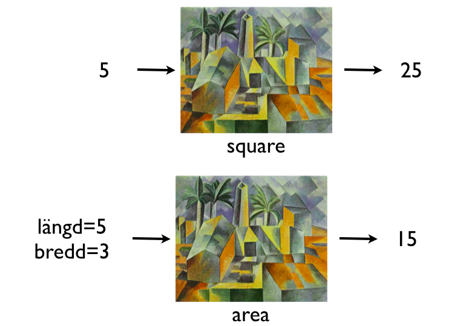
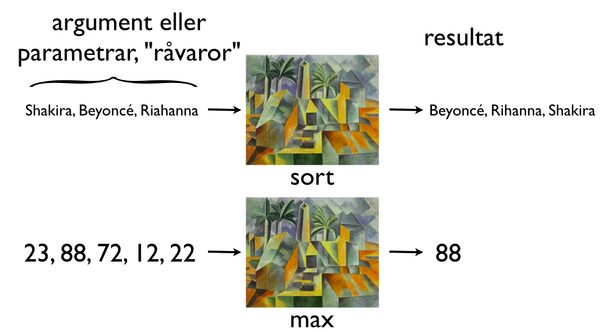

# Programmering för webben

## Föreläsning 6

### Dagens innehåll

Strukturerad programmering

- Include-filer
- Funktioner
- Pseudo-kod
 
### Include-filer

[Utförlig beskrivning om include-filer](include.pdf)

### Funktioner

Funktioner är som en "fabrik" som tar in råvaror och matar ut råvarorna i förädlad form:



 

### Funktionsdefinition

En funktion som beräknar kvadraten av ett tal. `$x` kallas argument och är input till funktionen. 

```php
function square($x) {
    return $x*$x;
}
```

En funktion kan ha flera argument. Följande funktion beräknar arean av en rektangel. 
 
```php
function area($width, $height) {
    $a=$width*$height;
    return $a;
}
```
 
### Funktionsanrop

När en funktion är definierad kan den anropas många gånger, tex så här:


```php
$hojd=10;
$bredd=7;

//här kommer funktionsanropet:
$yta=area($hojd,$bredd);

echo "En rektangel med bredden $bredd och höjden $hojd har arean $yta";
echo "<br>";

//vi kan nu ge nya värden till $hojd och $bredd
$hojd=1234;
$bredd=6789;

//här kommer ett nytt funktionsanrop:
$yta=area($hojd,$bredd);

echo "En rektangel med bredden $bredd och höjden $hojd har arean $yta";
echo "<br>";

//argumenten till en funktion behöver inte vara en variabler.
//resultatet behöver inte heller sparas i en variabel utan kan
//skrivas ut direkt med echo:

echo "kvadraten av 7 är ";
echo square(7); //49 skrivs ut
```
 
Resultatet av koden ovan blir:

```
En rektangel med bredden 7 och höjden 10 har arean 70
En rektangel med bredden 6789 och höjden 1234 har arean 8377626
kvadraten av 7 är 49
```

### Fördefinierade funktioner och egendefinierade funktioner

Vi har nu sett exempel på hur man kan definiera egna funktioner. PHP innehåller ett stort antal fördefinierade funktioner. Vi har redan använt flera fördefinierade funktioner, tex

htmlspecialchars
strtolower 
strtoupper

Det finns en stor mängd fördefinerade funktioner i php. Se <http://php.net/manual/en/funcref.php> för fullständig beskrivning.

### Repetition av loopar

En loop gör samma sak, eller *nästan* samma sak upprepade gånger. Det finns while-, for- och foreach-loopar.

```php
//En loop som gör samma sak 10 gånger
for ($i=0;$i<10;$i++) {
	echo "Samma sak<br>";
}
```

Utskriften blir:

```
Samma sak
Samma sak
Samma sak
Samma sak
Samma sak
Samma sak
Samma sak
Samma sak
Samma sak
Samma sak
```

```php
//En loop som gör nästan samma sak 5 gånger
for ($i=0;$i<5;$i++) {
	echo "En siffra: ";
	echo $i;
	echo "<br>";
}
```

Utskriften blir:

```
En siffra: 0
En siffra: 1
En siffra: 2
En siffra: 3
En siffra: 4
```

Foreach-loopar är praktiska för att gå igenom en array:

```php
$singers=array("Shakira","Beyoncé","Rihanna");

//$singers är en array med flera namn
//$singer blir ett namn åt gången, dvs de olika namnen i $singers i tur och ordning
foreach ($singers as $singer) {
	echo $singer;
	echo "<br>";
}
```

Utskriften blir:

```php
Shakira
Beyoncé
Rihanna
```

För associativa arrayer kan man med foreach utläsa både namn och värde:

```php
$days_in_months=array("jan"=>31,"feb"=>28,"mar"=>31);

foreach ($days_in_months as $key=>$value) {
	echo "Antal dagar i $key är $value <br>";
}
```

Utskriften blir:

```
Antal dagar i jan är 31 
Antal dagar i feb är 28 
Antal dagar i mar är 31 
```

### Repetion av villkor

Jämförelseoperatorer:

```
== lika med
!= inte lika med
< mindre än
> större än
<= mindre än eller lika med
>= större än eller lika med
```

Logiska operatorer:

```
and och (även &&)
or eller (även ||)
! icke
```

Med jämförelsoperatorer och logiska operatorer kan man sätta samman avancerade logiska villkor.

```php
if ($age>=18 and $age<65) {
	echo "Du måste betala fullt pris";
} else {
	echo "Du kan betala rabatterat pris";
}
```

### Viktigt inför nästa vecka

Gör följande förberedelse inför labben i nästa vecka:

Förbered 5 valfria png-bilder, 5 jpeg-bilder och 5 gif-bilder, alla  150 x 150 px.

Se till att filnamnen endast innehåller små bokstäver och siffror, inga åäö. 
