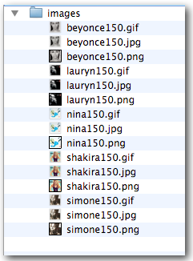
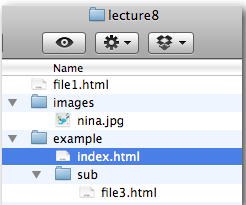
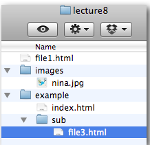
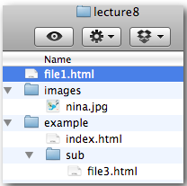
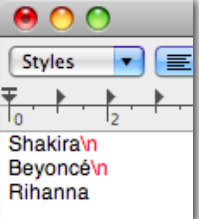

# Programmering för webben

## Föreläsning 7

### Dagens innehåll

- Filhantering 
- Repetition av arrayer och loopar
 
### Filhantering

Funktionen `scandir` listar alla filer och kataloger i en katalog och sparar dem i en array. 

Exempel: mappen *images* innehåller följande filer. 



PHP-kod för att spara filnamn i en array `$files` och sedan skriva ut dem blir:

```php
<?php
$files=scandir("images"); //$files blir en array med alla filnamn i mappen images
foreach ($files as $file) { 
    echo $file;
    echo "<br>";
}
?>
```

### Sökvägar

För att öppna en fil som ligger i annan katalog måste man ange sökväg.

Antag att vi har en mapp som innehåller filen *file1.html* samt mapparna *images* och *example*.
*images* innehåller filen *nina.jpg*. *example* innehåller filen *index.html* samt mappen *sub*. *sub* innehåller i sin tur filen *file3.html*.

**Exempel** Utgå från filen *index.html*. Antag att vi i den filen vill referera till andra filer eller mappar.



För att referera till *file3.html* anger vi 

`sub/file3.html`

För att referera till *file1.html* anger vi

`../file1.html`

(..betyder att vi går upp ett steg i katalogstrukturen)

För att referera till *nina.jpg* anger vi

`../images/nina.jpg`
 

**Exempel** Utgå istället från filen *file3.html*. Antag att vi i den filen vill referera till andra filer eller mappar.



För att referera till *index.html* anger vi

`../index.html`

För att referera till *file1.html* anger vi

`../../file1.html`

(../.. betyder att vi går upp två steg i katalogstrukturen)

För att referera till *nina.jpg* anger vi

`../../images/nina.jpg` 

**Exempel** Utgå från filen *file1.html*. Antag att vi i den filen vill referera till andra filer eller mappar.



För att referera till *index.html* anger vi

`example/index.html`

För att referera till *file3.html* anger vi

`example/sub/file3.html`

För att referera till *nina.jpg* anger vi

`images/nina.jpg`
 
### Läsa in filer

Funktionen `file_get_contents` kan användas för att läsa in godtycklig fil i en php-variabel.

**Exempel**

```php
<?php
$str=file_get_contents("text.txt"); //$str innehåller nu texten från filen text.txt
?>
```
 
### Kopiera, ta bort filer mm

Följande funktioner är användbara för att hantera filer:

- `file_exists` - kontrollerar om en fil finns
- `copy` - kopierar fil
- `unlink` - raderar fil
- `file_put_contents` - sparar data i en fil
 
### Radbrytningar i textfiler

Filer kan innehålla ett antal osynliga tecken som tex radbrytningar.

I slutet av varje rad i textfilen finns ett osynligt radbrytningstecken (ibland två osynliga tecken)



Olika datorsystem använder olika tecken för radbrytning: 

- Mac och Linux: `\n` 
- PC: `\r\n`
- Äldre Mac: `\r`
 
### Dela upp rader i en fil

Strängfunktionen `explode` är användbar vid filhantering. Grundfunktionen är att den delar upp en sträng och lägger in delarna i en array. Man bestämmer att uppdelningen ska ske vid ett visst tecken. 

**Exempel**

```php
<?php
$string="adam,bertil,cesar,david";
$arr=explode("," ,$string); //dela upp $string vid komma-tecken
?>
```

Resultat:

$arr blir en array där `$arr[0]="adam"`, `$arr[1]="bertil"`, `$arr[2]="cesar"` och `$arr[3]="david"`
 
Funktionen `explode` kan användas för att dela upp raderna i en fil så att varje rad blir ett element i en array.

**Exempel**

```php
<?php
$file=file_get_contents("text.txt");
$rows=explode("\n",$file);
?>
```

Resultat:

`$row` blir en array där `$rows[0]="Shakira"`, `$rows[1]="Beyoncé"` och `$rows[2]="Rihanna"`
 
### Array, repetition

Värden i en array kan tilldelas på följande sätt:

```php
<?php
$drawer = array("nyckel","telefon","passagekort");
?>
``` 

Värden kan hämtas på följande sätt:

```php
<?php
echo $drawer[0]; //skriver ut nyckel
echo $drawer[1]; //skriver ut telefon
echo $drawer[2]; //skriver ut passagekort
?>
``` 
 
Värden kan läggas till i en befintlig array. Här skapas ett fjärde element (med index = 3) med innehållet plånbok:

```php
<?php
$drawer[3] = "plånbok";
?>
``` 


Man kan även utelämna index för att lägga till ett element i slutet. Här skapas ett femte element (om det redan fanns fyra) med innehållet klocka:

```php
<?php
$drawer[] = "klocka";
?>
``` 

```php
<?php
echo $drawer[3]; //skriver ut plånbok 
echo $drawer[4]; //skriver ut klocka
?>
``` 

Variabler kan användas som index till en array:

```php
<?php
$i = 4;
echo $drawer[$i]; //skriver ut klocka
?>
``` 
 
## For-loop, repetition

```
for (startvärde; villkor; ändra värde på räknare)
{
    kod som upprepas
}
```

```php
<?php
foreach ($arrayvariabel as $variabel)
{
    kod som upprepas. För varje varv innehåller 
    $variabel de olika elementen från $arrayvariabel i 
    tur och ordning
}
?>
```

**Exempel**

```php
<?php
for ($i=1; $i<=3; $i++)
{
    echo "$i ";
}
?>
``` 

Resultat:

`1 2 3 `

**Exempel**

Gå igenom en array med en loop:

```php
<?php
$names=array('Adam','Bertil','Cesar');
for ($i=0;$i<count($names);$i++) {
    echo $names[$i];
    echo "<br>";
}
?>
```

Resultat:

```
Adam
Bertil
Cesar
```

**Exempel**

Samma sak med foreach:

```php
<?php
$names=array('Adam','Bertil','Cesar');
foreach ($names as $name) {
    echo $name;
    echo "<br>";
}
?>
```

Resultat:

```
Adam
Bertil
Cesar
```

 
### Exempel från föreläsning 2016-03-07

**exempel1.php**

```php
<!doctype html>
<html>
<head>
<meta charset="UTF-8">
<title>Untitled Document</title>
</head>

<body>

<?php
//$files blir en array med alla filnamn i mappen images
$files=scandir("images"); 
foreach ($files as $file) { 
    echo $file;
    echo "<br>";
}
?>
</body>
</html>
```

**exempel2.php**

```php
<!doctype html>
<html>
<head>
<meta charset="UTF-8">
<title>Untitled Document</title>
</head>

<body>
<?php

$str=file_get_contents("test.txt");

echo $str;

?>
</body>
</html>

```

Exemplet kräver att filen `test.txt` ligger i samma mapp som `exempel2.php`:

```
Bertil
Catarina
Adam
Karin
Sven
Sture
Sam Le
Oscar
```


**exempel3.php**

```php
<!DOCTYPE html>
<html>
  <head>
    <meta charset="utf-8">
    <title></title>
  </head>
  <body>
    <?php
    $filename = "nyfil.txt";
    
    $filecontents = "Adam Beata Caroline David";
    
    
    file_put_contents($filename,$filecontents);
    
    echo "Echo filen $filename har nu skapats!";        
    ?>
  </body>
</html>
```

**exempel4.php**

```php
<!doctype html>
<html>
<head>
<meta charset="UTF-8">
<title>Untitled Document</title>
</head>

<body>
<?php

$str=file_get_contents("test.txt");

$arr = explode("\n",$str);

sort($arr);

echo "<ul>";
foreach($arr as $name) {
    echo "<li>";
    echo $name;
    echo "</li>";
    
}
echo "</ul>";

?>
</body>
</html>

```

