#Programmering för webben

## Projektbeskrivning vt 2015

Det finns tre olika projekt att välja mellan:

1. Quiz. Se vidare beskrivning nedan.
2. Meme-generator. Se vidare beskrivning nedan. 
3. Egen projektidé som måste godkännas av kursansvarig. 

## Handledning

Handledning kommer att ges under schemalagda laborationstillfällen varje vecka.

## Projektinlämning

Följande ska lämnas in på it's learning senast 2 juni kl 13:00:

* Alla sidor med PHP-kod och HTML-kod ihopzippade.
* En webbadress (url) till ett fungerande projekt. **OBS** Om adressen saknas går projeket ej att testa vilket automatiskt leder till underkänt. 
* En pdf-rapport omfattande minst två A4-sidor där du beskriver ditt projekt. Rapporten ska innehålla:
	* Ditt namn.
	* Projektets namn.
	* Webbadress (url) till projektet.
	* En beskrivning av projektet.
	* Eventuella förbättringar som kan göras. Till exempel: Funkar åäö? Finns det säkerhetsluckor?
	* En reflektion över vad du lärt dig av projektet.
	* Skärmdumpar av valda sidor ur projektet.

## Projektredovisning

Projektet visas för lärare och övriga kursdeltagare den 3 juni kl 13:15-17:00. Projektet ska vara fullt fungerande så att det kan visas och testas.

## Betygsbedömning

För betyget godkänd krävs fungerande kod som är välstrukturerad, indenterad och kommenterad. 

För väl godkänd krävs även tilläggskrav som beskrivs under de olika projektidéerna.

## Projektalternativ 1: Quiz

Projektet går ut på att skriva PHP-kod för en quiz. 
Här finns ett mini-exempel på hur [resultatet av projektet kan se ut](http://ddwap.mah.se/k3bope/me132a/projekt2014/quiz/start.php).

Det rekommenderas, men är inte tvunget, att använda följande struktur:

1. Sidan index.php som är startsida där quizens alla frågor sparas i sessionsvariabler.
1. Sidan question.php som visar alla frågorna, en åt gången.
1. För VG: även sidan sendmail.php som skickar mail och sparar data i en databas. 

Dessutom behövs en fil *functions.php* som innehåller hjälpfunktioner som behöver användas. 

### Detaljerad beskrivning av quiz

* En quiz ska bestå av minst 7 frågor.
* En quiz ska ha minst 6 resultatalternativ som man kan få när man är klar med quizen. Om quizen är "Viken färg föredrar du?" kan resultatalternativen till exempel vara röd, blå, gul, grön, orange, vit, svart.
* Varje fråga ska ha lika många svarsalternativ som det finns resultatalternativ.
* Varje svarsalternativ måste stämma överens med ett resultatalternativ. 
* När quizen är klar får man ett resultat baserat på det resultatalternativ som valts flest gånger. 
* Till varje fråga ska det finnas en bild.
* Till varje resultatalternativ ska det finnas en bild.

För VG krävs även:

* Att resultatet sparas i en databas.
* Att resultatet kan skickas med mail till godtycklig mailadress.

### Detaljerad beskrivning av ingående sidor

Följande beskrivning är en **rekommendation**. Om ni hellre vill lösa uppgiften på ett annat sätt så att specifikationerna uppfylls går det bra. 

Det **rekommenderas varmt** att man börjar med att skriva en funktion för att visa en fråga.

I filen functions.php i [projektfiler.zip](projektfiler.zip) finns en stomme till funktionen show_question som kan användas för att visa en fråga:


<?php
function show_question($question,$alternative,$image) {
	//steg 1: komplettera denna funktion så att den visar ett formulär med en fråga
	shuffle_assoc($alternative);
	foreach ($alternative as $onevalue=>$onealternative) {
		//lägg till kod för radiobuttons här
	}
}
?>


Raden `shuffle_assoc($alternative)` gör att radioknapparna med svarsalternativen kommer i slumpvis ordning. 

I filen testshowquestion.php i [projektfiler.zip](projektfiler.zip) finns **en fråga** förberedd:


<!doctype html>
<html>
<head>
<meta charset="UTF-8">
<title>Test show_question</title>
</head>
<body>
<?php
echo "<h1>Test show_question</h1>";
include "functions.php";
$question="Vilken blomma föredrar du?";
$image="flower.jpg";
$alternative=array("ros","maskros","fyrklöver");
show_question($question,$alternative,$image);
?>
</body>
</html>


Från början, alltså innan man gjort klart funktionen show_question, visas bara en tom sida.

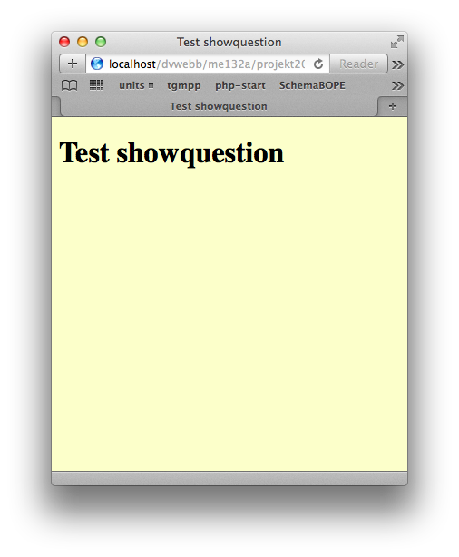

Testshowquestion innan funktionen show_question är klar

När funktionen show_question är klar visas ett formulär med en fråga.

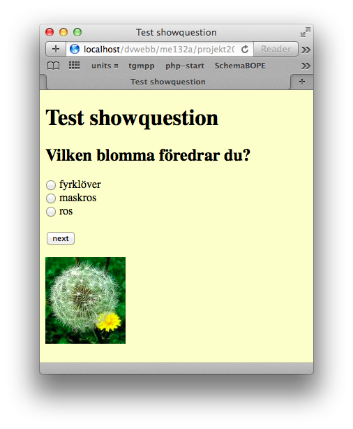

Testshowquestion när funktionen show_question är klar

Poängen med funktionen är att den ska kunna visa en godtycklig fråga. Om innehållet i variblerna `$question, $image och $alternative`  ändras så ska formuläret ändras. Testa till exempel att lägga till fler alternativ i variabeln `$alternative`. Då ska alla alternativ automatiskt läggas till. 


<?php
$alternative=array("ros","maskros","fyrklöver","tulpan","vitsippa");
?>


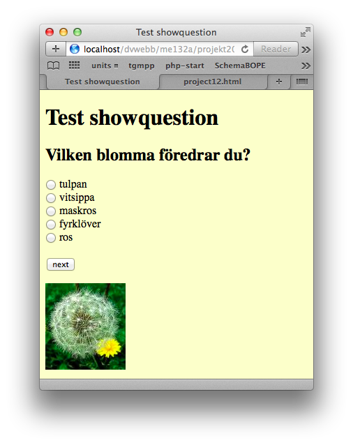

Testshowquestion när fler alternativ lagts till

När du fått testshowquestion att fungera bör den skapa ett formulär med html-kod som ser ut ungefär så här:

*Testshowquestion när fler alternativ lagts till*


<form method='get' action='question.php'>
<input type='radio' name='answer' value='2'> fyrklöver 
<input type='radio' name='answer' value='0'> ros 
<input type='radio' name='answer' value='1'> maskros 
<input type='submit' value='next'>
</form>


När detta fungerar är det dags att göra sidorna start.php och question.php.

**start.php** innehåller ett formulär där man anger sitt namn. 

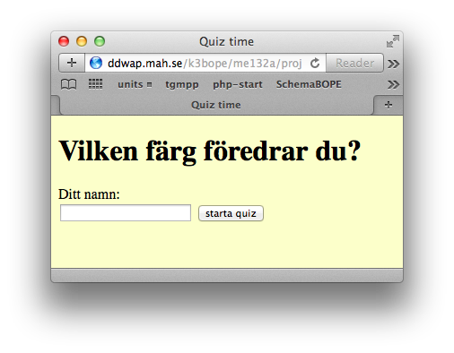 

Sidan start.php

Sidan start.php innehåller också PHP-kod som lagrar alla frågor i sessionsvariabler. Följande sessionsvariabler kan definieras:

* `$_SESSION['quizname']` - namnet på quizen
* `$_SESSION['question']` - en array med själva frågorna
* `$_SESSION['alternative']` - en tvådimensionell array med svarsalternativ för alla frågor.
* `$_SESSION['image']` - en array med filnamn på bilder till varje fråga
* `$_SESSION['result']` - en array med alla resultatalternativ. 
* `$_SESSION['resultimage']` - en array med filnamn på resultat-bilder. Till varje resultatalternativ ska det finnas en bild
* `$_SESSION['questionnumber']` - aktuellt frågenummer. Från början ska den ha värdet 0.
* `$_SESSION['answer']` - en array som används för att registrera vad man har svarat på de olika svarsalternaiven. Från början en tom array, men för varje fråga registreras vilket svarsalternativ man valt i ett nytt element. 

När man klickar *starta quiz* kommer man till sidan question.php som visar första frågan. 

**question.php** är själva hjärtat i quizen. Sidan ska visa de olika frågorna, en åt gången. Sidan testshowquestion.php är en bra grund, men den måste utökas enligt följande:

* **Första gången** man kommer till sidan question.php ska den spara namnet man matat in på startsidan i en sessionsvariabeln `$_SESSION['name']`.
* Alla gånger **utom första** gången man kommer till sidan ska den registrera vad man svarade på föregående fråga. Detta registreras i `$_SESSION['answer']`.
* Alla gånger **utom sista** gången ska den visa en ny fråga inklusive svarsalternativ och bild (som testshowquestion).
* **Sista gången** ska den istället visa resultatet av quizen. 

För att avgöra om man är på sidan första gången eller inte kan man använda sig av variabeln `$_SESSION['questionnumber']` som anger vilken fråga man är på. För varje fråga måste denna variabel räknas upp med ett. 

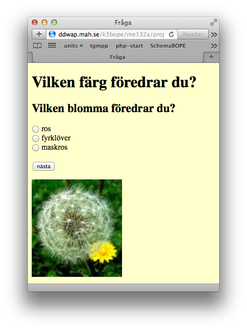

Sidan question.php första gågen den visas

När man kommit till sista frågan och klickar nästa ska resultatet av quizen visas.

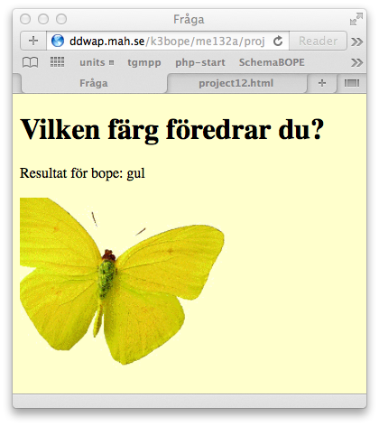

Sidan question.php när alla frågor visats

För att visa resultatet finns en färdig funktion `find_most($array)` som hittar det tal som förekommer flest gånger i en array. Det svarsalternativ som man svarat flest gånger är också det blir resultatet på quizen. 

För VG måste även projektet kompletteras med ett formulär där man kan ange en epostadress att skicka resultatet till. Dessutom måste namn och resultat sparas i en databas, så att tidigare resultat kan visas. Se ytterligare VG-krav under rubriken Betygsbedömning.

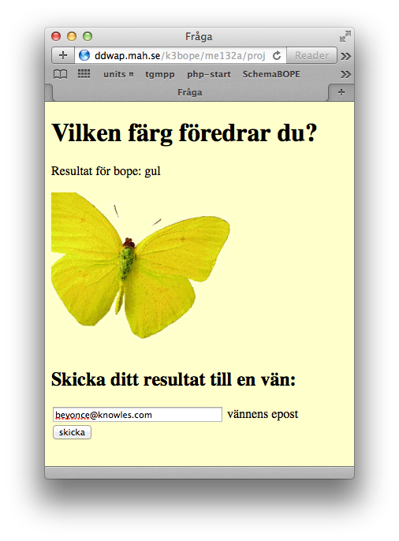

Sidan question med epost-funktion

När man klickar skicka kommer man vidare till sidan sendmail.php. 
  
**sendmail.php** skickar epost med resultatet till den adress som angavs i formuläret på föregående sida. Sidan sparar dessutom resultat och namn i en databas och visar alla tidigare resultat. 
 
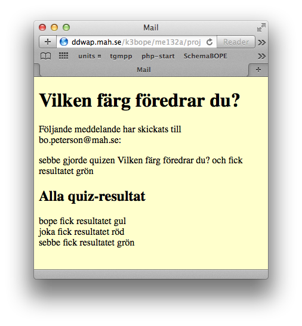

Sidan sendmail.php

## Projektalternativ 2: Meme-generator

Projektet går ut på att skriva PHP-kod som gör det möjligt att ladda upp en bild och sedan förse bilden med text i bildens överkant och nederkant. Man ska även kunna lägga till text till befintliga bilder. Detta projektet är inte lika styrt som quiz-alternativet, här gäller i större utsträckning att finna egna lösningar. Det finns en färdig funktion i filen memefunctions.php i [projektfiler.zip](projektfiler.zip) att tillgå som är till hjälp för att komplettera bild med text "av meme-typ" på bestämda koordinater:


<?php
function meme_text(&$im,$size,$x,$y,$font,$text) {
	//adds "meme-styled" text (white with black outline) to an image
	$col=imagecolorallocate($im,255,255,255); //white text
	$outlinecol=imagecolorallocate($im,0,0,0); //black outline
	$width=2; //width of outline
    // For every X pixel to the left and the right
    $xd=0-abs($width);
    for ($xc=$x-abs($width);$xc<=$x+abs($width);$xc++) {
        // For every Y pixel to the top and the bottom
        $yd=0-abs($width);
        for ($yc=$y-abs($width);$yc<=$y+abs($width);$yc++) {
            $text1 = imagettftext($im,$size,0,$xc,$yc,$outlinecol,$font,$text);
            $yd++;
        }
        $xd++;
    }
    // Draw the main text
    $text2 = imagettftext($im,$size,0,$x,$y,$col,$font,$text);
}	
?>


Typsnittet som brukar användas är Impact. (finns i [projektfiler.zip](projektfiler.zip)). 

**Tillägg 2015-05-28** Några har efterlyst möjligheten att skala om en bild. Funktionen `rescale` kan används till det:


function rescale(&$im,$height) {
    $sx = imagesx($im);
    $sy = imagesy($im);
    $width = round($height * $sx / $sy);
    $newim = imagecreatetruecolor($width, $height);
    imagecopyresampled($newim, $im, 0, 0, 0, 0, $width, $height, $sx, $sy);
    return $newim;
}
 

Lägg till funktionen i memefunctions-filen och anropa så här:


//antag att ni läst in en bild från fil i variabeln $im, tex så här:
$im=imagecreatefrompng($destination);

//skala om bilden så att den får höjden 400 pixlar
$im=rescale($im,400);


Projektet måste stödja följande:

* Nya bilder måste kunna laddas upp och sparas
* Meme-text ska kunna läggas till nyuppladdade eller tidigare uppladdade bilder
* Färdig meme-bild ska sparas. Dessutom måste en länk till detta meme skapas så att man senare kan hitta den

För VG krävs även:

* ÅÄÖ ska hanteras korrekt.
* Länk till bilden ska kunna mailas till godtycklig mailadress.
* Länk till alla genererade bilder ska sparas i en databas. 

### Miniexempel på meme-generator

Här finns ett [miniexempel](http://ddwap.mah.se/k3bope/me132a/projekt2014/meme/start.php) på en meme-generator.

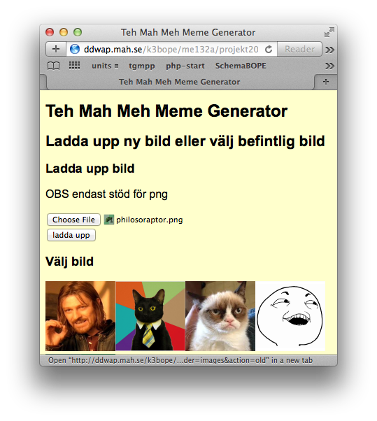

Startsida

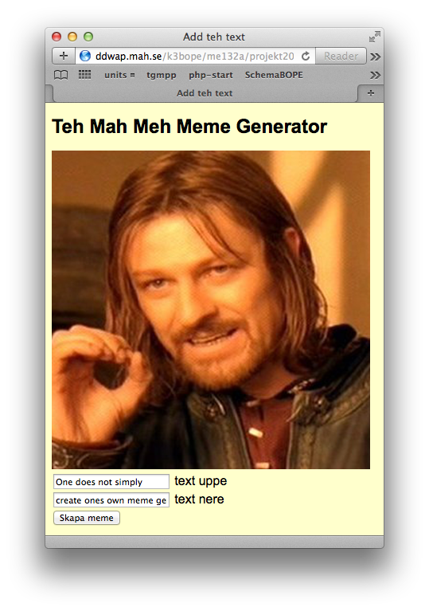

Formulär för att lägga till text

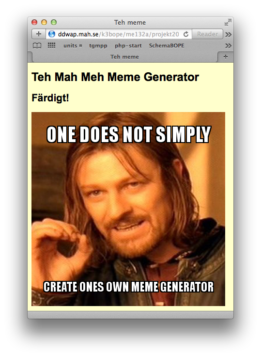

Färdig bild med text

## Projektalternativ 3: Egen idé

Om du har en egen idé måste du kontakta kursansvarig <bo.peterson@mah.se> för att diskutera idén senast 2015-04-24.
