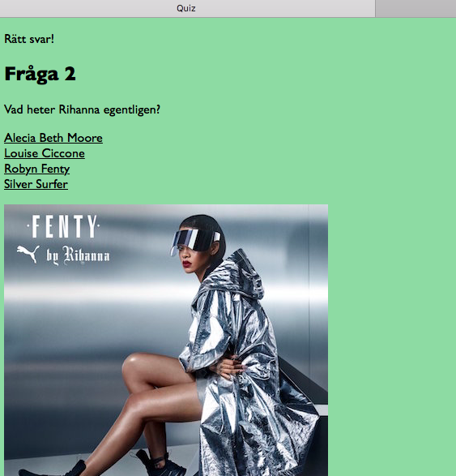

# Programmering för webben

## Projektbeskrivning vt 2016

Det finns tre olika projekt att välja mellan:

1. Quiz. 
2. Memory.  
3. Integrera något existerande API. Måste godkännas av kursansvarig. 

Se detaljerade specifikationer nedan. Alternativ 3 är ett mer öppet projekt som godkännas av kursansvarig när projektet startar. 

## Allmänt

* Projektet utförs enskilt
* Handledning kommer att ges under schemalagda laborationstillfällen varje vecka.
* Betygsskalan är underkänd, godkänd, väl godkänd


## Projektinlämning

Följande ska lämnas in på its learning senast 30 maj kl 13:00:

* Alla sidor med PHP-kod och HTML-kod ihopzippade.
* En webbadress (url) till ett fungerande projekt. **OBS** Om adressen saknas går projeket ej att testa vilket automatiskt leder till underkänt. 
* En pdf-rapport omfattande minst två A4-sidor där du beskriver ditt projekt. Rapporten ska innehålla:
	* Ditt namn.
	* Projektets namn.
	* Webbadress (url) till projektet.
	* En beskrivning av projektet.
	* Eventuella förbättringar som kan göras, tex saker som inte fungerar som tänkt. 
	* En reflektion över vad du lärt dig av projektet.
	* Skärmdumpar av valda sidor ur projektet.


## Projektredovisning

Projektet visas för lärare och övriga kursdeltagare den 31 maj kl 13:15-17:00 i sal E223. Projektet ska vara fullt fungerande så att det kan visas och testas.

## Betygsbedömning

För betyget godkänd krävs fungerande kod som uppfyller specifikationerna nedan. Det krävs att koden fungerar som specificerat utan att felmeddelanden visas. Det krävs även att koden är välstrukturerad, kommenterad och korrekt indenterad. Felaktigt indenterad kod är mycket svårläst och godkänns därför inte. Se [föreläsning 5](http://mah-webb.github.io/courses/me132a/lectures/lecture5.html) för mer information om indentering. 

För väl godkänd krävs även tilläggskrav som beskrivs under de olika projektidéerna.

Projektet behöver **inte** hantera ett korrekt beteende om man klickar webbläsarens tillbaka- och framåtknappar. Det är alltså ok om tillexempel quiz-alternativet beter sig konstigt om först svarar på en fråga och sedan klickar tillbaka-knappen och svarar på samma fråga igen.  

## Projektalternativ 1: Quiz

Projektet går ut på att skriva PHP-kod för en frågesport. [Här finns ett miniexempel](http://ddwap.mah.se/k3bope/me132a/projekt2016/quiz/start.php) av projektet. Detta exempel visar dock endast grunden och saknar några delar, till exempel poängräkning, för att bli godkänt. 

### Detaljerad beskrivning av quiz

* En quiz ska bestå av minst 10 frågor.
* Varje fråga ska ha minst 4 svarsalternativ.
* Endast ett svarsalternativ ska vara korrekt.
* Till varje fråga ska det finnas en bild.
* Om man svarar rätt på en fråga får man fortsätta svara på nästa fråga.
* Om man svarar fel på en fråga är frågesporten slut. 
* Om man svarat rätt på alla frågor är också frågesporten slut.
* När spelet är slut ska man få veta hur många poäng man fått. Ni avgör själva hur många poäng varje fråga ger. 

För VG krävs även:

* Att spelaren börjar med att ange sitt namn (eller alias) och epost-adress
* Att resultatet, namnet, datumet och klockslaget sparas i en databas.
* Att resultatet samt highscorelista med namn och poäng skickas med mail till spelaren. 

### Förslag till struktur för projektet

Följande beskrivning är en **rekommendation**. Om ni hellre vill lösa uppgiften på ett annat sätt så att specifikationerna uppfylls går det bra. 

Förslaget är att ni bygger upp grundfunktionen till projektet med två sidor, sidorna `start.php` och `question.php`. Extra sidor kan tillkomma beroende på hur ni löser projektet. 

#### Sidan start.php

Sidan `start.php` definierar alla frågor och några saker till i ett antal sessionsvariabler:

* `$_SESSION["questions"]` är en array som innehåller alla frågor
* `$_SESSION["answers"]` är en 2-dimensionell array som innehåller alla svarsalternativ
* `$_SESSION["rightanswers"]` är en array som innehåller korrekt svar
* `$_SESSION["images"]` är en array som innehåller filnamn till bild till frågan
* `$_SESSION["questionnumber"]` är en sessionsvariabel som håller reda på aktuell fråga. 

Så här skulle det kunna se ut för att definiera två frågor, fråga 0, och fråga 1. 

```php
<?php
$_SESSION["questions"][0]="Vad heter Beyoncés dotter?";
$_SESSION["answers"][0]=array("Blue Ivy","Red Lily","Green Oak","Silver Surfer");
$_SESSION["rightanswers"][0]="Blue Ivy";
$_SESSION["images"][0]="bey.jpg";

$_SESSION["questions"][1]="Vad heter Rihanna egentligen?";
$_SESSION["answers"][1]=array("Alecia Beth Moore","Louise Ciccone","Robyn Fenty","Silver Surfer");
$_SESSION["rightanswers"][1]="Robyn Fenty";
$_SESSION["images"][1]="riri.jpg";
?>
```

Genom att frågorna finns i sessionsvariabler kommer vi åt frågorna på mer än en php-sida. 

Sidan kan se ut ungefär så här:


När man klickar "Starta quizzen" kommer man vidare till sidan `question.php`.

#### Sidan question.php

När man kommer till `question.php` finns alla frågor, svar och bilder tillgängliga i de olika sessionsvariablerna. Sidan question har till huvuduppgift att visa en fråga med svarsalternativ och kan se ut ungefär så här:


När man klickar ett svar kommer man tillbaka till sidan `question.php` igen. Om man klickar rätt svar kan sidan se ut så här:
 


Om man istället klickar fel svar kan det bli så här:


Slutligen, när man svarat rätt på alla frågor kan det se ut så här:


Observera att poäng också måste visas för ett godkänt projekt. 

Som ni märker kommer sidan `question.php` att få lite olika utseende som beror på hur man svarar på frågan tidigare. Vi behöver därför styra sidans utseende med några if-satser. Vi måste ta hänsyn till följande:

* Vi måste kolla om svaret på föregående fråga var rätt eller fel **utom när vi kommer till allra första frågan** (dvs när vi kommer från sidan `start.php`).
* Om svaret är fel ska vi visa slutpoäng och avsluta spelet
* Om vi har svarat rätt på sista frågan ska vi också avsluta spelet
* Om vi svarat rätt men vi inte är på sista frågan ska vi visa nästa fråga

Följande pseudo-kod kan vara till hjälp för att strukturerar sidan:

```text

om vi är på första frågan {
    visa frågan 
} annars {
    kontrollera svarat
    visa om det var rätt eller fel svar
    om det var fel svar {
        visa slutpoäng
    } annars, om vi svarat på alla frågor
         grattis, du klarade alla frågorna!
    } annars {
        visa frågan
    }
}

```

## Projektalternativ 2: Memory

Projektet går ut på att skriva PHP-kod för ett memoryspel. [Här finns ett miniexempel](http://ddwap.mah.se/k3bope/me132a/projekt2016/memory/start.php) av projektet. Detta exempel visar dock endast grunden och saknar några delar för att bli godkänt. 

### Detaljerad beskrivning av memory

* Memoryspelet ska bestå av minst 16 brickor och minst 8 olika bilder. I utgångsläget visas baksidan av brickorna. Alla brickor har likadana baksidor. Brickorna ligger upplagda i ett rutnät med ett antal rader och kolumner. 
* Genom att klicka brickorna vänds brickorna och framsidan visas.
* Spelaren ska vända två brickor. Om de visar samma motiv är det ett korrekt drag och brickorna plockas bort. Om de visar olika motiv vänds de tillbaka
* När alla par har hittats är spelet slut
* Det är valfritt att göra ett spel för en spelare eller ett spel för två spelare. För VG krävs dock att spelet kan hantera både en och två spelare
* Om du väljer att göra spelet för en spelare ska det visas hur många drag som behövdes för att avsluta spelet. 
* Om du väljer att göra spelet för två spelare ska det visas hur många par respektive spelare hittat när spelet är klart. 

För betyget VG krävs dessutom 

* Att man börjar med att välja en eller två spelare
* Att spelerens eller spelarnas namn anges
* Att nya bilder till spelet kan laddas upp via ett webbformulär
* Att bildernas position slumpas fram

### Förslag till struktur för projektet

Följande beskrivning är en **rekommendation**. Om ni hellre vill lösa uppgiften på ett annat sätt så att specifikationerna uppfylls går det bra.
 
Förslaget är att ni bygger upp grundfunktionen till projektet med fyra sidor, sidorna `start.php`, `board1.php`, `board2.php` och `board3.php`. Extra sidor kan tillkomma beroende på hur ni löser projektet. 

#### Sidan start.php

Sidan `start.php` definierar själva spelplanen och sparar den i ett antal sessionsvariabler:

* `$_SESSION['board']` är en tvådimensionell array som innehåller filnamn på alla brickor. Varje bild återkommer två gånger. 
* `$_SESSION['state']` är också en tvådimensionell array som innehåller varje brickas *status* eller tillstånd. Varje bricka kan ha tre tillstånd: Tillstånd 0 betyder att baksidan visas. Tillstånd 1 betyder att framsidan visas. Tillstånd 2 betyder att brickan är borta från spelet och inte visas. 
* `$_SESSION['move1row']` är rad-koordinat för den först vända brickan 
* `$_SESSION['move1col']` är kolumn-koordinat för den först vända brickan
* `$_SESSION['move2row']` är rad-koordinat för den andra vända brickan 
* `$_SESSION['move2col']` är kolumn-koordinat för den andra vända brickan


Följande kod definierar ett spelplan med 2 rader och 4 kolumner:

```php
<?php
$_SESSION['board'][0]=array("cat.png","beyonce.png","dog.png","rihanna.png");
$_SESSION['board'][1]=array("rihanna.png","dog.png","cat.png","beyonce.png");

$_SESSION['state'][0]=array(0,0,0,0);
$_SESSION['state'][1]=array(0,0,0,0);
?>
```

Varje bricka får då en koordinat. Exempelvis har de två beyoce.png-brickorna koordinaterna `[0][1]`  och `[1][3]`, dvs `$_SESSION['board'][0][1]` har värdet `beyonce.png` och `$_SESSION['board'][1][3]` har också värdet `beyonce.png`. 

Sidan start kan se ut ungefär så här:


När man klickar start kommer man vidare till sidan `board1.php`.

#### Sidorna board1.php, board2.php och board3.php

Sidan `board1.php` visar brädet med alla brickor med baksidan upp, och kan se ut så här:


Lite senare i spelet när några brickor försvunnit kan `board1.php` se ut så här:


När man klickar en baksida på `board1.php` kommer man vidare till sidan `board2.png` som visar brädet med en bricka vänd:


När man sedan klickar en baksida på `board2.php` kommer man vidare till sidan `board3.png` som visar brädet med två brickor vända. Sidan visar också om det var ett bra eller dåligt drag, dvs om man hittade två lika brickor eller inte. 


Sidan ska även ha en länk som leder tillbaka till `board1.php`. När man återvänder till `board1.php` ska brickorna tas bort om man hittade samma bild eller vändas tillbaka om man inte hittade samma bild. 

Man kan slå ihop de tre sidorna board1, 2 och 3 i en sida, `board.php` som hanterar de olika fallen med hjälp av if-satser istället, på liknande sätt som är beskrivet för sidan `question.php` i quiz-uppgiften. 

## Projektalternativ 3: Egen API-idé

Om du vill ha mer frihet än i quiz- och memory-uppgifterna kan du välja en egen idé där du integrerar något befintligt API med egna PHP-sidor. Några exempel på API som kan integreras är 

- [Twitter API](https://dev.twitter.com/rest/public)
- [Facebook API](https://developers.facebook.com)
- [Google Maps API](https://developers.google.com/maps/web/)
- [Open Movie Database API](http://www.omdbapi.com)
- [Flickr API](https://www.flickr.com/services/api/)
- [Instagram API](https://www.instagram.com/developer/)

Om du har en egen idé måste du kontakta kursansvarig <bo.peterson@mah.se> för att diskutera idén så snart som möjligt. 